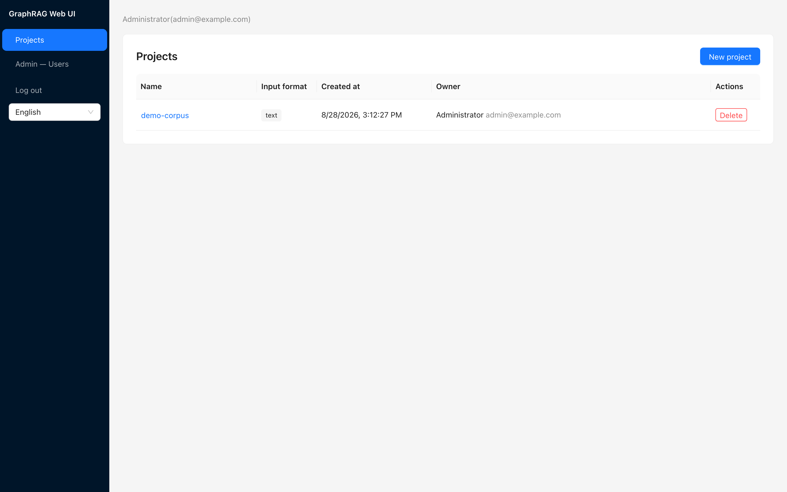
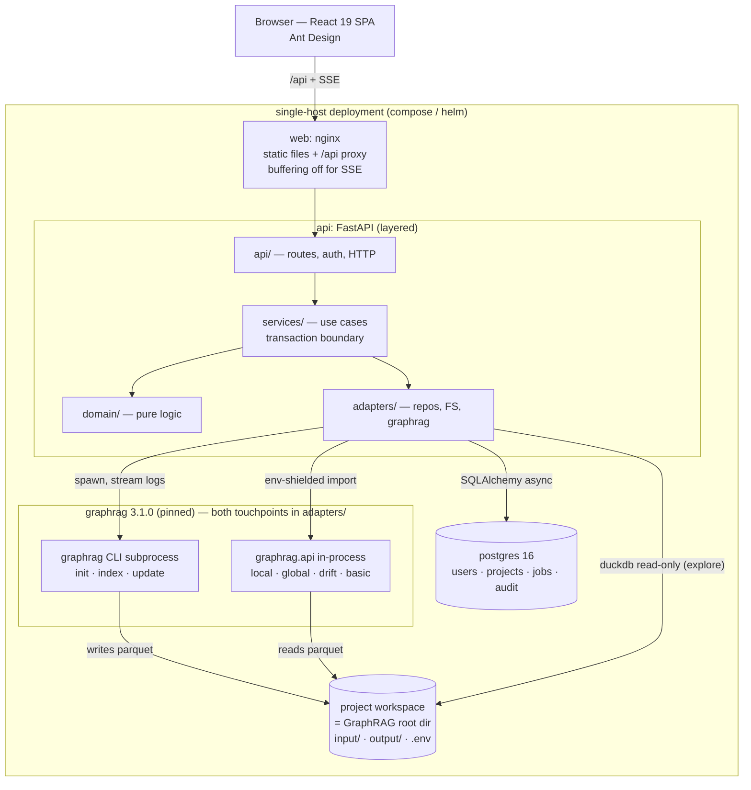
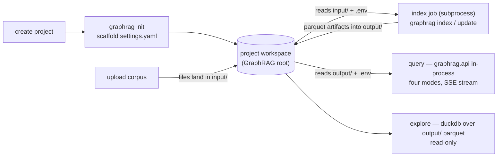
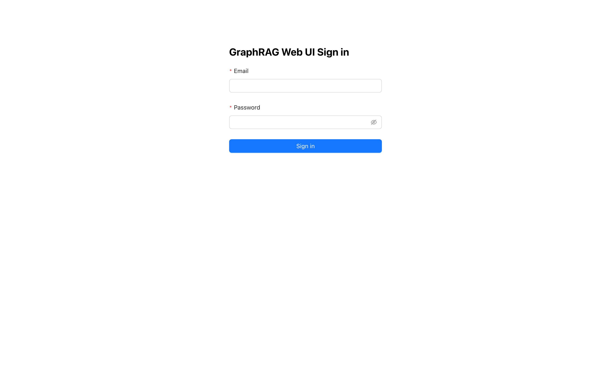
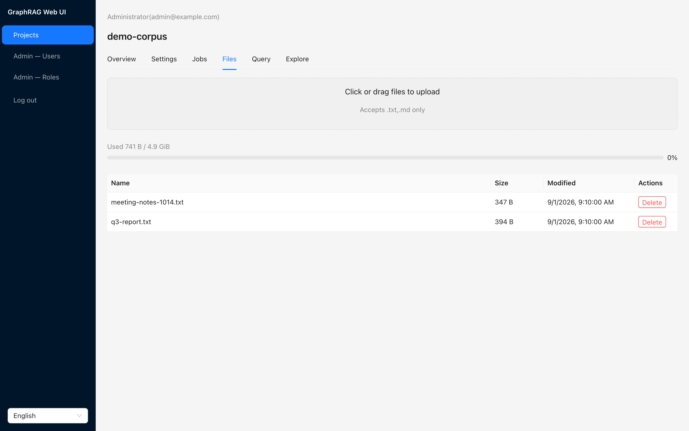
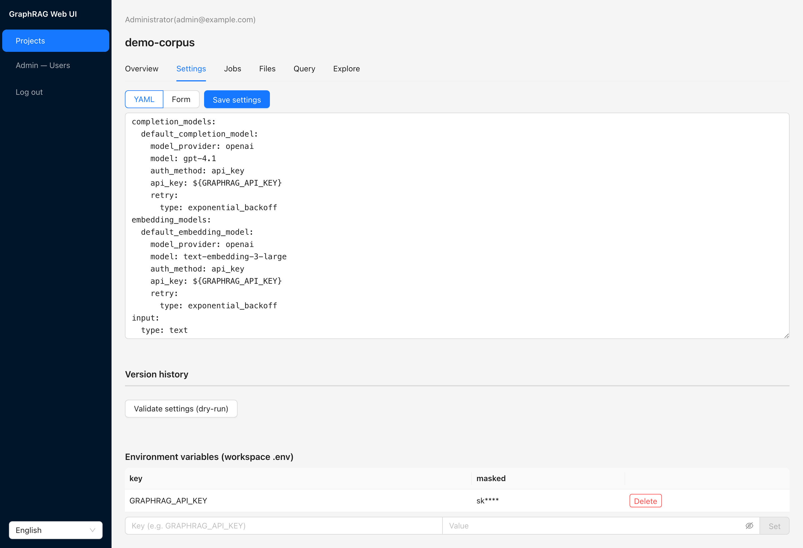
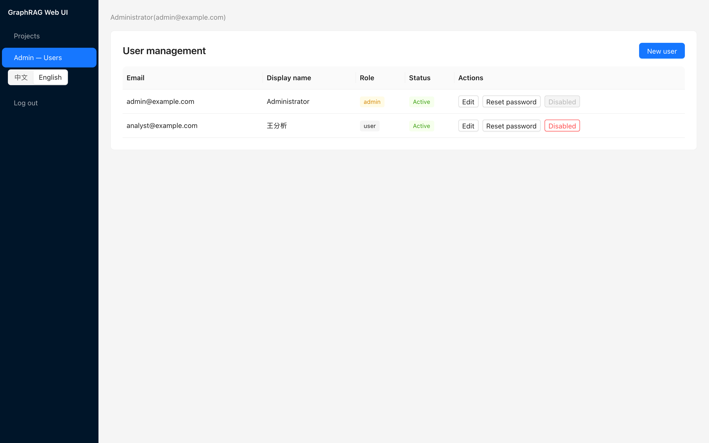
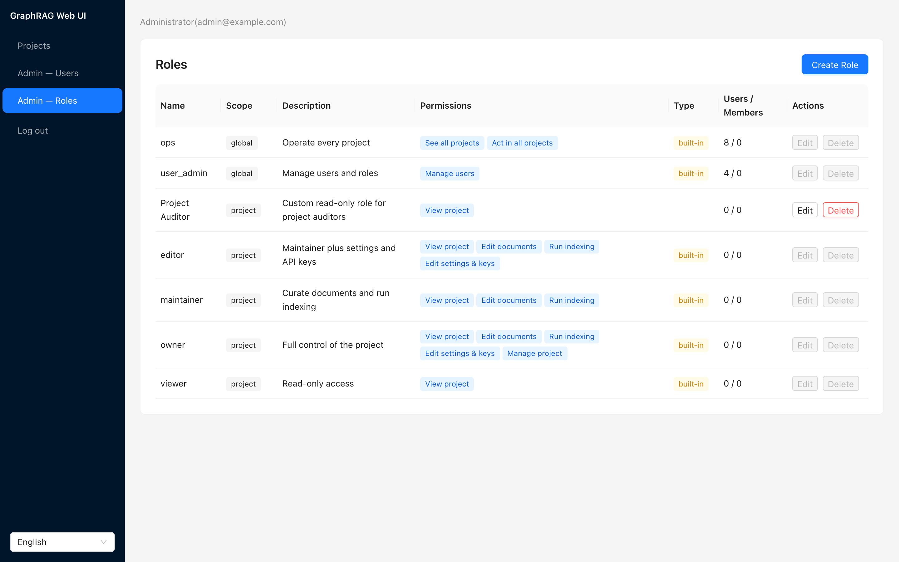
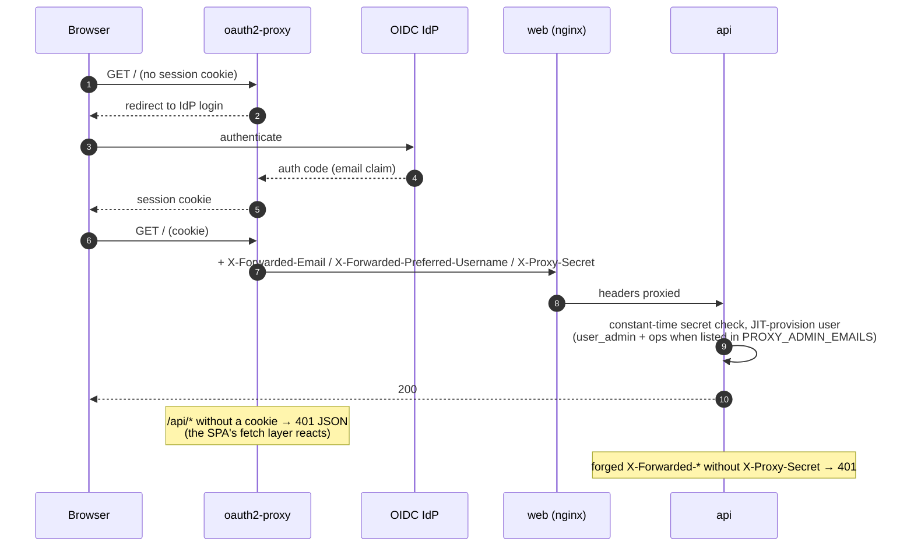

# GraphRAG Web UI

A team web console for [Microsoft GraphRAG](https://github.com/microsoft/graphrag): manage
projects, upload corpora, run indexing jobs, and query the knowledge graph — local / global /
drift / basic search modes, all streaming over SSE with inline citations. Browse the parquet
artifacts (entities, relationships, communities, documents, community reports, text units)
and explore the graph in an interactive WebGL Graph view. It replaces GraphRAG CLI
operations for non-technical teammates: everything from `graphrag init` to query runs behind
login, roles, and per-project quotas.



## Architecture

Short sketch (full detail in the [design spec](docs/superpowers/specs/)):

- **Frontend** — React 19 SPA (Ant Design, bilingual zh-TW/English interface), built with Vite and served
  by nginx, which also reverse-proxies `/api` to the backend (SSE-friendly: buffering off).
- **Backend** — FastAPI, layered `api` / `services` / `domain` / `adapters`.
  **Two graphrag touchpoints, both confined to `adapters/`:**
  - Indexing runs the graphrag CLI as a subprocess — `graphrag init` at project creation,
    then `graphrag index` / `graphrag update` jobs (`adapters/index_runner.py`,
    `adapters/workspace.py`).
  - Query/search calls `graphrag.api` in-process inside a shielded module
    (`adapters/graphrag_search.py` — shielded because graphrag's dependency chain loads
    `.env`/dotenv into `os.environ` on import; the adapter snapshots and restores the
    environment around that import).
- **Database** — PostgreSQL 16 (SQLAlchemy async + asyncpg); Alembic migrations run
  automatically at API startup.
- **Project workspaces** — the app's name for each project's GraphRAG root
  directory (what `graphrag init` scaffolds), created under `WORKSPACES_DIR`:
  uploads land in `input/`, index output in `output/`, per-project keys (e.g.
  `GRAPHRAG_API_KEY`) in the workspace `.env`.

### Component view



### Building on GraphRAG — the workspace lifecycle

The integration contract is the workspace — the app's name for each
project's GraphRAG root directory, scaffolded by `graphrag init` under
`WORKSPACES_DIR`. Every graphrag touchpoint — indexing, querying,
exploring — reads and writes only through it.



## Quickstart (15 minutes)

1. **Prerequisites** — Docker + Docker Compose. Node **24** and Python 3.12 + uv are only
   needed for local development (the frontend test stack — jsdom/undici — needs Node ≥ 22;
   CI pins 24).
2. **Configure** — `cp .env.example .env`, then set the three compose-enforced variables:

   - `JWT_SECRET` — the JWT signing key. `.env.example` ships it **empty**: it is
     required, must be at least 32 characters, and the API refuses to start on a
     placeholder, because anyone holding it can sign a token for any account.
     Generate one with `openssl rand -hex 32`
   - `BOOTSTRAP_ADMIN_EMAIL` — must use a routable domain, **not** `.local`: login
     validation rejects special-use domains
   - `BOOTSTRAP_ADMIN_PASSWORD`

   All 15 base variables and their defaults are documented in
   [`.env.example`](.env.example); the opt-in proxy-auth overlay adds its
   own set (see [OAuth2-Proxy authentication](#oauth2-proxy-authentication-optional)).
3. **Start** — `docker compose up --build -d`. The UI is at `http://localhost:8080`.
   Postgres starts first; the API waits for PG health and runs the Alembic migrations
   automatically.
4. **First login** — log in as the bootstrap admin; the UI forces a password change before
   anything else.

   

5. **Create a project** — pick `input_file_type` (`text` / `csv` / `json`). It is fixed at
   creation and decides which file extensions uploads accept.
6. **Upload the corpus** — files go to the project workspace `input/`. Per-file cap
   `UPLOAD_MAX_FILE_MB`, per-project quota `PROJECT_QUOTA_MB`; exceeding either → 413.

   

7. **Set the LLM key** — Project Settings → Env: set `GRAPHRAG_API_KEY` (per-project,
   stored in the workspace `.env`, read back masked). Without it, indexing jobs fail.

   

8. **Index** — Jobs → run an index job (method `fast` or `standard`). Caveat from
   real-corpus testing: on tiny corpora the `fast` method can fail ("Graph Pruning failed.
   No entities remain.") — use `standard` for the first run on small test corpora. Follow
   progress in the live log viewer.
9. **Query** — all four modes (`local`, `global`, `drift`, `basic`) stream over SSE with
   inline citations.
10. **Explore** — artifact tables (entities / relationships / communities / documents /
    community_reports / text_units) and the WebGL Graph view.

Accounts hold a set of roles rather than a single admin flag: the seeded
`user_admin` manages users and the role catalog, the seeded `ops` sees and
operates every project, and project members hold `viewer`/`maintainer`/
`editor` (owner is fixed to the creator); custom roles compose permission
atoms in both scopes. AdminUsers shows each account's roles as multi-select
tags (plus password resets and deactivation); the AdminRoles page manages
the catalog:




Every change writes an audit row (user and role edits, uploads and
deletions, env-key changes, settings saves). `Admin — Audit` reads them
back, newest first, filterable by action and target type, and gated on the
same `users:manage` right as the two pages above. It is read-only: nothing
in the trail can be edited or deleted through the API.

## Known caveats

- graphrag is pinned to `==3.1.0`: newer 3.1.x releases pull `lancedb` versions that have
  no macOS x86_64 wheel (see §13 of the design spec).
- On macOS, the `osxkeychain` credential helper blocks Docker in non-interactive
  sessions (SSH, agent terminals): `error getting credentials … keychain cannot
  be accessed` — even for public-image pulls/builds. Unlock the keychain first
  (`security -v unlock-keychain ~/Library/Keychains/login.keychain-db`), or —
  when only public images are needed — temporarily remove `"credsStore"` from
  `~/.docker/config.json` and restore it afterwards. With OrbStack this also
  affects `docker compose build`: the daemon resolves registry credentials
  through the host's docker config.

## Troubleshooting

- **"invalid email or password" right after re-running `docker compose up`** —
  the bootstrap admin is created **only on the first startup against an empty
  database**. If the Postgres volume already holds an admin (e.g.
  `BOOTSTRAP_ADMIN_PASSWORD` was changed in `.env` between runs), the *old*
  password still applies; the API log names the ignored variable at startup.
  For a clean trial state: `docker compose down -v` (⚠ destroys all data),
  then `up` again.
- **`npm ci` fails with `ERESOLVE` in the web image build** — the frontend
  tolerates the typescript 6 ↔ openapi-typescript peer conflict via
  `frontend/.npmrc` (`legacy-peer-deps=true`), and the Dockerfile must copy it
  into the build stage before `npm ci`. If you touch the copy steps, keep
  `.npmrc` with `package.json`.
- **"LiteLLM:WARNING … could not pre-load bedrock/sagemaker response stream
  shape" topping every index job log** — harmless: graphrag's LLM layer
  (litellm) probes for its optional AWS (botocore) integrations at import.
  Both graphrag touchpoints default `LITELLM_LOG=ERROR` so the noise never
  reaches job logs; export `LITELLM_LOG` explicitly (e.g. `DEBUG`) to
  override when debugging LLM calls.

## Local development

Backend (Docker required — the test suite uses testcontainers):

```
cd backend
uv sync
uv run pytest -m "not slow"
```

Frontend (Node 24):

```
cd frontend
npm ci
npm test
```

The Vite dev server proxies `/api` to `http://localhost:8000` by default; point it at
another front door with `API_PROXY_TARGET` (see `frontend/vite.config.ts`).

The screenshots in this README are regenerable — with the compose stack
running and a configured `.env`:

```
cd frontend
npx playwright install chromium   # once
npm run screenshots   # writes docs/assets/screenshots/{en,zh}/
```

## Deployment

- [`deploy/helm/graphrag-ui`](deploy/helm/graphrag-ui) — Helm chart;
  [`values.yaml`](deploy/helm/graphrag-ui/values.yaml) documents every environment variable,
  and `NOTES.txt` prints an install-time quickstart (zh-TW).
- [`docker-compose.yml`](docker-compose.yml) — single-host deployment; same 15 variables.

## OAuth2-Proxy authentication (optional)

Teams that already run an OIDC provider (Google, GitHub, Azure Entra,
Keycloak…) can front the app with
[oauth2-proxy](https://oauth2-proxy.github.io/) instead of maintaining a
second credential set. The mode is opt-in per deployment — default
deployments keep today's behavior byte-for-byte (design:
[spec](docs/superpowers/specs/2026-08-27-oauth2-proxy-auth-design.md)).

`AUTH_MODE=proxy` changes three things:

- **Local login is fully disabled** — `login` / `refresh` / `logout` /
  `change-password` are not registered (404) and no application JWTs
  exist. Identity comes from `X-Forwarded-Email` (display name:
  `X-Forwarded-Preferred-Username`) headers injected by oauth2-proxy on
  every request; the SPA detects the mode via `GET /api/auth/config`.
- **Header trust is anchored to a shared secret** — `PROXY_AUTH_SECRET`
  (required, ≥ 32 chars; the API exits at startup otherwise) travels as
  the `X-Proxy-Secret` header. A request without exactly one matching
  value is rejected, so forged `X-Forwarded-*` headers sent directly at
  nginx or the api are worthless.
- **Users are provisioned just-in-time** — a first-seen email becomes a
  `user` row with an unusable password hash (local login stays
  impossible for it). Emails listed in `PROXY_ADMIN_EMAILS`
  (comma-separated) are granted the `user_admin` + `ops` role pair on
  every request.



Setup (compose overlay + `.env` additions, helm, the email-domain
allowlist, mode-switching caveats, and a manual smoke runbook):
**[docs/oauth2-proxy.md](docs/oauth2-proxy.md)**.

## Contributing & docs

- [CONTRIBUTING.md](CONTRIBUTING.md)
- Traditional Chinese (zh-TW) mirror: [`docs/zh-TW/README.md`](docs/zh-TW/README.md)
- Design specs: [`docs/superpowers/specs/`](docs/superpowers/specs/)
- OAuth2-Proxy guide: [`docs/oauth2-proxy.md`](docs/oauth2-proxy.md)

## License

[MIT](LICENSE) — Copyright (c) 2026 Kehao Chen.
