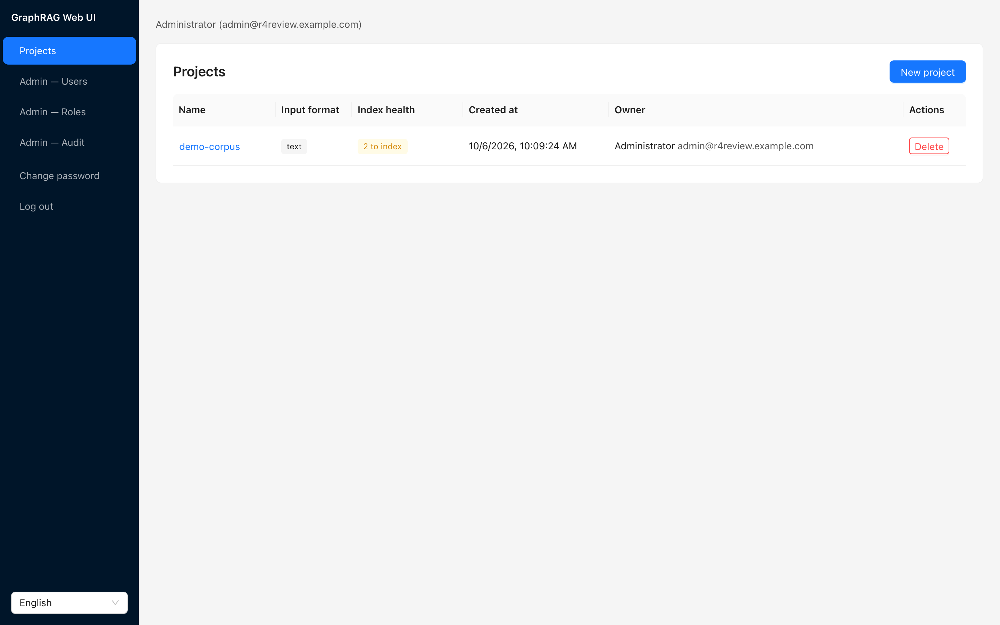
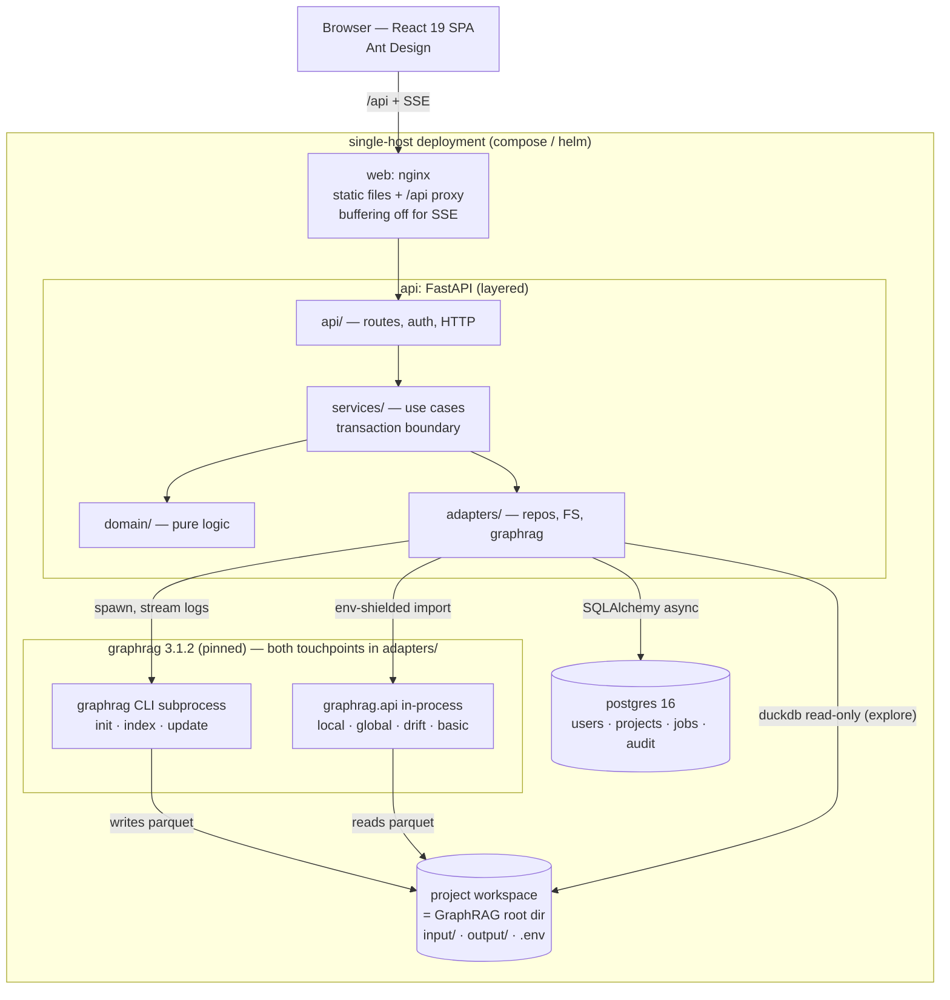
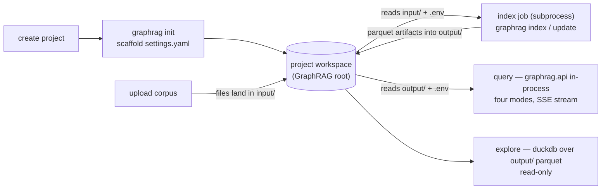
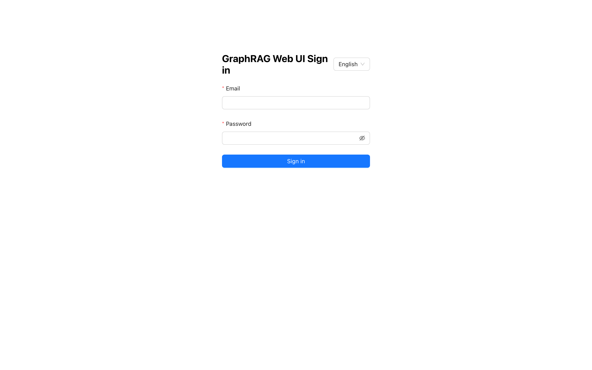
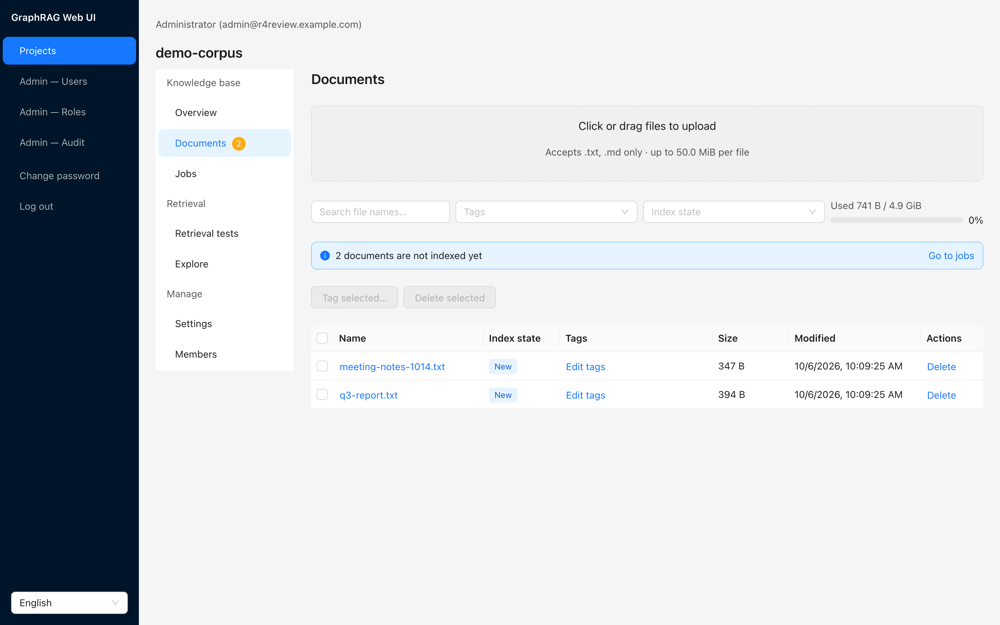
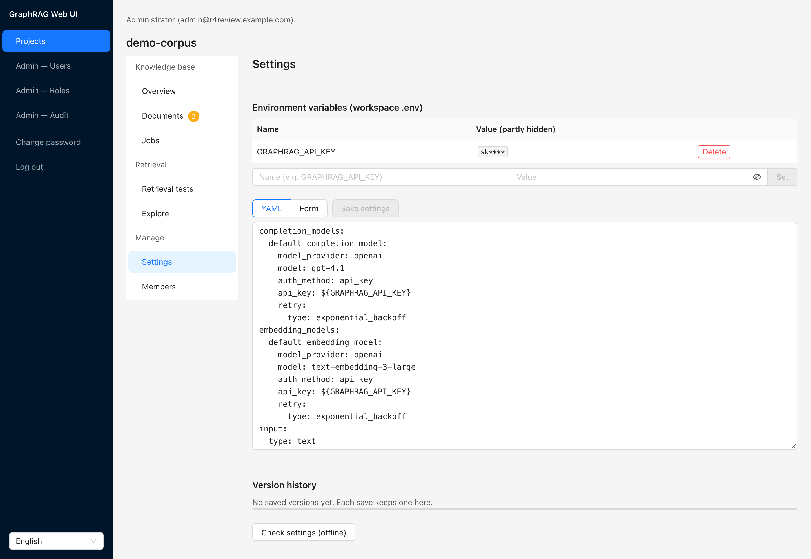
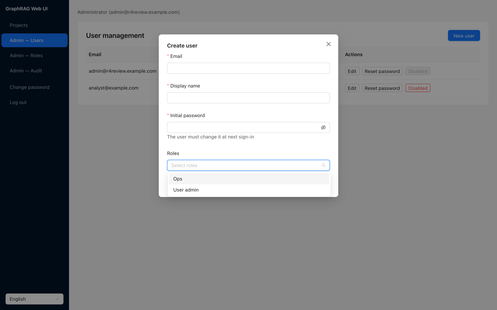
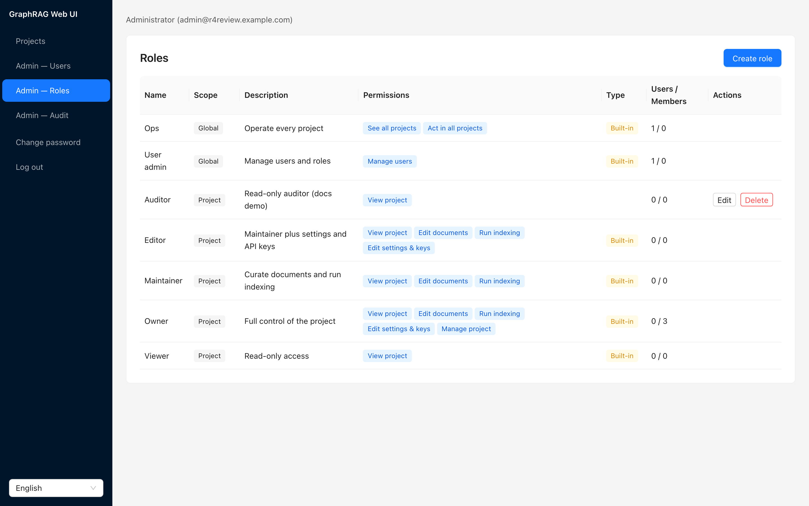
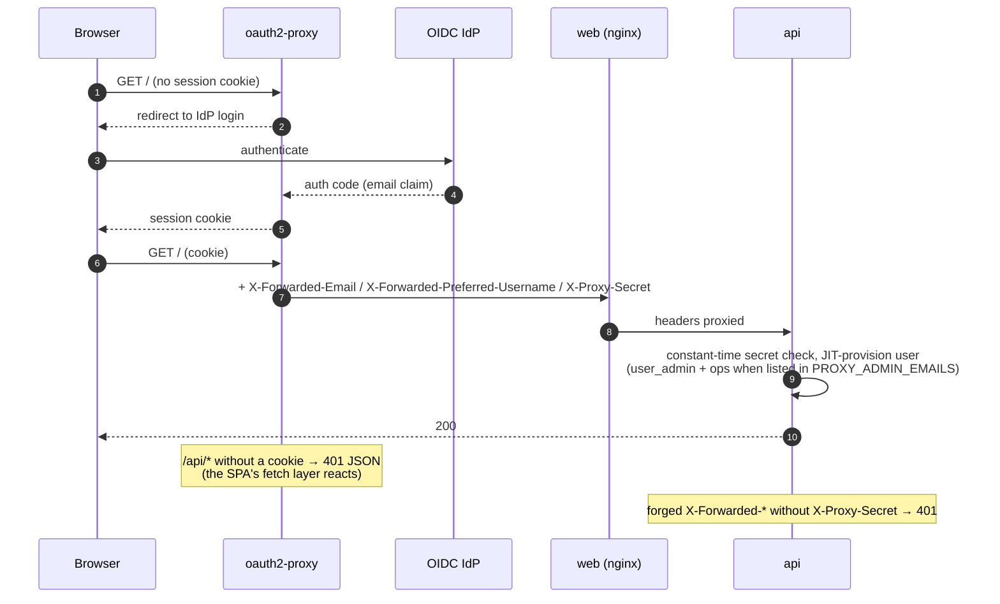

# GraphRAG Web UI

A team web console for [Microsoft GraphRAG](https://github.com/microsoft/graphrag): manage
projects, upload corpora, run indexing jobs, and query the knowledge graph — local / global /
drift / basic search modes, all streaming over SSE with inline citations. Browse the parquet
artifacts (entities, relationships, communities, documents, community reports, text units)
and explore the graph in an interactive WebGL Graph view. It replaces GraphRAG CLI
operations for non-technical teammates: everything from `graphrag init` to query runs behind
login, roles, and per-project quotas.



## Architecture

Short sketch (full detail in the [design spec](docs/superpowers/specs/)):

- **Frontend** — React 19 SPA (Ant Design, bilingual zh-TW/English interface), built with Vite and served
  by nginx, which also reverse-proxies `/api` to the backend (SSE-friendly: buffering off).
- **Backend** — FastAPI, layered `api` / `services` / `domain` / `adapters`.
  **Two graphrag touchpoints, both confined to `adapters/`:**
  - Indexing runs the graphrag CLI as a subprocess — `graphrag init` at project creation,
    then `graphrag index` / `graphrag update` jobs (`adapters/index_runner.py`,
    `adapters/workspace.py`).
  - Query/search calls `graphrag.api` in-process inside a shielded module
    (`adapters/graphrag_search.py` — shielded because graphrag's dependency chain loads
    `.env`/dotenv into `os.environ` on import; the adapter snapshots and restores the
    environment around that import).
  - Both touchpoints sit inside one trust boundary (`adapters/workspace_env.py`): the
    `${VAR}` placeholders in a project's `settings.yaml` resolve from that project's
    `.env` **only**, never from the API process environment, and the CLI subprocess gets
    an allowlisted environment (PATH, locale, `NLTK_DATA`, proxy/CA passthrough) plus the
    workspace pairs — never the API's secrets. Process-level names (`PATH`, `PYTHON*`,
    `*_PROXY`, CA bundles) are refused as `.env` keys.
- **Database** — PostgreSQL 16 (SQLAlchemy async + asyncpg); Alembic migrations run
  automatically at API startup.
- **Project workspaces** — the app's name for each project's GraphRAG root
  directory (what `graphrag init` scaffolds), created under `WORKSPACES_DIR`:
  uploads land in `input/`, index output in `output/`, per-project keys (e.g.
  `GRAPHRAG_API_KEY`) in the workspace `.env`.

### Component view


```mermaid
graph TB
    B["Browser — React 19 SPA<br/>Ant Design"] -->|"/api + SSE"| N
    subgraph stack["single-host deployment (compose / helm)"]
        N["web: nginx<br/>static files + /api proxy<br/>buffering off for SSE"]
        subgraph API["api: FastAPI (layered)"]
            L1["api/ — routes, auth, HTTP"] --> L2["services/ — use cases<br/>transaction boundary"]
            L2 --> L3["domain/ — pure logic"]
            L2 --> L4["adapters/ — repos, FS, graphrag"]
        end
        PG[("postgres 16<br/>users · projects · jobs · audit")]
        subgraph GR["graphrag 3.1.2 (pinned) — both touchpoints in adapters/"]
            CLI["graphrag CLI subprocess<br/>init · index · update"]
            LIB["graphrag.api in-process<br/>local · global · drift · basic"]
        end
        WS[("project workspace<br/>= GraphRAG root dir<br/>input/ · output/ · .env")]
    end
    N --> L1
    L4 -->|"SQLAlchemy async"| PG
    L4 -->|"spawn, stream logs"| CLI
    L4 -->|"env-shielded import"| LIB
    CLI -->|"writes parquet"| WS
    LIB -->|"reads parquet"| WS
    L4 -->|"duckdb read-only (explore)"| WS
```

### Building on GraphRAG — the workspace lifecycle

The integration contract is the workspace — the app's name for each
project's GraphRAG root directory, scaffolded by `graphrag init` under
`WORKSPACES_DIR`. Every graphrag touchpoint — indexing, querying,
exploring — reads and writes only through it.


```mermaid
flowchart LR
    P["create project"] --> I["graphrag init<br/>scaffold settings.yaml"]
    I --> W[("project workspace<br/>(GraphRAG root)")]
    U["upload corpus"] -->|"files land in input/"| W
    W -->|"reads input/ + .env"| X["index job (subprocess)<br/>graphrag index / update"]
    X -->|"parquet artifacts into output/"| W
    W -->|"reads output/ + .env"| Q["query — graphrag.api in-process<br/>four modes, SSE stream"]
    W --> E["explore — duckdb over output/ parquet<br/>read-only"]
```

### Documents — the knowledge manager view

The **Documents** tab is where a knowledge manager curates a project's corpus.
Every file in `input/` carries an **index state** — `new` (never indexed),
`modified` (changed since the last index), `indexed`, `skipped` (silently
dropped by the last run), or `removed` (deleted from disk but still inside the
index; only a full rebuild clears it). Files can be searched, filtered by state
and tag, tagged, previewed, and bulk-deleted from this view.

While an `index`/`update` job is queued or running, the project's input and
configuration are **frozen**: uploads, deletes, bulk deletes, `settings.yaml`
writes and `.env` edits are refused with HTTP 409 until the job finishes, so
the indexer's snapshot is exactly what was uploaded.

A trustworthy baseline comes from a full `index` run; an `update` never
creates one, so existing projects read every file as `new` until someone runs
a full index.

### Retrieval tests — the retrieval-testing loop

The **Retrieval tests** tab is the retrieval-testing loop. A knowledge manager saves a
question set once — sets are created, renamed and archived in the rating
matrix, and an ad-hoc answer joins a set (or starts one) in one action — then
**re-runs the whole set** against the current index as a background job.
The run's question manifest is materialized when the job is enqueued, so an
edit made while the job sits queued cannot change what runs. Answers are
rated by humans (`good` / `fair` / `poor`, plus a note) in the rating
matrix: rows are question lineages, columns are the most recent runs
(default 5), and "regressions only" keeps questions whose newest rating is
worse than the previous run's. Clicking a cell opens the result drawer —
the question as asked, the answer, citations and timings; with the drawer
open, `1`/`2`/`3` rate and advance to the next result. Selecting a second
cell opens a side-by-side diff that highlights changes at **sentence**
granularity, because character diffs bury the real change in prose. Editing
a question that has runs creates a new version; past runs keep the wording
they actually asked.

### The knowledge manager's loop — closed (slice 3)

Slices 1 and 2 built the parts; slice 3 wires the loop between them:
**upload → index → test → find the document at fault → fix → re-index.**
A knowledge manager uploads documents and runs a full `index`; the
retrieval tests then ask the question set against that index. When an
answer is wrong, its `Sources` citations name the documents they came
from, and one click opens the cited document's preview centered on the
passage that was used — the manager edits that document, and the next
index run plus a re-run of the set shows whether the fix took. The
overview page's action card names the single next action at any moment,
and the project list flags faults (`3 to index`, `Deleted documents
still in the index`) so a project that quietly drifted cannot read
healthy.

## Quickstart (15 minutes)

1. **Prerequisites** — Docker + Docker Compose. Node **24** and Python 3.12 + uv are only
   needed for local development (the frontend test stack — jsdom/undici — needs Node ≥ 22;
   CI pins 24).
2. **Configure** — `cp .env.example .env`, then set the three compose-enforced variables:

   - `JWT_SECRET` — the JWT signing key. `.env.example` ships it **empty**: it is
     required, must be at least 32 characters, and the API refuses to start on a
     placeholder, because anyone holding it can sign a token for any account.
     Generate one with `openssl rand -hex 32`
   - `BOOTSTRAP_ADMIN_EMAIL` — must use a routable domain, **not** `.local`: login
     validation rejects special-use domains
   - `BOOTSTRAP_ADMIN_PASSWORD` — at least 12 characters and not the `.env.example`
     placeholder; the API refuses to start otherwise

   All 18 base variables and their defaults are documented in
   [`.env.example`](.env.example); the opt-in proxy-auth overlay adds its
   own set (see [OAuth2-Proxy authentication](#oauth2-proxy-authentication-optional)).
3. **Start** — `docker compose up --build -d`. The UI is at `http://localhost:8080`.
   Postgres starts first; the API waits for PG health and runs the Alembic migrations
   automatically.
4. **First login** — log in as the bootstrap admin; the UI forces a password change before
   anything else.

   

5. **Create a project** — pick `input_file_type` (`text` / `csv` / `json`). It is fixed at
   creation and decides which file extensions uploads accept.
6. **Upload the corpus** — files go to the project workspace `input/`. Per-file cap
   `UPLOAD_MAX_FILE_MB`, per-project quota `PROJECT_QUOTA_MB`; exceeding either → 413.
   The shipped nginx and the Helm ingress are sized for that cap; if you put another
   proxy in front, raise its body-size limit too (nginx defaults to 1 MiB).

   

7. **Set the LLM key** — Settings → Environment variables: set `GRAPHRAG_API_KEY`
   (per-project, stored in the workspace `.env`, read back masked). Without it, indexing
   jobs fail; until it is set, the overview and Settings flag the key `graphrag init`
   left as a placeholder.

   

8. **Index** — Jobs → run an index job (method `fast` or `standard`). Caveat from
   real-corpus testing: on tiny corpora the `fast` method can fail ("Graph Pruning failed.
   No entities remain.") — use `standard` for the first run on small test corpora. A
   running job shows "N of M workflows done" in the jobs table; its live log viewer
   follows the output.
9. **Query** — from the Retrieval tests tab: all four modes (`local`, `global`, `drift`,
   `basic`) stream over SSE with inline citations.
10. **Explore** — artifact tables (entities / relationships / communities / documents /
    community_reports / text_units) and the WebGL Graph view.

Accounts hold a set of roles rather than a single admin flag: the seeded
`user_admin` manages users and the role catalog, the seeded `ops` sees and
operates every project, and project members hold `viewer`/`maintainer`/
`editor` (owner is fixed to the creator); custom roles compose permission
atoms in both scopes. AdminUsers shows each account's roles as multi-select
tags (plus password resets and deactivation); the AdminRoles page manages
the catalog:




Every change writes an audit row (user and role edits, uploads and
deletions, env-key changes, settings saves). `Admin — Audit` reads them
back, newest first, filterable by action and target type, and gated on the
same `users:manage` right as the two pages above. It is read-only: nothing
in the trail can be edited or deleted through the API.

Project managers rename a project and edit its description from the
Members pane, where members are added (as `viewer` by default) and their
roles changed. With local sign-in, every user changes their own password
from *Change password* in the sidebar menu.

## Known caveats

- graphrag is pinned to `==3.1.2` (latest stable). Its `graphrag-vectors` dependency
  pulls `lancedb>=0.37`, which ships no macOS x86_64 wheel — on Intel Macs `uv sync`
  fails, so run the backend gates in a Linux container there (recipe in
  [`AGENTS.md`](AGENTS.md)). CI (Linux) and Apple-silicon Macs are unaffected. Do not
  bump graphrag without re-checking the `settings.yaml` key names it reads
  (`AGENTS.md`, Working Rules).
- On macOS, the `osxkeychain` credential helper blocks Docker in non-interactive
  sessions (SSH, agent terminals): `error getting credentials … keychain cannot
  be accessed` — even for public-image pulls/builds. Unlock the keychain first
  (`security -v unlock-keychain ~/Library/Keychains/login.keychain-db`), or —
  when only public images are needed — temporarily remove `"credsStore"` from
  `~/.docker/config.json` and restore it afterwards. With OrbStack this also
  affects `docker compose build`: the daemon resolves registry credentials
  through the host's docker config.

## Troubleshooting

- **"invalid email or password" right after re-running `docker compose up`** —
  the bootstrap admin is created **only on the first startup against an empty
  database**. If the Postgres volume already holds an admin (e.g.
  `BOOTSTRAP_ADMIN_PASSWORD` was changed in `.env` between runs), the *old*
  password still applies; the API log names the ignored variable at startup.
  For a clean trial state: `docker compose down -v` (⚠ destroys all data),
  then `up` again.
- **`npm ci` fails with `ERESOLVE` in the web image build** — the frontend
  tolerates the typescript 6 ↔ openapi-typescript peer conflict via
  `frontend/.npmrc` (`legacy-peer-deps=true`), and the Dockerfile must copy it
  into the build stage before `npm ci`. If you touch the copy steps, keep
  `.npmrc` with `package.json`.
- **`docker compose up` reports every container running, but
  `http://localhost:8080` refuses connections** — another process holds host
  port 8080 (for example a `kubefwd` session on a loopback alias), so the
  published port never binds and nothing says so. Check with
  `lsof -nP -iTCP:8080 -sTCP:LISTEN`, then publish on another port with a
  one-service override file passed as a second `-f`:

  ```yaml
  # compose.port.yml — keep it outside the repo or untracked
  services:
    web:
      ports: !override ["18080:8080"]
  ```

  `docker compose -f docker-compose.yml -f compose.port.yml up -d` — the UI
  is then on `http://localhost:18080`. With the proxy-auth overlay, override
  the `auth` service's port instead and set `OAUTH2_PROXY_REDIRECT_URL` to
  match.
- **"LiteLLM:WARNING … could not pre-load bedrock/sagemaker response stream
  shape" topping every index job log** — harmless: graphrag's LLM layer
  (litellm) probes for its optional AWS (botocore) integrations at import.
  Both graphrag touchpoints default `LITELLM_LOG=ERROR` so the noise never
  reaches job logs; export `LITELLM_LOG` explicitly (e.g. `DEBUG`) to
  override when debugging LLM calls.

## Local development

Backend (Docker required — the test suite uses testcontainers):

```
cd backend
uv sync
uv run pytest -m "not slow"
```

Frontend (Node 24):

```
cd frontend
npm ci
npm test
```

The Vite dev server proxies `/api` to `http://localhost:8000` by default; point it at
another front door with `API_PROXY_TARGET` (see `frontend/vite.config.ts`).

The screenshots in this README are regenerable — with the compose stack
running and a configured `.env`:

```
cd frontend
npx playwright install chromium   # once
npm run screenshots   # writes docs/assets/screenshots/{en,zh}/
```

## Deployment

- [`docker-compose.yml`](docker-compose.yml) — single-host deployment; the same 18
  variables (`DATABASE_URL` and `WORKSPACES_DIR` are fixed inside the compose file, the
  rest come from `.env`). Services restart on their own after a reboot or a crash, the
  api has a health check, and the web container waits for it.
- [`deploy/helm/graphrag-ui`](deploy/helm/graphrag-ui) — Helm chart;
  [`values.yaml`](deploy/helm/graphrag-ui/values.yaml) documents every environment variable,
  and `NOTES.txt` prints an install-time quickstart. The ingress sends every path,
  `/api` included, to the web Service, whose nginx proxies the api. Install one release
  per namespace (the web nginx reaches the api through a Service named `api`). The
  workspace PVC takes `persistence.storageClassName` or a `persistence.existingClaim`.
  The bundled PostgreSQL defaults to the frozen `bitnamilegacy/postgresql:16.6.0`
  mirror (Bitnami's 2025 registry reorg removed the public semver tags): it pulls, but
  gets no further patches — for production set `externalDatabase.url` or point
  `postgresql.image.*` at a maintained source.

**Images.** No registry publishes the two images; build them and push them to yours,
then point the chart at them:

```
docker build -t registry.example.com/graphrag-ui/api:0.1.0 backend
docker build -t registry.example.com/graphrag-ui/web:0.1.0 frontend
docker push registry.example.com/graphrag-ui/api:0.1.0
docker push registry.example.com/graphrag-ui/web:0.1.0
helm upgrade --install graphrag deploy/helm/graphrag-ui -n graphrag --create-namespace \
  --set api.image.repository=registry.example.com/graphrag-ui/api --set api.image.tag=0.1.0 \
  --set web.image.repository=registry.example.com/graphrag-ui/web --set web.image.tag=0.1.0 \
  --set jwtSecret=$(openssl rand -hex 32) …
```

## Operations

### Upgrading

1. **Back up first** (next section), at a moment when no job is running — an upgrade
   stops the api, and a job it was running is marked `failed(interrupted)` at the
   next start and has to be run again.
2. **Compose:** `git pull`, then `docker compose up -d --build`. **Helm:** build and push
   the new images, then `helm upgrade` with the new tags. The chart uses the
   `Recreate` strategy, so the old pod stops before the new one starts: expect a short
   outage.
3. **Watch the migration.** The api runs `alembic upgrade head` before it starts
   listening: `docker compose logs -f api` (or `kubectl logs -f deploy/<release>-graphrag-ui-api`)
   shows one `Running upgrade …` line per revision, then `Application startup complete`.
   The chart's startup probe gives a migration up to 5 minutes.
4. **If the migration fails,** the api exits and is restarted in a loop (compose) or
   CrashLoopBackOffs (Helm), and the previous version is already stopped. Fix forward,
   or roll back: restore the database and the workspaces taken in step 1, then start the
   previous images. `alembic downgrade` is **not** a rollback path — some revisions are
   one-way (the RBAC migration's downgrade loses custom roles; the failed-question
   scrub cannot restore the text it removed).

### Backup and restore

Back up two things **from the same moment**: the PostgreSQL database (users, roles,
projects, members, jobs, audit trail, index snapshots) and the workspaces volume
(documents, `settings.yaml`, each project's `.env` with its model keys, index output and
job logs). Stop the api and web while you take them, so no job or upload writes between
the two.

Compose — the volume names carry the compose project name (the directory name unless
you pass `-p`; `docker volume ls` shows them):

```
# back up
docker compose stop api web
docker compose exec -T postgres pg_dump -U graphrag -Fc graphrag > graphrag-$(date +%F).dump
docker run --rm -v graphrag-web-ui_workspaces:/data:ro -v "$PWD":/backup alpine \
  tar czf /backup/workspaces-$(date +%F).tgz -C /data .
docker compose start api web

# restore (replaces everything in both)
docker compose stop api web
docker compose exec -T postgres pg_restore -U graphrag -d graphrag --clean --if-exists < graphrag-YYYY-MM-DD.dump
docker run --rm -v graphrag-web-ui_workspaces:/data -v "$PWD":/backup:ro alpine \
  sh -c 'rm -rf /data/* && tar xzf /backup/workspaces-YYYY-MM-DD.tgz -C /data && chown -R 10001:10001 /data'
docker compose start api web
```

Helm — the database: your managed database's backups when `externalDatabase.url` is
set; for the bundled one,
`kubectl exec -n <ns> <release>-postgresql-0 -- env PGPASSWORD=<password> pg_dump -U graphrag -Fc graphrag > graphrag.dump`.
The workspaces PVC: a `VolumeSnapshot` where the storage class's CSI driver supports
it; otherwise stream it out of the api pod while no job runs,
`kubectl exec -n <ns> deploy/<release>-graphrag-ui-api -- tar czf - -C /data/workspaces . > workspaces.tgz`.

### Logs

- **The api log** (`docker compose logs api`, `kubectl logs`) has one timestamped line
  per job step — enqueued, claimed, started, spawned (with the process id), cancel
  requested, and finished with status, exit code and duration — plus a warning for
  each job found interrupted at startup and the totals of the daily retention sweep.
  Health-check requests are left out of the access log. Live streams sign in with a
  one-minute ticket valid for that stream only (never the access token), and the
  access log shows it as `[redacted]`.
- **A job's own output** (graphrag's log) is on the Jobs page, live while it runs; on
  disk it is `logs/jobs/<job id>.log` in the project's workspace. Log files are kept
  `JOB_LOG_RETENTION_DAYS` (30) days after success and `JOB_LOG_FAILED_RETENTION_DAYS`
  (90) after a failure; the job row keeps the error tail for good.
- **Who did what** is in *Admin — Audit*: job starts and cancels, uploads, settings and
  key changes, member and role changes, password changes, cache clears.

### Sizing

- **Memory.** The indexing subprocess, the api and the query cache share one limit:
  2 GiB in both compose (`mem_limit`) and the chart. One job's indexing peak measured
  about 566 MiB, and the query cache is capped by `QUERY_CACHE_MB` (1024). Each extra
  concurrent job (`MAX_CONCURRENT_JOBS`, default 2) adds roughly one more indexing
  peak, which grows with the corpus — raise the limit or lower `QUERY_CACHE_MB`. When
  the limit is hit the container is killed; running jobs end `failed(interrupted)`,
  and exit code 137 is marked as a likely out-of-memory.
- **Disk.** Per project: documents plus index output up to `PROJECT_QUOTA_MB` (5000),
  graphrag's cache (a warning above `CACHE_QUOTA_MB`, 2048; *Clear cache* on the Jobs
  page empties it — the next index then pays the model again for what was cached),
  the `update_output/` runs kept by `UPDATE_OUTPUT_KEEP_LATEST` (2), and job logs.
  A job is refused when the volume has less than `DISK_WATERMARK_MB` (2048) free or
  the project is over its quota.

### Session lifetimes

With local sign-in, `ACCESS_TOKEN_MINUTES` (default 15) sets the access token's
lifetime and `REFRESH_TOKEN_DAYS` (default 7) the refresh token's, renewed on every
use; a sign-in's chain of refresh tokens ends 30 days after it started regardless.
The access token is also what a live-log or streamed-answer URL carries, so a shorter
one narrows that window too. Proxy mode issues no tokens; oauth2-proxy's cookie
settings apply instead.

## OAuth2-Proxy authentication (optional)

Teams that already run an OIDC provider (Google, GitHub, Azure Entra,
Keycloak…) can front the app with
[oauth2-proxy](https://oauth2-proxy.github.io/) instead of maintaining a
second credential set. The mode is opt-in per deployment — default
deployments keep today's behavior byte-for-byte (design:
[spec](docs/superpowers/specs/2026-08-27-oauth2-proxy-auth-design.md)).

`AUTH_MODE=proxy` changes three things:

- **Local login is fully disabled** — `login` / `refresh` / `logout` /
  `change-password` are not registered (404) and no application JWTs
  exist. Identity comes from `X-Forwarded-Email` (display name:
  `X-Forwarded-Preferred-Username`) headers injected by oauth2-proxy on
  every request; the SPA detects the mode via `GET /api/auth/config`.
- **Header trust is anchored to a shared secret** — `PROXY_AUTH_SECRET`
  (required, ≥ 32 chars; the API exits at startup otherwise) travels as
  the `X-Proxy-Secret` header. A request without exactly one matching
  value is rejected, so forged `X-Forwarded-*` headers sent directly at
  nginx or the api are worthless.
- **Users are provisioned just-in-time** — a first-seen email becomes a
  `user` row with an unusable password hash (local login stays
  impossible for it). Emails listed in `PROXY_ADMIN_EMAILS`
  (comma-separated) are granted the `user_admin` + `ops` role pair on
  every request.


```mermaid
sequenceDiagram
    autonumber
    participant B as Browser
    participant O as oauth2-proxy
    participant I as OIDC IdP
    participant N as web (nginx)
    participant A as api
    B->>O: GET / (no session cookie)
    O-->>B: redirect to IdP login
    B->>I: authenticate
    I-->>O: auth code (email claim)
    O-->>B: session cookie
    B->>O: GET / (cookie)
    O->>N: + X-Forwarded-Email / X-Forwarded-Preferred-Username / X-Proxy-Secret
    N->>A: headers proxied
    A->>A: constant-time secret check, JIT-provision user<br/>(user_admin + ops when listed in PROXY_ADMIN_EMAILS)
    A-->>B: 200
    note over O: /api/* without a cookie → 401 JSON<br/>(the SPA's fetch layer reacts)
    note over A: forged X-Forwarded-* without X-Proxy-Secret → 401
```

Setup (compose overlay + `.env` additions, helm, the email-domain
allowlist, mode-switching caveats, and a manual smoke runbook):
**[docs/oauth2-proxy.md](docs/oauth2-proxy.md)**.

## Contributing & docs

- [CONTRIBUTING.md](CONTRIBUTING.md)
- [CHANGELOG.md](CHANGELOG.md) — release notes per feature slice
- Traditional Chinese (zh-TW) mirror: [`docs/zh-TW/README.md`](docs/zh-TW/README.md)
- Design specs: [`docs/superpowers/specs/`](docs/superpowers/specs/)
- OAuth2-Proxy guide: [`docs/oauth2-proxy.md`](docs/oauth2-proxy.md)

## License

[MIT](LICENSE) — Copyright (c) 2026 Kehao Chen.
