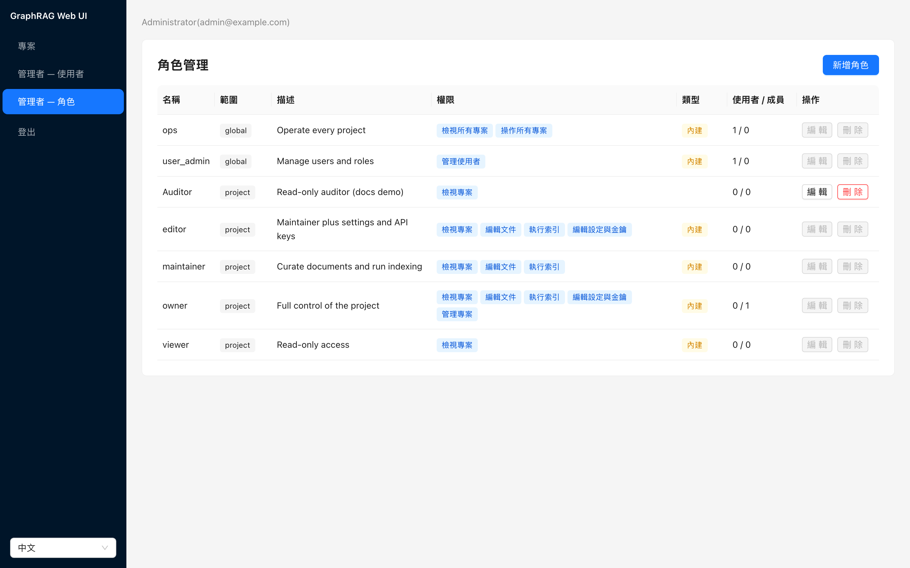

# Composable Roles & Permission Atoms (RBAC v2) Implementation Plan

> **For agentic workers:** REQUIRED SUB-SKILL: Use superpowers:subagent-driven-development (recommended) or superpowers:executing-plans to implement this plan task-by-task. Steps use checkbox (`- [ ]`) syntax for tracking.

**Goal:** Replace the two-tier admin/user + owner/editor/viewer model with permission atoms, seeded built-in roles, and admin-defined custom roles at global and project scope, front to back.

**Architecture:** Permission atoms are the currency; a role is a named set of them; effective permissions are the union over all roles a principal holds. `domain/permissions.py` resolves atoms as pure functions; a request-scoped `Principal` (API layer) carries the user row plus its global atom union; project routes resolve the caller's member-role atoms per project. The legacy `users.role` / `project_members.role` columns are dropped after every reader is migrated.

**Tech Stack:** FastAPI + pydantic v2, SQLAlchemy 2 async + alembic + testcontainers (Postgres 16), `TEXT[]` for role permissions, React 18 + TS + antd 6 + vitest, openapi-typescript codegen.

**Spec:** `docs/superpowers/specs/2026-08-30-rbac-composable-roles-design.md` — the spec travels with this plan; executors read both. Section references (§4, §5.2…) point at the spec.

## Global Constraints

- **Atom catalog is fixed** (spec §4.1), exact strings: global `users:manage`, `projects:view_any`, `projects:act_any`, `projects:create`; project `project:view`, `project:edit_content`, `project:run_jobs`, `project:edit_settings`, `project:manage`. Implications: `projects:act_any` ⇒ every project atom **and** `projects:view_any`; `projects:view_any` ⇒ `project:view` everywhere. `projects:create` is a baseline for every active user — a domain constant, never stored in DB.
- **Built-in role ids are fixed literals** (spec §4.2), byte-for-byte: `user_admin` `00000000-0000-4000-8000-000000000001`, `ops` `…0002`, `viewer` `…0003`, `maintainer` `…0004`, `editor` `…0005`, `owner` `…0006`. Seed by id with `ON CONFLICT (id) DO NOTHING`; the migration inlines the literals (migrations never import app modules) and must match `domain/role_catalog.py`.
- **Migration is delivered as two alembic revisions, not the spec's one** (spec §5.2 deviation, deliberate): R1 additive (creates `roles`/`user_roles`, adds nullable `project_members.role_id`, backfills, keeps both legacy columns) so Tasks 1–3 land green while legacy code still runs; R2 destructive (straggler backfill, `NOT NULL`, drops legacy columns) rides in Task 4, the backend cutover. End-state schema is identical to spec §5.2's; R1+R2 together execute the spec's five steps in order, and R2 carries the spec's lossy downgrade.
- **Layering** (AGENTS.md): `domain/` pure — no I/O, no ORM objects, only frozensets/str/uuid; `services/` no FastAPI imports, no `HTTPException` — they raise domain errors that routes translate; `api/` owns `Principal` (defined in `api/deps.py`, spec §6.1) and all pydantic models.
- **One route, one atom** (spec §4.3): `PATCH /api/projects/{id}` moves to `project:manage` as a whole (name + description); jobs preflight keeps `project:view` (it is a read probe; `JobsPanel` fires it on mount — gating it on `run_jobs` would toast every viewer). Env API key set/delete move to `project:edit_settings`; file upload/delete stay `edit_content`; job trigger/cancel become `run_jobs`.
- **Error codes** (spec §7): added `last_user_manager_protected`, `role_is_system`, `role_in_use`, `role_name_taken`, `role_scope_mismatch`, `role_not_found`, `role_permissions_invalid`; removed `user_last_admin_protected` (superseded); `admin_only` and `forbidden` codes **kept** — only the `admin_only` i18n message is reworded to "requires user management". Every added code needs a zh-TW + en-US entry in the frontend error catalog (Task 5).
- **JWT**: the `role` claim is dropped and nothing replaces it (spec §6.3). Authorization is DB-driven per request, as today.
- **Audit actions** (spec §6.4): new `role.created`, `role.updated`, `role.deleted`. Role grants are NOT a separate action — they ride the existing `user.updated` payload as `roles: [name, …]`, matching that route's changed-dict convention. `user.role_promoted` keeps its name (proxy reconciliation); `member.added`/`member.role_changed` payloads switch to `role_id` + `role_name`.
- **Every task ends green**: `cd backend && uv run pytest -q -m "not slow"` (Docker required for testcontainers) and `uv run ruff check`; frontend tasks additionally `cd frontend && npm test && npx tsc -b --noEmit`. No task leaves the suite red.
- **Contract gate**: `openapi.json` + `frontend/src/api/types.generated.ts` regenerate in the SAME commit as any schema/route change (`cd backend && uv run python scripts/gen_openapi.py`, then `cd frontend && npm run gen:types`). Generated files are never hand-edited.
- Schema drift gate `tests/test_schema_drift.py` must stay green at every task: `adapters/models.py` must match alembic head exactly (Task 1 keeps the legacy columns in the models; Task 4 drops them together with R2).
- Comments/docstrings English-only (CI-enforced); UI strings via i18n catalogs with **both** zh-TW and en-US keys for every new string; Conventional Commits in English; README changes update `docs/zh-TW/README.md` in the same PR.
- graphrag stays pinned `==3.1.0`; no new backend/frontend runtime dependencies; no new environment variables (fixed list in AGENTS.md).
- Frontend permission gating reads **backend-computed atoms only** (`UserOut.permissions`, `ProjectOut.my_permissions`) — never a frontend-rebuilt role→permission table (spec §8).

## File Structure

```
backend/src/graphrag_ui/
  domain/
    permissions.py        # REWRITTEN (Task 4): Atom enum, can(), effective_project_perms()
    role_catalog.py       # NEW (Task 1): fixed built-in role UUID constants
  adapters/
    models.py             # Task 1: + Role, UserRole, ProjectMember.role_id (legacy kept)
                          # Task 4: - User.role, - ProjectMember.role
  services/
    roles.py              # NEW (Task 2): role CRUD, validation, usage counts
    users.py              # Task 4: atom-based guards, role_ids params, last-user-manager
    projects.py           # Task 4: get_member_perms, member_perms_for_projects, role_id writes
    auth.py               # Task 4: bootstrap grants, proxy reconciliation, JWT claim drop
  api/
    deps.py               # Task 4: Principal, load_global_perms, require_atom
    schemas.py            # Task 3: + RoleOut; Task 4: UserOut roles/permissions, user_out()
    roles_routes.py       # NEW (Task 3)
    users_routes.py       # Task 4: roles payloads
    projects_routes.py    # Task 4: MemberIn/MemberOut, my_permissions, guards
    jobs_routes.py / files_routes.py / settings_routes.py / env_routes.py /
    dry_run_routes.py / query_routes.py / explore_routes.py / auth_routes.py
                          # Task 4: mechanical guard sweep
backend/migrations/versions/
    <r1>_rbac_roles_additive.py    # NEW (Task 1)
    <r2>_rbac_drop_legacy_role.py  # NEW (Task 4)
backend/tests/
    test_rbac_migration.py  # NEW (Task 1)
    test_roles_service.py   # NEW (Task 2)
    test_roles_api.py       # NEW (Task 3)
    test_rbac_api.py        # NEW (Task 4): persona matrix
    test_permissions.py     # REWRITTEN (Task 4)
    test_users.py / test_projects.py / test_proxy_auth.py / test_error_codes.py  # updated (Task 4)
frontend/src/
    api/types.ts           # Task 5: + Role alias (User/Member/Project shapes flow from codegen)
    pages/AdminUsers.tsx   # Task 5: role multi-select
    pages/ProjectDetail.tsx / Projects.tsx  # Task 5: my_permissions-driven
    components/Layout.tsx  # Task 5: users:manage nav gating
    pages/AdminRoles.tsx   # NEW (Task 6)
    App.tsx                # Task 6: /admin/roles route
    i18n/locales/{zh-TW,en-US}.ts  # Tasks 5-6
```

---

### Task 1: Role catalog, models, R1 additive migration

**Files:**
- Create: `backend/src/graphrag_ui/domain/role_catalog.py`
- Create: `backend/migrations/versions/<r1>_rbac_roles_additive.py` (generate with `uv run alembic revision -m "rbac roles tables additive"`; verify `uv run alembic heads` shows `47b77c99bc8f` as the current head first)
- Modify: `backend/src/graphrag_ui/adapters/models.py`
- Test: `backend/tests/test_rbac_migration.py` (new file)

**Interfaces:**
- Consumes: nothing (first task).
- Produces: `Role`, `UserRole` ORM models; `ProjectMember.role_id: Mapped[uuid.UUID | None]` (nullable until Task 4; legacy `role` string column still present and still authoritative); constants `ROLE_ID_USER_ADMIN`, `ROLE_ID_OPS`, `ROLE_ID_VIEWER`, `ROLE_ID_MAINTAINER`, `ROLE_ID_EDITOR`, `ROLE_ID_OWNER` (all `uuid.UUID`), `GLOBAL_BUILTIN_ROLE_IDS`, `PROJECT_BUILTIN_ROLE_IDS` (frozensets) in `domain/role_catalog.py`. Migration tables `roles` (cols `id, scope, name, description, permissions TEXT[], is_system, created_at`; unique `(scope, name)`) and `user_roles` (PK `(user_id, role_id)`, FKs CASCADE/RESTRICT), plus `project_members.role_id` FK → `roles.id` ON DELETE RESTRICT.

**Legacy code is untouched in this task.** Existing services keep writing `users.role` / `project_members.role`; new rows simply carry `role_id = NULL` until Task 4 (nothing reads `role_id` before then; R2 backfills stragglers). The schema drift gate stays green because the models keep the legacy columns.

- [ ] **Step 1: Write the failing migration tests**

Create `backend/tests/test_rbac_migration.py`:

```python
"""R1/R2 RBAC migrations (spec §5.2): seed, backfill, and lossy downgrade.

Runs against its OWN Postgres container: the shared session fixture is
already migrated to head, and this test walks revisions up/down, which
would mutate the shared schema under other tests' feet.

Two facts about this repo shape the plumbing below — do not simplify them
away:

1. `migrations/env.py` overwrites `sqlalchemy.url` with
   `get_settings().database_url` at import time, so setting that option on
   the Config object does NOTHING. The container is selected through the
   DATABASE_URL env var plus `get_settings.cache_clear()`, and restored on
   teardown so the session-wide container keeps working.
2. No sync driver is installed (neither psycopg2 nor psycopg), so every
   statement here goes through asyncpg. The tests stay SYNC functions:
   env.py runs `asyncio.run()` internally, which raises inside a running
   loop — an `async def` test would break every alembic call. The helpers
   therefore wrap their async work in `asyncio.run()`.
"""
import asyncio
import os

import pytest
import sqlalchemy as sa
from alembic import command
from alembic.config import Config
from testcontainers.postgres import PostgresContainer

from graphrag_ui.adapters.db import make_engine
from graphrag_ui.config import get_settings
# Only ROLE_ID_OPS is referenced (the R2 grant); ruff F401 fails an
# import of the other five.
from graphrag_ui.domain.role_catalog import ROLE_ID_OPS

LEGACY_BASE = "47b77c99bc8f"  # indexing_jobs, the revision right before R1
# Relative refs, never "head": Task 4 adds R2, which would silently
# retarget these R1 assertions (they require the legacy columns to exist).
R1 = f"{LEGACY_BASE}+1"
R2 = f"{LEGACY_BASE}+2"


@pytest.fixture(scope="module")
def legacy_container():
    """One container for the whole module (each test resets it below).

    DATABASE_URL points at it for the module's duration because env.py
    reads the url through get_settings(); the previous value is restored
    so the session-scoped shared container survives.
    """
    previous = os.environ.get("DATABASE_URL")
    with PostgresContainer("postgres:16-alpine") as pg:
        url = pg.get_connection_url().replace("psycopg2", "asyncpg")
        os.environ["DATABASE_URL"] = url
        get_settings.cache_clear()
        cfg = Config("alembic.ini")
        cfg.set_main_option("script_location", "migrations")
        yield url, cfg
    if previous is None:
        os.environ.pop("DATABASE_URL", None)
    else:
        os.environ["DATABASE_URL"] = previous
    get_settings.cache_clear()


@pytest.fixture
def legacy_db(legacy_container):
    """The module container reset to the pre-R1 revision for each test."""
    url, cfg = legacy_container
    command.downgrade(cfg, "base")
    command.upgrade(cfg, LEGACY_BASE)
    return url, cfg


async def _aexec(url: str, statements: tuple[str, ...]) -> None:
    engine = make_engine(url)
    try:
        async with engine.begin() as conn:
            for stmt in statements:  # one statement per execute (asyncpg)
                await conn.execute(sa.text(stmt))
    finally:
        await engine.dispose()


async def _arows(url: str, sql: str) -> list:
    engine = make_engine(url)
    try:
        async with engine.connect() as conn:
            return (await conn.execute(sa.text(sql))).fetchall()
    finally:
        await engine.dispose()


def _exec(url: str, *statements: str) -> None:
    # Sync wrapper: these tests must not be async (see the module docstring)
    asyncio.run(_aexec(url, statements))


def _rows(url: str, sql: str) -> list:
    return asyncio.run(_arows(url, sql))


def _seed_legacy_rows(url):
    _exec(
        url,
        """
            INSERT INTO users (id, email, password_hash, display_name, role,
                               is_active, must_change_password, created_at)
            VALUES
              ('11111111-1111-1111-1111-111111111111', 'a@x.com', 'h', 'A',
               'admin', true, false, now()),
              ('22222222-2222-2222-2222-222222222222', 'b@x.com', 'h', 'B',
               'user', true, false, now()),
              ('33333333-3333-3333-3333-333333333333', 'c@x.com', 'h', 'C',
               'user', false, false, now()),
              ('44444444-4444-4444-4444-444444444444', 'd@x.com', 'h', 'D',
               'admin', true, false, now())
        """,
        """
            INSERT INTO projects (id, name, slug, description, owner_id,
                                  input_file_type, created_at)
            VALUES ('aaaa0000-0000-0000-0000-00000000000a', 'P', 'p', NULL,
                    '11111111-1111-1111-1111-111111111111', 'text', now())
        """,
        """
            INSERT INTO project_members (project_id, user_id, role)
            VALUES
              ('aaaa0000-0000-0000-0000-00000000000a',
               '11111111-1111-1111-1111-111111111111', 'owner'),
              ('aaaa0000-0000-0000-0000-00000000000a',
               '22222222-2222-2222-2222-222222222222', 'editor'),
              ('aaaa0000-0000-0000-0000-00000000000a',
               '44444444-4444-4444-4444-444444444444', 'viewer')
        """,
    )


def test_r1_seeds_builtins_and_backfills(legacy_db):
    url, cfg = legacy_db
    _seed_legacy_rows(url)
    command.upgrade(cfg, R1)

    roles = {r[0]: (r[1], tuple(r[2])) for r in _rows(url, """
        SELECT name, scope, permissions FROM roles ORDER BY name
    """)}
    # spot-check the six built-ins carry the spec §4.2 atom sets
    assert roles["user_admin"] == ("global", ("users:manage",))
    assert set(roles["ops"][1]) == {"projects:view_any", "projects:act_any"}
    # (array column order is not guaranteed — compare as sets)
    assert roles["viewer"] == ("project", ("project:view",))
    assert roles["editor"][0] == "project"
    assert set(roles["editor"][1]) == {
        "project:view", "project:edit_content", "project:run_jobs",
        "project:edit_settings"}
    assert set(roles["owner"][1]) == {
        "project:view", "project:edit_content", "project:run_jobs",
        "project:edit_settings", "project:manage"}
    assert set(roles["maintainer"][1]) == {
        "project:view", "project:edit_content", "project:run_jobs"}

    # users.role='admin' rows gain exactly [user_admin, ops]; 'user' rows none
    grants = _rows(url, """
        SELECT u.email, r.name FROM users u
        JOIN user_roles ur ON ur.user_id = u.id
        JOIN roles r ON r.id = ur.role_id
        ORDER BY u.email, r.name
    """)
    assert grants == [
        ("a@x.com", "ops"), ("a@x.com", "user_admin"),
        ("d@x.com", "ops"), ("d@x.com", "user_admin"),
    ]

    # member strings map to role_id; the combination case (global admin
    # AND project editor on one user, spec §9) must not interfere
    members = {r[0]: r[1] for r in _rows(url, """
        SELECT u.email, r.name FROM project_members pm
        JOIN users u ON u.id = pm.user_id
        JOIN roles r ON r.id = pm.role_id
    """)}
    assert members == {
        "a@x.com": "owner", "b@x.com": "editor", "d@x.com": "viewer"}

    # R1 keeps the legacy columns (spec deviation note in plan header)
    cols = {r[0] for r in _rows(url, """
        SELECT column_name FROM information_schema.columns
        WHERE table_name IN ('users', 'project_members') AND column_name = 'role'
    """)}
    assert cols == {"role"}


def test_r1_is_safe_on_empty_database(legacy_db):
    url, cfg = legacy_db
    command.upgrade(cfg, R1)  # no legacy rows at all
    assert len(_rows(url, "SELECT id FROM roles")) == 6
    assert _rows(url, "SELECT * FROM user_roles") == []


def test_r1_downgrade_drops_rbac_tables(legacy_db):
    url, cfg = legacy_db
    _seed_legacy_rows(url)
    command.upgrade(cfg, R1)
    command.downgrade(cfg, LEGACY_BASE)
    tables = {r[0] for r in _rows(url, """
        SELECT table_name FROM information_schema.tables
        WHERE table_schema = 'public'
    """)}
    assert "roles" not in tables and "user_roles" not in tables
    # legacy data untouched by the roundtrip
    assert len(_rows(url, "SELECT id FROM users")) == 4
    members = _rows(url, "SELECT role FROM project_members ORDER BY role")
    assert [m[0] for m in members] == ["editor", "owner", "viewer"]
```

Notes for the implementer:

- `test_r1_downgrade_drops_rbac_tables` seeds rows, upgrades, downgrades —
  the R1 downgrade drops the `role_id` column, so the legacy `role` values
  must survive verbatim.
- The three plumbing constraints (env.py's url override, no sync driver,
  sync test functions) are spelled out in the module docstring because
  each one fails in a differently confusing way: the first silently
  migrates the SHARED container, the second raises
  `ModuleNotFoundError: psycopg2`, the third raises "asyncio.run() cannot
  be called from a running event loop".
- One container per module, reset per test, keeps the fast suite fast;
  a per-test container would add a fresh Postgres start to every case.

- [ ] **Step 2: Run tests to verify they fail**

Run: `cd backend && uv run pytest tests/test_rbac_migration.py -v`
Expected: FAIL — `ModuleNotFoundError: No module named 'graphrag_ui.domain.role_catalog'` (and no R1 revision exists).

- [ ] **Step 3: Create `domain/role_catalog.py`**

```python
"""Fixed built-in role ids (spec §4.2).

The literals are duplicated verbatim in the R1 migration (migrations never
import app modules); changing one side without the other breaks the seed.
Custom roles get random UUIDs at creation time and never appear here.
"""
import uuid

ROLE_ID_USER_ADMIN = uuid.UUID("00000000-0000-4000-8000-000000000001")
ROLE_ID_OPS = uuid.UUID("00000000-0000-4000-8000-000000000002")
ROLE_ID_VIEWER = uuid.UUID("00000000-0000-4000-8000-000000000003")
ROLE_ID_MAINTAINER = uuid.UUID("00000000-0000-4000-8000-000000000004")
ROLE_ID_EDITOR = uuid.UUID("00000000-0000-4000-8000-000000000005")
ROLE_ID_OWNER = uuid.UUID("00000000-0000-4000-8000-000000000006")

GLOBAL_BUILTIN_ROLE_IDS = frozenset({ROLE_ID_USER_ADMIN, ROLE_ID_OPS})
PROJECT_BUILTIN_ROLE_IDS = frozenset({
    ROLE_ID_VIEWER, ROLE_ID_MAINTAINER, ROLE_ID_EDITOR, ROLE_ID_OWNER})
```

- [ ] **Step 4: Add the ORM models**

In `backend/src/graphrag_ui/adapters/models.py`, add imports `ForeignKey`, `UniqueConstraint` if missing, `ARRAY` from `sqlalchemy.dialects.postgresql`, and add (keep every existing model untouched, including `User.role` and `ProjectMember.role`):

```python
class Role(Base):
    """A named set of permission atoms (spec §4). Built-ins are seeded by
    fixed id and are immutable (is_system); custom roles are admin-created."""
    __tablename__ = "roles"
    __table_args__ = (UniqueConstraint("scope", "name", name="uq_roles_scope_name"),)
    id: Mapped[uuid.UUID] = mapped_column(UUID(as_uuid=True), primary_key=True,
                                          default=uuid.uuid4)
    scope: Mapped[str] = mapped_column(String(10))  # global|project
    name: Mapped[str] = mapped_column(String(50))
    description: Mapped[str] = mapped_column(String(200), default="")
    permissions: Mapped[list[str]] = mapped_column(ARRAY(Text()), default=list)
    is_system: Mapped[bool] = mapped_column(Boolean, default=False)
    created_at: Mapped[datetime] = mapped_column(DateTime(timezone=True),
                                                 server_default=func.now())


class UserRole(Base):
    """Global role grant. Scope (global) is enforced in the service layer —
    a CHECK cannot span tables without triggers, which we do not add."""
    __tablename__ = "user_roles"
    user_id: Mapped[uuid.UUID] = mapped_column(
        UUID(as_uuid=True), ForeignKey("users.id", ondelete="CASCADE"),
        primary_key=True)
    role_id: Mapped[uuid.UUID] = mapped_column(
        UUID(as_uuid=True), ForeignKey("roles.id", ondelete="RESTRICT"),
        primary_key=True)
```

And inside `class ProjectMember`, directly below the existing `role` line, add:

```python
    # Nullable until the R2 cutover backfills stragglers; nothing reads it
    # before Task 4 (plan note). Legacy `role` above stays authoritative.
    role_id: Mapped[uuid.UUID | None] = mapped_column(
        UUID(as_uuid=True), ForeignKey("roles.id", ondelete="RESTRICT"),
        nullable=True)
```

- [ ] **Step 5: Write the R1 migration**

Generate the file (`uv run alembic revision -m "rbac roles tables additive"` — `down_revision` auto-points at `47b77c99bc8f`), then fill it:

```python
"""rbac roles tables additive (R1 of spec §5.2)

Creates roles + user_roles, seeds the six built-in roles by fixed id,
backfills user_roles from users.role and project_members.role_id from the
role strings, and KEEPS both legacy columns (dropped by R2 after the code
cutover). UUID literals below must match domain/role_catalog.py verbatim.

Revision ID: <generated>
Revises: 47b77c99bc8f
"""
import sqlalchemy as sa
from alembic import op
from sqlalchemy.dialects.postgresql import ARRAY, UUID

revision = "<generated>"
down_revision = "47b77c99bc8f"
branch_labels = None
depends_on = None

ROLE_IDS = {
    "user_admin": "00000000-0000-4000-8000-000000000001",
    "ops": "00000000-0000-4000-8000-000000000002",
    "viewer": "00000000-0000-4000-8000-000000000003",
    "maintainer": "00000000-0000-4000-8000-000000000004",
    "editor": "00000000-0000-4000-8000-000000000005",
    "owner": "00000000-0000-4000-8000-000000000006",
}


def upgrade() -> None:
    op.create_table(
        "roles",
        sa.Column("id", UUID(as_uuid=True), primary_key=True),
        sa.Column("scope", sa.String(10), nullable=False),
        sa.Column("name", sa.String(50), nullable=False),
        sa.Column("description", sa.String(200), nullable=False,
                  server_default=""),
        sa.Column("permissions", ARRAY(sa.Text()), nullable=False,
                  server_default="{}"),
        sa.Column("is_system", sa.Boolean(), nullable=False,
                  server_default=sa.text("false")),
        sa.Column("created_at", sa.DateTime(timezone=True), nullable=False,
                  server_default=sa.func.now()),
        sa.UniqueConstraint("scope", "name", name="uq_roles_scope_name"),
    )
    op.create_table(
        "user_roles",
        sa.Column("user_id", UUID(as_uuid=True),
                  sa.ForeignKey("users.id", ondelete="CASCADE"),
                  primary_key=True),
        sa.Column("role_id", UUID(as_uuid=True),
                  sa.ForeignKey("roles.id", ondelete="RESTRICT"),
                  primary_key=True),
    )
    op.create_index("ix_user_roles_role_id", "user_roles", ["role_id"])

    op.add_column("project_members",
                  sa.Column("role_id", UUID(as_uuid=True), nullable=True))
    op.create_index("ix_project_members_role_id", "project_members",
                    ["role_id"])
    op.create_foreign_key(
        "fk_project_members_role_id", "project_members", "roles",
        ["role_id"], ["id"], ondelete="RESTRICT")

    # Seed built-ins by fixed id; idempotent on re-run / partially-seeded DBs
    op.execute(sa.text("""
        INSERT INTO roles (id, scope, name, description, permissions,
                           is_system, created_at)
        VALUES
          (:user_admin, 'global', 'user_admin',
           'Manage users and roles', ARRAY['users:manage'], true, now()),
          (:ops, 'global', 'ops',
           'Operate every project', ARRAY['projects:view_any',
           'projects:act_any'], true, now()),
          (:viewer, 'project', 'viewer',
           'Read-only access', ARRAY['project:view'], true, now()),
          (:maintainer, 'project', 'maintainer',
           'Curate documents and run indexing',
           ARRAY['project:view', 'project:edit_content',
                 'project:run_jobs'], true, now()),
          (:editor, 'project', 'editor',
           'Maintainer plus settings and API keys',
           ARRAY['project:view', 'project:edit_content', 'project:run_jobs',
                 'project:edit_settings'], true, now()),
          (:owner, 'project', 'owner',
           'Full control of the project',
           ARRAY['project:view', 'project:edit_content', 'project:run_jobs',
                 'project:edit_settings', 'project:manage'], true, now())
        ON CONFLICT (id) DO NOTHING
    """).bindparams(**{k: sa.bindparam(k, value=v) for k, v in ROLE_IDS.items()}))

    # Legacy admins gain exactly [user_admin, ops]; plain users gain nothing
    # (projects:create is a code constant, spec §4.1)
    op.execute(sa.text(f"""
        INSERT INTO user_roles (user_id, role_id)
        SELECT u.id, '{ROLE_IDS["user_admin"]}'
        FROM users u WHERE u.role = 'admin'
        ON CONFLICT DO NOTHING
    """))
    op.execute(sa.text(f"""
        INSERT INTO user_roles (user_id, role_id)
        SELECT u.id, '{ROLE_IDS["ops"]}'
        FROM users u WHERE u.role = 'admin'
        ON CONFLICT DO NOTHING
    """))
    op.execute(sa.text(f"""
        UPDATE project_members SET role_id = CASE role
          WHEN 'owner' THEN '{ROLE_IDS["owner"]}'
          WHEN 'editor' THEN '{ROLE_IDS["editor"]}'
          WHEN 'viewer' THEN '{ROLE_IDS["viewer"]}'
        END
        WHERE role_id IS NULL
    """))


def downgrade() -> None:
    """Custom roles vanish with the tables — stated loss (spec §5.2)."""
    op.drop_index("ix_project_members_role_id", table_name="project_members")
    op.drop_constraint("fk_project_members_role_id", "project_members",
                       type_="foreignkey")
    op.drop_column("project_members", "role_id")
    op.drop_index("ix_user_roles_role_id", table_name="user_roles")
    op.drop_table("user_roles")
    op.drop_table("roles")
```

If `op.execute(...bindparams...)` trips over bound params in your alembic version, inline the UUID literals into the SQL text instead (they are literals, not user input).

- [ ] **Step 6: Run the migration tests and the drift gate**

Run: `cd backend && uv run pytest tests/test_rbac_migration.py tests/test_schema_drift.py -v`
Expected: PASS (schema drift green because the models keep the legacy columns).

- [ ] **Step 6b: Re-seed built-in roles after every truncate**

`conftest.py`'s `clean_db` truncates **every** `Base.metadata` table — now
including `roles`, which wipes the migration's seed, and every later
fixture (`bootstrap_admin` grants, Task 2's service tests) needs the
catalog back. Modify `backend/tests/conftest.py`:

1. Add to the imports: `from graphrag_ui.domain.role_catalog import (ROLE_ID_EDITOR, ROLE_ID_MAINTAINER, ROLE_ID_OPS, ROLE_ID_OWNER, ROLE_ID_USER_ADMIN, ROLE_ID_VIEWER)` (merge into the existing `graphrag_ui` import block, keep ruff's isort order).
2. Define a module-level constant above `clean_db`:

```python
# The built-in role rows must survive every clean_db truncate (the R1 seed
# runs once per session; tasks 2+ read the catalog in every fixture). Same
# descriptions as the R1 migration — keep the two in sync.
_BUILTIN_ROLES_SQL = text(f"""
    INSERT INTO roles (id, scope, name, description, permissions,
                       is_system, created_at) VALUES
      ('{ROLE_ID_USER_ADMIN}', 'global', 'user_admin',
       'Manage users and roles', ARRAY['users:manage'], true, now()),
      ('{ROLE_ID_OPS}', 'global', 'ops', 'Operate every project',
       ARRAY['projects:view_any', 'projects:act_any'], true, now()),
      ('{ROLE_ID_VIEWER}', 'project', 'viewer', 'Read-only access',
       ARRAY['project:view'], true, now()),
      ('{ROLE_ID_MAINTAINER}', 'project', 'maintainer',
       'Curate documents and run indexing',
       ARRAY['project:view', 'project:edit_content', 'project:run_jobs'],
       true, now()),
      ('{ROLE_ID_EDITOR}', 'project', 'editor',
       'Maintainer plus settings and API keys',
       ARRAY['project:view', 'project:edit_content', 'project:run_jobs',
             'project:edit_settings'], true, now()),
      ('{ROLE_ID_OWNER}', 'project', 'owner', 'Full control of the project',
       ARRAY['project:view', 'project:edit_content', 'project:run_jobs',
             'project:edit_settings', 'project:manage'], true, now())
    ON CONFLICT (id) DO NOTHING
""")
```

3. In `clean_db`, run it right after the TRUNCATE inside the same
   `engine.begin()` block:
   `await conn.execute(text(f"TRUNCATE {names} RESTART IDENTITY CASCADE"))`
   then `await conn.execute(_BUILTIN_ROLES_SQL)`.

Also add `backend/tests/conftest.py` to the Step 8 `git add` list.

- [ ] **Step 7: Run the full fast suite (legacy behavior untouched)**

Run: `cd backend && uv run pytest -q -m "not slow" && uv run ruff check`
Expected: PASS — no legacy code changed.

- [ ] **Step 8: Commit**

```bash
git add backend/src/graphrag_ui/domain/role_catalog.py \
        backend/src/graphrag_ui/adapters/models.py \
        backend/migrations/versions/ backend/tests/test_rbac_migration.py
git commit -m "feat(rbac): roles/user_roles tables, builtin seed, R1 additive migration"
```

---

### Task 2: Role CRUD service

**Files:**
- Create: `backend/src/graphrag_ui/services/roles.py`
- Test: `backend/tests/test_roles_service.py` (new file)

**Interfaces:**
- Consumes: `Role`/`UserRole`/`ProjectMember` models (Task 1); `audit()` from `services/audit.py`; atom catalog from `domain/permissions.py` — which does NOT exist yet (Task 4). For now, validate against a local constant (below) that Task 4 replaces with the domain enum; the strings are identical, so the swap is a pure import change.
- Produces (used by Tasks 3–4):
  - `list_roles(session, scope: str | None = None) -> list[Role]`
  - `get_role(session, role_id: uuid.UUID) -> Role` (raises `RoleNotFound`)
  - `create_role(session, *, scope, name, description, permissions, actor_id) -> Role`
  - `update_role(session, role: Role, *, name, description, permissions, actor_id) -> Role`
  - `delete_role(session, role: Role, *, actor_id) -> None`
  - `usage_counts(session) -> dict[uuid.UUID, dict[str, int]]` (keys `users`, `members`)
  - `roles_for_user(session, user_id) -> list[Role]`
  - `load_roles(session, role_ids: list[uuid.UUID]) -> list[Role]` (raises `RoleNotFound`)
  - `validate_global_roles(roles: list[Role]) -> None` (raises `RoleScopeMismatchError`)
  - Errors: `RoleNotFound(LookupError)`, `RoleIsSystemError(ValueError)`, `RoleInUseError(ValueError)`, `RoleScopeMismatchError(ValueError)`, `RoleNameTakenError(ValueError)`, `RolePermissionsInvalidError(ValueError)`, `LastUserManagerError(ValueError)`
  - The last-user-manager guard hook `would_lose_last_user_manager(session, role, future_permissions) -> bool` and `other_active_manager_count(session, user_id) -> int` — Task 4's users service reuses both.
  - `validate_global_roles` is a PLAIN function (no I/O, nothing to await) — call sites must not `await` it.

- [ ] **Step 1: Write the failing service tests**

Create `backend/tests/test_roles_service.py`:

```python
"""services/roles.py: validation, system protection, in-use, guards."""
import uuid

import pytest

from graphrag_ui.adapters.models import Project, ProjectMember, User, UserRole
from graphrag_ui.domain.role_catalog import (
    ROLE_ID_OPS, ROLE_ID_OWNER, ROLE_ID_USER_ADMIN, ROLE_ID_VIEWER,
)
from graphrag_ui.services import roles as svc


async def _user(db, email="u@x.com", active=True):
    u = User(email=email, password_hash="h", display_name=email,
             is_active=active, must_change_password=False)
    db.add(u)
    await db.flush()
    return u


async def _project(db, owner):
    p = Project(name="P", slug=f"p-{uuid.uuid4().hex[:8]}", owner_id=owner.id,
                input_file_type="text")
    db.add(p)
    await db.flush()
    # `role` is the legacy column: still NOT NULL until R2 (Task 4) drops
    # it. Every ProjectMember built before Task 4 must set BOTH columns.
    db.add(ProjectMember(project_id=p.id, user_id=owner.id, role="owner",
                         role_id=ROLE_ID_OWNER))
    await db.flush()
    return p


async def test_create_role_validates_scope(db_session):
    u = await _user(db_session)
    with pytest.raises(svc.RoleScopeMismatchError):
        await svc.create_role(db_session, scope="team", name="x",
                              description="", permissions=[], actor_id=u.id)


async def test_create_role_rejects_wrong_scope_atoms(db_session):
    u = await _user(db_session)
    # a global role may not carry project atoms (spec §5.3)
    with pytest.raises(svc.RolePermissionsInvalidError):
        await svc.create_role(db_session, scope="global", name="auditor",
                              description="",
                              permissions=["project:view"], actor_id=u.id)
    # ...and a project role may not carry global atoms
    with pytest.raises(svc.RolePermissionsInvalidError):
        await svc.create_role(db_session, scope="project", name="weird",
                              description="",
                              permissions=["projects:view_any"],
                              actor_id=u.id)


async def test_create_role_rejects_unknown_atom(db_session):
    u = await _user(db_session)
    with pytest.raises(svc.RolePermissionsInvalidError):
        await svc.create_role(db_session, scope="global", name="x",
                              description="",
                              permissions=["users:manage", "not:an_atom"],
                              actor_id=u.id)


async def test_create_role_name_unique_per_scope(db_session):
    u = await _user(db_session)
    await svc.create_role(db_session, scope="global", name="auditor",
                          description="", permissions=["projects:view_any"],
                          actor_id=u.id)
    # same name, same scope -> rejected; same name, other scope -> allowed
    with pytest.raises(svc.RoleNameTakenError, match="auditor"):
        await svc.create_role(db_session, scope="global", name="auditor",
                              description="", permissions=[],
                              actor_id=u.id)
    await svc.create_role(db_session, scope="project", name="auditor",
                          description="", permissions=["project:view"],
                          actor_id=u.id)


async def test_system_roles_are_immutable(db_session):
    u = await _user(db_session)
    role = await svc.get_role(db_session, ROLE_ID_VIEWER)
    with pytest.raises(svc.RoleIsSystemError):
        await svc.update_role(db_session, role, name="viewer2",
                              description="", permissions=[],
                              actor_id=u.id)
    with pytest.raises(svc.RoleIsSystemError):
        await svc.delete_role(db_session, role, actor_id=u.id)


async def test_delete_role_in_use_rejected(db_session):
    u = await _user(db_session)
    p = await _project(db_session, u)
    # a SECOND user: _project already inserted the owner's member row and
    # (project_id, user_id) is the PK — reusing `u` is a duplicate key
    member = await _user(db_session, "member@x.com")
    custom = await svc.create_role(
        db_session, scope="project", name="auditor", description="",
        permissions=["project:view"], actor_id=u.id)
    db_session.add(ProjectMember(project_id=p.id, user_id=member.id,
                                 role="viewer", role_id=custom.id))
    await db_session.commit()
    with pytest.raises(svc.RoleInUseError):
        await svc.delete_role(db_session, custom, actor_id=u.id)
    # unused custom role deletes fine
    other = await svc.create_role(db_session, scope="global", name="empty",
                                  description="", permissions=[],
                                  actor_id=u.id)
    await svc.delete_role(db_session, other, actor_id=u.id)


async def test_update_role_dropping_users_manage_guarded(db_session):
    # two users: one holds users:manage ONLY via the custom role
    holder = await _user(db_session, "holder@x.com")
    db_session.add(UserRole(user_id=holder.id, role_id=ROLE_ID_USER_ADMIN))
    custom = await svc.create_role(
        db_session, scope="global", name="helper", description="",
        permissions=["users:manage"], actor_id=holder.id)
    db_session.add(UserRole(user_id=holder.id, role_id=custom.id))
    await db_session.commit()
    # stripping users:manage from the custom role would leave exactly one
    # active manager (the direct user_admin holder) -> allowed
    await svc.update_role(db_session, custom, name="helper", description="",
                          permissions=[], actor_id=holder.id)
    # now make it the LAST source: drop the direct grant too
    await db_session.execute(
        UserRole.__table__.delete().where(
            UserRole.user_id == holder.id,
            UserRole.role_id == ROLE_ID_USER_ADMIN))
    custom2 = await svc.create_role(
        db_session, scope="global", name="last", description="",
        permissions=["users:manage"], actor_id=holder.id)
    db_session.add(UserRole(user_id=holder.id, role_id=custom2.id))
    await db_session.commit()
    with pytest.raises(svc.LastUserManagerError):
        await svc.update_role(db_session, custom2, name="last",
                              description="", permissions=[],
                              actor_id=holder.id)


async def test_usage_counts_and_roles_for_user(db_session):
    u = await _user(db_session)
    p = await _project(db_session, u)
    member = await _user(db_session, "member@x.com")  # see the note above
    custom = await svc.create_role(db_session, scope="project", name="aud",
                                   description="",
                                   permissions=["project:view"],
                                   actor_id=u.id)
    db_session.add(ProjectMember(project_id=p.id, user_id=member.id,
                                 role="viewer", role_id=custom.id))
    db_session.add(UserRole(user_id=u.id, role_id=ROLE_ID_OPS))
    await db_session.commit()
    counts = await svc.usage_counts(db_session)
    assert counts[custom.id] == {"users": 0, "members": 1}
    assert counts[ROLE_ID_OPS] == {"users": 1, "members": 0}
    assert counts[ROLE_ID_OWNER] == {"users": 0, "members": 1}
    names = {r.name for r in await svc.roles_for_user(db_session, u.id)}
    assert names == {"ops"}


async def test_load_roles_and_global_scope_validation(db_session):
    u = await _user(db_session)
    with pytest.raises(svc.RoleNotFound):
        await svc.load_roles(db_session, [uuid.uuid4()])
    with pytest.raises(svc.RoleScopeMismatchError):
        svc.validate_global_roles(  # plain function — never awaited
            [await svc.get_role(db_session, ROLE_ID_VIEWER)])
    svc.validate_global_roles([await svc.get_role(db_session, ROLE_ID_OPS)])
```

(`create_role` rejects a taken name with its own `RoleNameTakenError` —
overloading `RoleScopeMismatchError` would surface a duplicate name to the
UI as "role scope mismatch". The route maps it to 409 `role_name_taken`
(Task 3), which the spec's §7 error list now carries.)

- [ ] **Step 2: Run tests to verify they fail**

Run: `cd backend && uv run pytest tests/test_roles_service.py -v`
Expected: FAIL — `ModuleNotFoundError: No module named 'graphrag_ui.services.roles'`.

- [ ] **Step 3: Implement `services/roles.py`**

```python
"""Role CRUD and validation (spec §5.3, §6.2).

Scope rules and atom-subset rules live here because Postgres CHECKs cannot
span tables (no triggers, spec §5.1). The last-user-manager guard queries
the same permissions @> containment the users service uses.
"""
import uuid

from sqlalchemy import delete as sa_delete
from sqlalchemy import func, select
from sqlalchemy.ext.asyncio import AsyncSession

from graphrag_ui.adapters.models import ProjectMember, Role, User, UserRole
from graphrag_ui.services.audit import audit

# Temporary atom catalog: Task 4 replaces this with domain.permissions
# (identical strings — the swap is a pure import change).
_ATOMS_BY_SCOPE: dict[str, frozenset[str]] = {
    "global": frozenset({
        "users:manage", "projects:view_any", "projects:act_any"}),
    "project": frozenset({
        "project:view", "project:edit_content", "project:run_jobs",
        "project:edit_settings", "project:manage"}),
}


class RoleNotFound(LookupError):
    """No role exists for the requested id."""


class RoleIsSystemError(ValueError):
    """The target is a seeded built-in role and is immutable."""


class RoleInUseError(ValueError):
    """The role is still granted to users or assigned to members."""


class RoleScopeMismatchError(ValueError):
    """The role's scope does not fit the requested operation."""


class RoleNameTakenError(ValueError):
    """Another role in the same scope already uses this name."""


class RolePermissionsInvalidError(ValueError):
    """The permission set is not a subset of the scope's atom catalog."""


class LastUserManagerError(ValueError):
    """The change would leave zero active holders of users:manage."""


async def list_roles(session: AsyncSession,
                     scope: str | None = None) -> list[Role]:
    stmt = select(Role).order_by(Role.scope, Role.name)
    if scope is not None:
        stmt = stmt.where(Role.scope == scope)
    return list((await session.execute(stmt)).scalars().all())


async def get_role(session: AsyncSession, role_id: uuid.UUID) -> Role:
    role = await session.get(Role, role_id)
    if role is None:
        raise RoleNotFound(str(role_id))
    return role


def _validate(scope: str, permissions: list[str]) -> None:
    if scope not in _ATOMS_BY_SCOPE:
        raise RoleScopeMismatchError(f"unknown scope {scope!r}")
    allowed = _ATOMS_BY_SCOPE[scope]
    bad = [p for p in permissions if p not in allowed]
    if bad:
        raise RolePermissionsInvalidError(
            f"atoms not valid for scope {scope!r}: {', '.join(sorted(bad))}")


async def _name_taken(session: AsyncSession, scope: str, name: str,
                      exclude_id: uuid.UUID | None = None) -> bool:
    stmt = select(Role.id).where(Role.scope == scope, Role.name == name)
    if exclude_id is not None:
        stmt = stmt.where(Role.id != exclude_id)
    return (await session.execute(stmt)).scalar_one_or_none() is not None


async def create_role(session: AsyncSession, *, scope: str, name: str,
                      description: str, permissions: list[str],
                      actor_id: uuid.UUID | None) -> Role:
    _validate(scope, permissions)
    if await _name_taken(session, scope, name):
        raise RoleNameTakenError(
            f"role name {name!r} already exists in scope {scope!r}")
    role = Role(scope=scope, name=name, description=description,
                permissions=permissions, is_system=False)
    session.add(role)
    await session.flush()
    await audit(session, actor_id, "role.created", "role", str(role.id),
                payload={"scope": scope, "name": name,
                         "permissions": sorted(permissions)})
    await session.commit()
    return role


async def update_role(session: AsyncSession, role: Role, *, name: str,
                      description: str, permissions: list[str],
                      actor_id: uuid.UUID | None) -> Role:
    if role.is_system:
        raise RoleIsSystemError("built-in roles are immutable")
    _validate(role.scope, permissions)  # scope is immutable (spec §5.3)
    if name != role.name and await _name_taken(session, role.scope, name,
                                               exclude_id=role.id):
        raise RoleNameTakenError(
            f"role name {name!r} already exists in scope {role.scope!r}")
    if await would_lose_last_user_manager(session, role,
                                          frozenset(permissions)):
        raise LastUserManagerError(
            "cannot remove the last active source of users:manage")
    role.name = name
    role.description = description
    role.permissions = permissions
    await audit(session, actor_id, "role.updated", "role", str(role.id),
                payload={"name": name, "permissions": sorted(permissions)})
    await session.commit()
    return role


async def delete_role(session: AsyncSession, role: Role, *,
                      actor_id: uuid.UUID | None) -> None:
    if role.is_system:
        raise RoleIsSystemError("built-in roles are immutable")
    counts = (await usage_counts(session)).get(role.id, {})
    if counts.get("users", 0) or counts.get("members", 0):
        raise RoleInUseError("role is still granted; unassign it first")
    await audit(session, actor_id, "role.deleted", "role", str(role.id),
                payload={"scope": role.scope, "name": role.name})
    await session.execute(sa_delete(Role).where(Role.id == role.id))
    await session.commit()


async def usage_counts(session: AsyncSession) -> dict[uuid.UUID, dict[str, int]]:
    """Reference counts per role id: {id: {"users": n, "members": n}}."""
    users = dict((await session.execute(
        select(UserRole.role_id, func.count())
        .group_by(UserRole.role_id))).all())
    members = dict((await session.execute(
        select(ProjectMember.role_id, func.count())
        .where(ProjectMember.role_id.is_not(None))  # nullable until R2
        .group_by(ProjectMember.role_id))).all())
    ids = set(users) | set(members)
    return {rid: {"users": users.get(rid, 0), "members": members.get(rid, 0)}
            for rid in ids}


async def roles_for_user(session: AsyncSession,
                         user_id: uuid.UUID) -> list[Role]:
    return list((await session.execute(
        select(Role).join(UserRole, UserRole.role_id == Role.id)
        .where(UserRole.user_id == user_id)
        .order_by(Role.scope, Role.name))).scalars().all())


async def load_roles(session: AsyncSession,
                     role_ids: list[uuid.UUID]) -> list[Role]:
    roles = [await get_role(session, rid) for rid in role_ids]
    return roles


def validate_global_roles(roles: list[Role]) -> None:
    for r in roles:
        if r.scope != "global":
            raise RoleScopeMismatchError(
                f"role {r.name!r} is project-scoped and cannot be granted "
                "to a user")


async def _active_manager_count(
        session: AsyncSession, *,
        exclude_user_id: uuid.UUID | None = None,
        exclude_role_id: uuid.UUID | None = None) -> int:
    """Active users holding users:manage, optionally ignoring one user
    and/or one role as a SOURCE of the atom (spec §6.2). Matching is by
    atom, never by role name — a user can hold it via a custom role."""
    stmt = (select(func.count(func.distinct(User.id)))
            .join(UserRole, UserRole.user_id == User.id)
            .join(Role, Role.id == UserRole.role_id)
            .where(User.is_active.is_(True),
                   Role.permissions.contains(["users:manage"])))
    if exclude_user_id is not None:
        stmt = stmt.where(User.id != exclude_user_id)
    if exclude_role_id is not None:
        stmt = stmt.where(Role.id != exclude_role_id)
    return (await session.execute(stmt)).scalar_one()


async def other_active_manager_count(session: AsyncSession,
                                     user_id: uuid.UUID) -> int:
    """Active users OTHER than user_id holding users:manage. Task 4's
    users service uses this for the patch-user guard."""
    return await _active_manager_count(session, exclude_user_id=user_id)


async def would_lose_last_user_manager(session: AsyncSession, role: Role,
                                       future_permissions: frozenset[str]) -> bool:
    """True when editing `role` to `future_permissions` would leave zero
    active users:manage holders. Only the edit path calls this — deletion
    is blocked outright by role_in_use.

    ONE query, deliberately no per-holder loop. The question is only
    whether some active user still holds the atom from a role OTHER than
    this one. A loop that asks per holder "does another user hold it?"
    counts users whose sole source is the role being edited, so two
    holders of the only users:manage role each look like the other's
    fallback and the guard waves through an edit that ends at zero
    managers.
    """
    if "users:manage" not in set(role.permissions or ()):
        return False   # this role was never a source of the atom
    if "users:manage" in future_permissions:
        return False   # it stays a source
    return await _active_manager_count(session, exclude_role_id=role.id) == 0
```

- [ ] **Step 4: Run the service tests**

Run: `cd backend && uv run pytest tests/test_roles_service.py -v`
Expected: PASS.

- [ ] **Step 5: Run the full fast suite + ruff, then commit**

Run: `cd backend && uv run pytest -q -m "not slow" && uv run ruff check`
Expected: PASS.

```bash
git add backend/src/graphrag_ui/services/roles.py backend/tests/test_roles_service.py
git commit -m "feat(rbac): role CRUD service with validation and usage guards"
```

---

### Task 3: Role catalog API

**Files:**
- Create: `backend/src/graphrag_ui/api/roles_routes.py`
- Modify: `backend/src/graphrag_ui/api/schemas.py` (add `RoleOut`)
- Modify: `backend/src/graphrag_ui/main.py` (register the new routes; find the spot with `grep -n "register_users_routes" backend/src/graphrag_ui/main.py`)
- Modify: `openapi.json` + `frontend/src/api/types.generated.ts` (regenerated, committed)
- Test: `backend/tests/test_roles_api.py` (new file)

**Interfaces:**
- Consumes: `services/roles.py` (Task 2), `require_admin`/`AdminUser`/`CurrentUser`/`DbSession` from `api/deps.py` (Task 4 swaps the gate to `require_atom(Atom.users_manage)` — one-line sweep).
- Produces:
  - `GET /api/roles?scope=global|project` → `list[RoleOut]`, any authenticated active user.
  - `/api/admin/roles`: `GET` (each `RoleOut` carries `user_count`/`member_count`), `POST` (201), `PATCH /{role_id}`, `DELETE /{role_id}` (204). Conflicts are 409: `role_in_use` on delete, `role_name_taken` on create/rename.
  - `RoleOut` in `api/schemas.py` — Task 4's `UserOut.roles` and `user_out()` reuse it.

- [ ] **Step 1: Write the failing route tests**

Create `backend/tests/test_roles_api.py`:

```python
"""GET /api/roles + /api/admin/roles CRUD (spec §7)."""
import uuid

from sqlalchemy import select

from graphrag_ui.adapters.models import Project, ProjectMember, User
from graphrag_ui.domain.role_catalog import ROLE_ID_VIEWER


async def _login(client, email, password):
    r = await client.post("/api/auth/login",
                          json={"email": email, "password": password})
    return {"Authorization": f"Bearer {r.json()['access_token']}"}


async def _activate(client, email, initial_pw, new_pw):
    hdr = await _login(client, email, initial_pw)
    await client.post("/api/auth/change-password", headers=hdr, json={
        "current_password": initial_pw, "new_password": new_pw})
    return await _login(client, email, new_pw)


async def _admin(client):
    return await _activate(client, "admin@test.local",
                           "admin-pass-123", "admin-new-1")


async def test_catalog_open_to_authenticated_users(client):
    admin = await _admin(client)
    r = await client.get("/api/roles", headers=admin)
    assert r.status_code == 200
    names = {role["name"] for role in r.json()}
    assert names == {"user_admin", "ops", "viewer", "maintainer",
                     "editor", "owner"}
    r = await client.get("/api/roles?scope=project", headers=admin)
    assert {role["name"] for role in r.json()} == {
        "viewer", "maintainer", "editor", "owner"}


async def test_catalog_requires_authentication(client):
    assert (await client.get("/api/roles")).status_code == 401


async def test_admin_crud_and_audit(client, db_session):
    from graphrag_ui.adapters.models import AuditLog
    admin = await _admin(client)
    body = {"scope": "global", "name": "auditor",
            "description": "read everything",
            "permissions": ["projects:view_any"]}
    r = await client.post("/api/admin/roles", headers=admin, json=body)
    assert r.status_code == 201
    role = r.json()
    assert role["is_system"] is False
    assert role["permissions"] == ["projects:view_any"]
    role_id = role["id"]

    actions = (await db_session.execute(
        select(AuditLog.action).where(AuditLog.action == "role.created")
    )).scalars().all()
    assert actions

    r = await client.patch(f"/api/admin/roles/{role_id}", headers=admin,
                           json={"name": "auditor", "description": "x",
                                 "permissions": []})
    assert r.status_code == 200 and r.json()["permissions"] == []

    r = await client.delete(f"/api/admin/roles/{role_id}", headers=admin)
    assert r.status_code == 204


async def test_admin_list_carries_usage_counts(client, db_session):
    from graphrag_ui.adapters.models import UserRole
    from graphrag_ui.domain.role_catalog import ROLE_ID_OPS
    admin = await _admin(client)
    # The bootstrap admin is still a legacy `role='admin'` row with NO
    # grants — auth.py only starts granting the composition in Task 4, so
    # this test creates the grant it wants to count.
    admin_id = (await db_session.execute(
        select(User.id).where(User.email == "admin@test.local"))).scalar_one()
    db_session.add(UserRole(user_id=admin_id, role_id=ROLE_ID_OPS))
    await db_session.commit()

    r = await client.get("/api/admin/roles", headers=admin)
    counts = {role["name"]: (role["user_count"], role["member_count"])
              for role in r.json()}
    assert counts["ops"] == (1, 0)
    assert counts["user_admin"] == (0, 0)
    assert counts["viewer"] == (0, 0)


async def test_wrong_scope_atom_rejected(client):
    admin = await _admin(client)
    r = await client.post("/api/admin/roles", headers=admin, json={
        "scope": "global", "name": "bad", "description": "",
        "permissions": ["project:view"]})
    assert r.status_code == 400
    assert r.json()["code"] == "role_permissions_invalid"


async def test_system_role_immutable_via_api(client):
    admin = await _admin(client)
    r = await client.patch(
        f"/api/admin/roles/{ROLE_ID_VIEWER}", headers=admin,
        json={"name": "viewer", "description": "", "permissions": []})
    assert r.status_code == 400
    assert r.json()["code"] == "role_is_system"
    r = await client.delete(f"/api/admin/roles/{ROLE_ID_VIEWER}",
                            headers=admin)
    assert r.status_code == 400
    assert r.json()["code"] == "role_is_system"


async def test_delete_in_use_conflicts(client, db_session):
    admin = await _admin(client)
    role_id = (await client.post("/api/admin/roles", headers=admin, json={
        "scope": "project", "name": "aud", "description": "",
        "permissions": ["project:view"]})).json()["id"]
    # make it in-use with a direct member row (the member API accepts
    # role_id payloads only after Task 4)
    admin_row = (await db_session.execute(
        select(User).where(User.email == "admin@test.local"))).scalar_one()
    project = Project(name="P", slug=f"p-{uuid.uuid4().hex[:8]}",
                      owner_id=admin_row.id, input_file_type="text")
    db_session.add(project)
    await db_session.flush()
    db_session.add(ProjectMember(project_id=project.id,
                                 user_id=admin_row.id,
                                 role="viewer",  # legacy NOT NULL until R2
                                 role_id=uuid.UUID(role_id)))
    await db_session.commit()
    r = await client.delete(f"/api/admin/roles/{role_id}", headers=admin)
    assert r.status_code == 409
    assert r.json()["code"] == "role_in_use"


async def test_non_admin_crud_forbidden(client):
    admin = await _admin(client)
    await client.post("/api/admin/users", headers=admin, json={
        "email": "alice@test.local", "display_name": "A",
        "password": "alice-pass-1"})
    alice = await _activate(client, "alice@test.local",
                            "alice-pass-1", "alice-pass-2")
    r = await client.post("/api/admin/roles", headers=alice, json={
        "scope": "global", "name": "x", "description": "",
        "permissions": []})
    assert r.status_code == 403
    assert r.json()["code"] == "admin_only"
```

- [ ] **Step 2: Run tests to verify they fail**

Run: `cd backend && uv run pytest tests/test_roles_api.py -v`
Expected: FAIL — `GET /api/roles` returns 404 (no route registered).

- [ ] **Step 3: Add `RoleOut` to `api/schemas.py`**

Place it above `UserOut` (Task 4 builds on it):

```python
class RoleOut(BaseModel):
    """One role catalog entry; user_count/member_count are populated only
    by GET /api/admin/roles (spec §7)."""
    model_config = ConfigDict(from_attributes=True)

    id: str
    scope: str
    name: str
    description: str
    permissions: list[str]
    is_system: bool
    user_count: int | None = None
    member_count: int | None = None

    @field_validator("id", mode="before")
    @classmethod
    def _uuid_to_str(cls, v: object) -> object:
        # pydantic 2 does not implicitly coerce UUID to str; Role.id is a UUID
        return str(v) if isinstance(v, UUID) else v
```

- [ ] **Step 4: Create `api/roles_routes.py`**

```python
"""Role catalog endpoints (spec §7).

GET /api/roles is open to every authenticated active user — the member
picker and the admin pages need the catalog, and role names leak nothing
sensitive. /api/admin/roles is the users:manage-gated CRUD surface
(require_admin until Task 4 swaps in require_atom; the admin_only error
code is kept either way, spec §7).
"""
import uuid

from fastapi import APIRouter, Depends, Query, Response, status
from pydantic import BaseModel, Field

from graphrag_ui.api.deps import (
    AdminUser,
    CurrentUser,
    DbSession,
    get_current_user,
    require_admin,
)
from graphrag_ui.api.errors import ApiError
from graphrag_ui.api.schemas import RoleOut
from graphrag_ui.services.roles import (
    LastUserManagerError,
    RoleIsSystemError,
    RoleInUseError,
    RoleNameTakenError,
    RoleNotFound,
    RolePermissionsInvalidError,
    RoleScopeMismatchError,
    create_role,
    delete_role,
    get_role,
    list_roles,
    update_role,
    usage_counts,
)


class RoleCreateIn(BaseModel):
    scope: str = Field(pattern="^(global|project)$")
    name: str = Field(min_length=1, max_length=50)
    description: str = Field(default="", max_length=200)
    permissions: list[str]


class RoleUpdateIn(BaseModel):
    # scope is immutable on purpose (spec §5.3): moving a role between
    # scopes would silently re-scope every existing grant. All three
    # fields are required: the verb is PATCH but the body is a full
    # replacement, so a partial payload cannot silently blank
    # `description` or `permissions`. The AdminRoles form always sends
    # every field.
    name: str = Field(min_length=1, max_length=50)
    description: str = Field(default="", max_length=200)
    permissions: list[str]


_BAD_REQUEST = {
    RoleIsSystemError: ("role_is_system", "built-in roles are immutable"),
    RoleScopeMismatchError: ("role_scope_mismatch", None),
    RolePermissionsInvalidError: ("role_permissions_invalid", None),
    LastUserManagerError: ("last_user_manager_protected", None),
}


def _api_error(exc: Exception, fallback_detail: str) -> ApiError:
    code, detail = _BAD_REQUEST.get(type(exc), (None, None))
    if code is None:
        raise exc  # unmapped — let the 500 handler have it, never swallow
    return ApiError(status.HTTP_400_BAD_REQUEST, code,
                    detail or fallback_detail)


def register_roles_routes(app):
    # Same conventions as users_routes: routers built inside the function
    # (create_app is called repeatedly in tests), auth on the router itself.
    open_router = APIRouter(prefix="/api/roles",
                            dependencies=[Depends(get_current_user)])

    @open_router.get("", response_model=list[RoleOut])
    async def get_roles(db: DbSession, user: CurrentUser,
                        scope: str | None = Query(
                            default=None, pattern="^(global|project)$")):
        return [RoleOut.model_validate(r)
                for r in await list_roles(db, scope)]

    app.include_router(open_router)

    admin_router = APIRouter(
        prefix="/api/admin/roles",
        dependencies=[Depends(require_admin)])

    @admin_router.get("", response_model=list[RoleOut])
    async def admin_get_roles(db: DbSession):
        roles = await list_roles(db)
        counts = await usage_counts(db)
        out = []
        for r in roles:
            ro = RoleOut.model_validate(r)
            ro.user_count = counts.get(r.id, {}).get("users", 0)
            ro.member_count = counts.get(r.id, {}).get("members", 0)
            out.append(ro)
        return out

    @admin_router.post("", response_model=RoleOut,
                       status_code=status.HTTP_201_CREATED)
    async def post_role(body: RoleCreateIn, admin: AdminUser, db: DbSession):
        try:
            role = await create_role(
                db, scope=body.scope, name=body.name,
                description=body.description,
                permissions=body.permissions, actor_id=admin.id)
        except RoleNameTakenError as e:
            raise ApiError(status.HTTP_409_CONFLICT, "role_name_taken",
                           "a role with that name already exists") from e
        except (RoleIsSystemError, RoleScopeMismatchError,
                RolePermissionsInvalidError, LastUserManagerError) as e:
            raise _api_error(e, "role rejected") from None
        return RoleOut.model_validate(role)

    @admin_router.patch("/{role_id}", response_model=RoleOut)
    async def patch_one(role_id: uuid.UUID, body: RoleUpdateIn,
                        admin: AdminUser, db: DbSession):
        try:
            role = await get_role(db, role_id)
            role = await update_role(
                db, role, name=body.name, description=body.description,
                permissions=body.permissions, actor_id=admin.id)
        except RoleNotFound as e:
            raise ApiError(status.HTTP_404_NOT_FOUND, "role_not_found",
                           "role not found") from e
        except RoleNameTakenError as e:
            raise ApiError(status.HTTP_409_CONFLICT, "role_name_taken",
                           "a role with that name already exists") from e
        except (RoleIsSystemError, RoleScopeMismatchError,
                RolePermissionsInvalidError, LastUserManagerError) as e:
            raise _api_error(e, "role rejected") from None
        return RoleOut.model_validate(role)

    @admin_router.delete("/{role_id}",
                         status_code=status.HTTP_204_NO_CONTENT)
    async def delete_one(role_id: uuid.UUID, admin: AdminUser,
                         db: DbSession):
        try:
            role = await get_role(db, role_id)
            await delete_role(db, role, actor_id=admin.id)
        except RoleNotFound as e:
            raise ApiError(status.HTTP_404_NOT_FOUND, "role_not_found",
                           "role not found") from e
        except RoleIsSystemError as e:
            raise _api_error(e, "role rejected") from None
        except RoleInUseError as e:
            raise ApiError(status.HTTP_409_CONFLICT, "role_in_use",
                           "role is still granted; unassign it first") from e
        return Response(status_code=status.HTTP_204_NO_CONTENT)

    app.include_router(admin_router)
```

- [ ] **Step 5: Register the routes**

In `backend/src/graphrag_ui/main.py`: add
`from graphrag_ui.api.roles_routes import register_roles_routes` beside
the other `register_*_routes` imports, and call
`register_roles_routes(app)` in `create_app()` directly after
`register_users_routes(app)` (locate both with
`grep -n "register_users_routes" backend/src/graphrag_ui/main.py`).

- [ ] **Step 6: Run the route tests, the fast suite, and regenerate the contract**

Run: `cd backend && uv run pytest tests/test_roles_api.py -v && uv run pytest -q -m "not slow" && uv run ruff check`
Expected: PASS.

Then regenerate the contract artifacts (same commit — CI gate):
`cd backend && uv run python scripts/gen_openapi.py && cd ../frontend && npm run gen:types`
(`types.generated.ts` gains the new endpoints additively; no frontend code changes yet, `npx tsc -b --noEmit` stays green.)

- [ ] **Step 7: Commit**

```bash
git add backend/src/graphrag_ui/api/roles_routes.py \
        backend/src/graphrag_ui/api/schemas.py \
        backend/src/graphrag_ui/main.py \
        backend/tests/test_roles_api.py \
        openapi.json frontend/src/api/types.generated.ts
git commit -m "feat(rbac): role catalog API with usage counts and guards"
```

---

### Task 4: Backend cutover — atoms end-to-end

This is the irreducible task: `can()`'s signature change cascades through
every guard at once, so the domain rewrite, the `Principal` dependency,
all nine route files, three services, the schemas, and the R2 destructive
migration land in ONE commit. Everything genuinely new (tables, role CRUD,
catalog API) already landed in Tasks 1–3; this task is a mechanical sweep
plus the atomized permission core. Read the whole task before starting.

**Files:**
- Rewrite: `backend/src/graphrag_ui/domain/permissions.py`
- Rewrite: `backend/src/graphrag_ui/api/deps.py`
- Modify: `backend/src/graphrag_ui/services/auth.py`, `services/users.py`, `services/projects.py`
- Modify: `backend/src/graphrag_ui/api/schemas.py` (`UserOut`, `user_out()`, `ProjectOut.my_permissions`)
- Modify: `backend/src/graphrag_ui/api/users_routes.py`, `auth_routes.py`, `projects_routes.py`, `jobs_routes.py`, `files_routes.py`, `settings_routes.py`, `env_routes.py`, `dry_run_routes.py`, `query_routes.py`, `explore_routes.py`, `roles_routes.py`
- Modify: `backend/src/graphrag_ui/adapters/models.py` (drop `User.role`, `ProjectMember.role`)
- Create: `backend/migrations/versions/<r2>_rbac_drop_legacy_role.py`
- Rewrite: `backend/tests/test_permissions.py`; Create: `backend/tests/test_rbac_api.py`
- Modify: `backend/tests/test_users.py`, `test_projects.py`, `test_proxy_auth.py`, `test_error_codes.py`, `test_rbac_migration.py` (+ any hit of the grep in Step 12)
- Modify: `openapi.json` + `frontend/src/api/types.generated.ts` (regenerated, committed)

**Interfaces:**
- Consumes: `Role`/`UserRole` models + `role_catalog` (Task 1), `services/roles.py` incl. `other_active_manager_count` (Task 2), `RoleOut` (Task 3).
- Produces (used by Task 5's frontend and by every route):
  - `domain.permissions.Atom` (StrEnum, 9 members, values = atom strings), `GLOBAL_ATOMS`/`PROJECT_ATOMS` frozensets, `can(global_perms: frozenset[str], is_active: bool, action: Atom, member_perms: frozenset[str] | None = None) -> bool`, `effective_project_perms(global_perms, member_perms) -> frozenset[str]`
  - `api.deps.Principal` frozen dataclass — `user: User`, `global_perms: frozenset[str]`, delegating properties `id/email/display_name/is_active`; `CurrentUser`/`SseUser` now yield `Principal`; `require_atom(Atom) -> dependency` (keeps error code `admin_only`); alias `ManageUsers = Annotated[Principal, Depends(require_atom(Atom.users_manage))]`; `load_global_perms(db, user_id) -> frozenset[str]`
  - `services.projects.get_member_perms(session, project_id, user_id) -> frozenset[str] | None` and `member_perms_for_projects(session, user_id, project_ids) -> dict[uuid.UUID, frozenset[str]]` (replace `get_project_role`)
  - `schemas.user_out(user, roles) -> UserOut`; `UserOut.roles: list[RoleOut]`, `UserOut.permissions: list[str]`; `ProjectOut.my_permissions: list[str]`
  - `services.users.patch_user_guarded(session, actor: User, actor_perms: frozenset[str], user_id, *, display_name, role_ids: list[uuid.UUID] | None, is_active) -> User`, raising the SHARED `services.roles.LastUserManagerError` — one class for the whole last-manager guard, mapped once to `last_user_manager_protected`

Single commit at the end (Step 13); the intermediate steps share one
working tree.

- [ ] **Step 1: Rewrite the domain unit tests (failing)**

Replace `backend/tests/test_permissions.py` entirely:

```python
"""Atom model (spec §4.1): union resolution, implications, baseline,
scope isolation, is_active short-circuit."""
import pytest

from graphrag_ui.domain.permissions import Atom, can, effective_project_perms

MANAGER = frozenset({"users:manage"})
OPS = frozenset({"projects:view_any", "projects:act_any"})
AUDITOR = frozenset({"projects:view_any"})
EMPTY = frozenset()

VIEWER = frozenset({"project:view"})
MAINTAINER = frozenset({"project:view", "project:edit_content",
                        "project:run_jobs"})
EDITOR = MAINTAINER | {"project:edit_settings"}
OWNER = EDITOR | {"project:manage"}

GLOBAL = {Atom.users_manage, Atom.projects_view_any, Atom.projects_act_any,
          Atom.projects_create}
PROJECT_ATOMS = {a for a in Atom if a not in GLOBAL}


def test_create_project_is_baseline_for_every_active_user():
    assert can(EMPTY, True, Atom.projects_create) is True
    assert can(EMPTY, True, Atom.projects_create, None) is True


def test_disabled_account_short_circuits_everything():
    for a in Atom:
        assert can(MANAGER | OPS, False, a, OWNER) is False


def test_global_atoms_check_global_membership_only():
    assert can(MANAGER, True, Atom.users_manage) is True
    assert can(OPS, True, Atom.users_manage) is False


def test_scope_isolation():
    # project atoms never satisfy a global check (spec §9)
    assert can(OWNER, True, Atom.users_manage) is False
    # global perms never imply project atoms except via implications
    assert can(MANAGER, True, Atom.project_view, None) is False


@pytest.mark.parametrize("member_perms,action,expected", [
    (VIEWER, Atom.project_view, True),
    (VIEWER, Atom.project_edit_content, False),
    (VIEWER, Atom.project_run_jobs, False),
    (VIEWER, Atom.project_edit_settings, False),
    (VIEWER, Atom.project_manage, False),
    (MAINTAINER, Atom.project_view, True),
    (MAINTAINER, Atom.project_edit_content, True),
    (MAINTAINER, Atom.project_run_jobs, True),
    # the maintainer boundary (spec decision 1): no settings, no keys
    (MAINTAINER, Atom.project_edit_settings, False),
    (MAINTAINER, Atom.project_manage, False),
    (EDITOR, Atom.project_edit_settings, True),
    (EDITOR, Atom.project_manage, False),
    (OWNER, Atom.project_manage, True),
    (None, Atom.project_view, False),
])
def test_project_matrix(member_perms, action, expected):
    assert can(EMPTY, True, action, member_perms) is expected


def test_act_any_implies_every_project_atom():
    for a in PROJECT_ATOMS:
        assert can(OPS, True, a, None) is True


def test_view_any_implies_view_only():
    assert can(AUDITOR, True, Atom.project_view, None) is True
    # member_perms=None on purpose: view_any alone grants nothing beyond
    # project:view. (Passing MAINTAINER here would assert False against a
    # member who legitimately holds edit_content.)
    assert can(AUDITOR, True, Atom.project_edit_content, None) is False


def test_effective_project_perms_for_my_permissions():
    assert effective_project_perms(OPS, None) == frozenset(
        a.value for a in PROJECT_ATOMS)
    assert effective_project_perms(AUDITOR, MAINTAINER) == \
        MAINTAINER | {"project:view"}
    assert effective_project_perms(EMPTY, None) == frozenset()
```

- [ ] **Step 2: Write the failing persona route tests**

Create `backend/tests/test_rbac_api.py`:

```python
"""Persona matrix at the route level (spec §9): maintainer boundary,
viewer preflight regression, ops-only, user_admin-only, custom auditor."""
import uuid

from sqlalchemy import select

from graphrag_ui.adapters.models import User
from graphrag_ui.adapters.workspace import FakeInitializer
from graphrag_ui.api.projects_routes import get_initializer
from graphrag_ui.domain.role_catalog import (
    ROLE_ID_MAINTAINER, ROLE_ID_OPS, ROLE_ID_USER_ADMIN, ROLE_ID_VIEWER,
)


async def _login(client, email, password):
    r = await client.post("/api/auth/login",
                          json={"email": email, "password": password})
    return {"Authorization": f"Bearer {r.json()['access_token']}"}


async def _activate(client, email, initial_pw, new_pw):
    hdr = await _login(client, email, initial_pw)
    await client.post("/api/auth/change-password", headers=hdr, json={
        "current_password": initial_pw, "new_password": new_pw})
    return await _login(client, email, new_pw)


async def _admin(client):
    return await _activate(client, "admin@test.local",
                           "admin-pass-123", "admin-new-1")


async def _mk_user(client, admin, email, password):
    r = await client.post("/api/admin/users", headers=admin, json={
        "email": email, "display_name": email.split("@")[0],
        "password": password})
    assert r.status_code == 201
    return await _activate(client, email, password, password + "-2")


async def _user_id(db_session, email) -> uuid.UUID:
    return (await db_session.execute(
        select(User.id).where(User.email == email))).scalar_one()


async def _grant_global(client, admin, db_session, email, role_ids):
    uid = await _user_id(db_session, email)
    r = await client.patch(f"/api/admin/users/{uid}", headers=admin,
                           json={"roles": [str(r) for r in role_ids]})
    assert r.status_code == 200


async def _project(client, owner_hdr, name="P1") -> str:
    r = await client.post("/api/projects", headers=owner_hdr, json={
        "name": name, "input_file_type": "text"})
    assert r.status_code == 201
    return r.json()["id"]


async def _add_member(client, owner_hdr, pid, uid, role_id):
    r = await client.put(f"/api/projects/{pid}/members/{uid}",
                         headers=owner_hdr, json={"role_id": str(role_id)})
    assert r.status_code == 200


async def test_maintainer_full_path(client, app, db_session):
    app.dependency_overrides[get_initializer] = FakeInitializer
    admin = await _admin(client)
    alice = await _mk_user(client, admin, "alice@test.local", "alice-pass-1")
    bob = await _mk_user(client, admin, "bob@test.local", "bob-pass-1234")
    pid = await _project(client, alice)
    await _add_member(client, alice, pid, await _user_id(db_session, "bob@test.local"),
                      ROLE_ID_MAINTAINER)

    # content: allowed
    r = await client.get(f"/api/projects/{pid}/files", headers=bob)
    assert r.status_code == 200
    r = await client.post(f"/api/projects/{pid}/files", headers=bob,
                          files={"file": ("a.txt", b"hello", "text/plain")})
    assert r.status_code == 201
    # jobs: trigger + preflight (view) + cancel all allowed
    r = await client.get(f"/api/projects/{pid}/jobs/preflight", headers=bob)
    assert r.status_code == 200
    r = await client.post(f"/api/projects/{pid}/jobs", headers=bob,
                          json={"type": "index", "method": "standard"})
    assert r.status_code == 201
    job_id = r.json()["id"]
    # cancel lives at /api/jobs/{id}/cancel — NOT under /api/projects
    r = await client.post(f"/api/jobs/{job_id}/cancel", headers=bob)
    assert r.status_code == 202
    # reads: settings visible
    r = await client.get(f"/api/projects/{pid}/settings", headers=bob)
    assert r.status_code == 200

    # the boundary: settings PUT, dry-run, env keys, project PATCH, members
    r = await client.put(f"/api/projects/{pid}/settings", headers=bob,
                         json={"content": "x", "expected_hash": "h"})
    assert r.status_code == 403
    r = await client.post(f"/api/projects/{pid}/dry-run", headers=bob)
    assert r.status_code == 403
    r = await client.patch(f"/api/projects/{pid}/env", headers=bob,
                           json={"key": "GRAPHRAG_API_KEY", "value": "v"})
    assert r.status_code == 403
    r = await client.patch(f"/api/projects/{pid}", headers=bob,
                           json={"name": "nope"})
    assert r.status_code == 403
    r = await client.put(f"/api/projects/{pid}/members/"
                         f"{await _user_id(db_session, 'alice@test.local')}",
                         headers=bob, json={"role_id": str(ROLE_ID_VIEWER)})
    assert r.status_code == 403


async def test_viewer_preflight_regression(client, app, db_session):
    """Preflight did NOT move to run_jobs (spec decision 6): a viewer
    gets 200 while every write stays 403."""
    app.dependency_overrides[get_initializer] = FakeInitializer
    admin = await _admin(client)
    alice = await _mk_user(client, admin, "alice@test.local", "alice-pass-1")
    carol = await _mk_user(client, admin, "carol@test.local", "carol-pass-1")
    pid = await _project(client, alice)
    await _add_member(client, alice, pid,
                      await _user_id(db_session, "carol@test.local"),
                      ROLE_ID_VIEWER)
    assert (await client.get(f"/api/projects/{pid}/jobs/preflight",
                             headers=carol)).status_code == 200
    assert (await client.post(f"/api/projects/{pid}/jobs", headers=carol,
                              json={"type": "index",
                                    "method": "standard"})).status_code == 403
    assert (await client.post(
        f"/api/projects/{pid}/files", headers=carol,
        files={"file": ("a.txt", b"x", "text/plain")})).status_code == 403


async def test_ops_only_sees_and_acts_everywhere_but_not_users(client, app, db_session):
    app.dependency_overrides[get_initializer] = FakeInitializer
    admin = await _admin(client)
    alice = await _mk_user(client, admin, "alice@test.local", "alice-pass-1")
    dave = await _mk_user(client, admin, "dave@test.local", "dave-pass-1")
    await _grant_global(client, admin, db_session, "dave@test.local",
                        [ROLE_ID_OPS])
    pid = await _project(client, alice)

    # ops is not a member but act_any lets him in; view_any lists the project
    projects = (await client.get("/api/projects", headers=dave)).json()
    assert any(p["id"] == pid for p in projects)
    mine = next(p for p in projects if p["id"] == pid)["my_permissions"]
    assert "project:manage" in mine  # my_permissions carries the implication
    r = await client.patch(f"/api/projects/{pid}", headers=dave,
                           json={"description": "by ops"})
    assert r.status_code == 200
    # user management is NOT part of ops
    r = await client.get("/api/admin/users", headers=dave)
    assert r.status_code == 403
    assert r.json()["code"] == "admin_only"


async def test_user_admin_only_manages_users(client, app, db_session):
    app.dependency_overrides[get_initializer] = FakeInitializer
    admin = await _admin(client)
    alice = await _mk_user(client, admin, "alice@test.local", "alice-pass-1")
    erin = await _mk_user(client, admin, "erin@test.local", "erin-pass-1")
    await _grant_global(client, admin, db_session, "erin@test.local",
                        [ROLE_ID_USER_ADMIN])
    pid = await _project(client, alice)

    assert (await client.get("/api/admin/users",
                             headers=erin)).status_code == 200
    # no project visibility beyond own memberships (none)
    assert (await client.get("/api/projects", headers=erin)).json() == []
    assert (await client.get(f"/api/projects/{pid}",
                             headers=erin)).status_code == 403


async def test_custom_auditor_role_via_api(client, app, db_session):
    app.dependency_overrides[get_initializer] = FakeInitializer
    admin = await _admin(client)
    alice = await _mk_user(client, admin, "alice@test.local", "alice-pass-1")
    frank = await _mk_user(client, admin, "frank@test.local", "frank-pass-1")
    role_id = (await client.post("/api/admin/roles", headers=admin, json={
        "scope": "global", "name": "auditor", "description": "",
        "permissions": ["projects:view_any"]})).json()["id"]
    await _grant_global(client, admin, db_session, "frank@test.local",
                        [uuid.UUID(role_id)])
    pid = await _project(client, alice)

    projects = (await client.get("/api/projects", headers=frank)).json()
    assert any(p["id"] == pid for p in projects)
    assert (await client.get(f"/api/projects/{pid}",
                             headers=frank)).status_code == 200
    assert (await client.post(
        f"/api/projects/{pid}/files", headers=frank,
        files={"file": ("a.txt", b"x", "text/plain")})).status_code == 403


async def test_userout_carries_roles_and_permissions(client):
    admin = await _admin(client)  # bootstrap admin = user_admin + ops
    me = (await client.get("/api/auth/me", headers=admin)).json()
    names = {r["name"] for r in me["roles"]}
    assert names == {"user_admin", "ops"}
    assert set(me["permissions"]) == {
        "users:manage", "projects:view_any", "projects:act_any"}


async def test_member_contract_and_my_permissions(client, app, db_session):
    app.dependency_overrides[get_initializer] = FakeInitializer
    admin = await _admin(client)
    alice = await _mk_user(client, admin, "alice@test.local", "alice-pass-1")
    pid = await _project(client, alice)
    members = (await client.get(f"/api/projects/{pid}/members",
                                headers=alice)).json()
    assert members[0]["role_name"] == "owner"
    assert members[0]["role_id"] == \
        "00000000-0000-4000-8000-000000000006"
    project = (await client.get(f"/api/projects/{pid}",
                                headers=alice)).json()
    assert set(project["my_permissions"]) == {
        "project:view", "project:edit_content", "project:run_jobs",
        "project:edit_settings", "project:manage"}
```

Notes for the implementer: the codes above are the ones the routes
return today — upload **201**, job trigger **201**, cancel **202** at
`/api/jobs/{job_id}/cancel` (not nested under the project), settings PUT
body `{"content", "expected_hash"}`, env PATCH body `{"key", "value"}`.
None of these contracts change in this task; re-check with
`grep -n "status_code\|@router" backend/src/graphrag_ui/api/jobs_routes.py backend/src/graphrag_ui/api/files_routes.py`
only if the tree has drifted.

- [ ] **Step 3: Run the new tests to verify they fail**

Run: `cd backend && uv run pytest tests/test_permissions.py tests/test_rbac_api.py -v`
Expected: FAIL — `ImportError: cannot import name 'Atom'` in both files.

- [ ] **Step 4: Rewrite `domain/permissions.py`**

```python
"""Permission atoms (spec §4.1). Pure: no I/O, no ORM, frozensets only."""
from enum import StrEnum


class Atom(StrEnum):
    users_manage = "users:manage"
    projects_view_any = "projects:view_any"
    projects_act_any = "projects:act_any"
    projects_create = "projects:create"
    project_view = "project:view"
    project_edit_content = "project:edit_content"
    project_run_jobs = "project:run_jobs"
    project_edit_settings = "project:edit_settings"
    project_manage = "project:manage"


GLOBAL_ATOMS: frozenset[Atom] = frozenset({
    Atom.users_manage, Atom.projects_view_any, Atom.projects_act_any,
    Atom.projects_create,
})
PROJECT_ATOMS: frozenset[Atom] = frozenset(
    {a for a in Atom if a not in GLOBAL_ATOMS})


def can(global_perms: frozenset[str], is_active: bool, action: Atom,
        member_perms: frozenset[str] | None = None) -> bool:
    """Effective-permission check. `global_perms` is the union of the
    actor's global-role atoms; `member_perms` the member-role atoms for
    the project in question (None = not a member)."""
    if not is_active:
        return False
    if action is Atom.projects_create:
        return True  # baseline for every active user (spec §4.1)
    if action in GLOBAL_ATOMS:
        return action in global_perms
    # act_any implies every project atom AND view_any (spec §4.1); a
    # custom role holding only act_any must still see the project list
    if Atom.projects_act_any in global_perms:
        return True
    if action is Atom.project_view and Atom.projects_view_any in global_perms:
        return True
    return member_perms is not None and action in member_perms


def effective_project_perms(
    global_perms: frozenset[str],
    member_perms: frozenset[str] | None,
) -> frozenset[str]:
    """The caller's atom set for ONE project (ProjectOut.my_permissions,
    spec §7): act_any expands to every project atom; view_any at least to
    project:view; otherwise the member-role atoms."""
    if Atom.projects_act_any in global_perms:
        return frozenset(a.value for a in PROJECT_ATOMS)
    perms = frozenset(member_perms or ())
    if Atom.projects_view_any in global_perms:
        perms |= {Atom.project_view.value}
    return perms
```

Then switch `services/roles.py`'s temporary `_ATOMS_BY_SCOPE` to the
domain catalog (same strings, pure import change):

```python
from graphrag_ui.domain.permissions import GLOBAL_ATOMS, PROJECT_ATOMS

_ATOMS_BY_SCOPE: dict[str, frozenset[str]] = {
    "global": frozenset(a.value for a in GLOBAL_ATOMS
                        if a is not Atom.projects_create),
    "project": frozenset(a.value for a in PROJECT_ATOMS),
}
```
(`projects:create` is a baseline, never grantable — spec §4.1.) Import
`Atom` alongside. Delete the old inline dict.

- [ ] **Step 5: Rewrite `api/deps.py` around `Principal`**

Full new file content (everything not shown is unchanged and must be
carried over verbatim — the must-change paths are listed after):

```python
import hmac
import uuid
from dataclasses import dataclass
from typing import Annotated

import jwt
from fastapi import Depends, Query, Request, status
from fastapi.security import HTTPAuthorizationCredentials, HTTPBearer
from pydantic import EmailStr, TypeAdapter, ValidationError
from sqlalchemy import select
from sqlalchemy.ext.asyncio import AsyncSession

from graphrag_ui.adapters.db import get_session_factory
from graphrag_ui.adapters.models import Role, User, UserRole
from graphrag_ui.api.errors import ApiError
from graphrag_ui.config import get_settings
from graphrag_ui.domain.permissions import Atom
from graphrag_ui.services.auth import get_or_provision_user

_bearer = HTTPBearer(auto_error=False)

# MUST_CHANGE_ALLOWED_PATHS: carry over verbatim from the current file


@dataclass(frozen=True)
class Principal:
    """Request-scoped identity (spec §6.1): the ORM row plus the union of
    the user's global-role atoms, loaded once per request. The delegating
    properties keep route bodies reading `user.id` / `user.email` /
    `user.is_active` / `user.must_change_password` unchanged; guards read
    `global_perms`.

    Read-only on purpose (frozen, properties without setters): any route
    that WRITES to the user row must go through `principal.user`
    (`auth_routes.change_password` is the one such site — see Step 10).
    """
    user: User
    global_perms: frozenset[str]

    @property
    def id(self) -> uuid.UUID:
        return self.user.id

    @property
    def email(self) -> str:
        return self.user.email

    @property
    def display_name(self) -> str:
        return self.user.display_name

    @property
    def is_active(self) -> bool:
        return self.user.is_active

    @property
    def must_change_password(self) -> bool:
        return self.user.must_change_password


async def load_global_perms(db: AsyncSession,
                            user_id: uuid.UUID) -> frozenset[str]:
    rows = (await db.execute(
        select(Role.permissions)
        .join(UserRole, UserRole.role_id == Role.id)
        .where(UserRole.user_id == user_id))).scalars().all()
    return frozenset().union(*rows) if rows else frozenset()


async def _principal(db: AsyncSession, user: User) -> Principal:
    return Principal(user=user, global_perms=await load_global_perms(db, user.id))


# get_db, resolve_access_user: carry over verbatim
_email_adapter = TypeAdapter(EmailStr)


async def resolve_proxy_user(request: Request, db: AsyncSession) -> Principal:
    """Trusted-header identity for AUTH_MODE=proxy; every failure a 401
    except a disabled account (403, so the SPA shows 'account disabled'
    instead of looping into /oauth2/start). Secret/email checks are
    carried over verbatim from the current file — only the return value
    wraps into a Principal now."""
    # ... verbatim secret + email validation ...
    user = await get_or_provision_user(db, email, display or email.split("@")[0])
    if not user.is_active:
        raise ApiError(status.HTTP_403_FORBIDDEN, "auth_user_disabled", "account disabled")
    return await _principal(db, user)


async def get_current_user(
    request: Request,
    creds: Annotated[HTTPAuthorizationCredentials | None, Depends(_bearer)],
    db: Annotated[AsyncSession, Depends(get_db)],
) -> Principal:
    """Bearer/none auth; every failure is a 401. Must-change gate carried
    over verbatim; returns a Principal."""
    if get_settings().auth_mode == "proxy":
        return await resolve_proxy_user(request, db)
    if creds is None:
        raise ApiError(status.HTTP_401_UNAUTHORIZED, "auth_not_authenticated", "Not authenticated")
    user = await resolve_access_user(creds.credentials, db)
    if user is None:
        raise ApiError(status.HTTP_401_UNAUTHORIZED, "auth_invalid_token", "Invalid or expired token")
    if user.must_change_password and request.url.path not in MUST_CHANGE_ALLOWED_PATHS:
        raise ApiError(status.HTTP_403_FORBIDDEN, "auth_must_change_password", "password change required")
    return await _principal(db, user)


DbSession = Annotated[AsyncSession, Depends(get_db)]
CurrentUser = Annotated[Principal, Depends(get_current_user)]


def require_atom(atom: Atom):
    """Router-level dependency: the caller must hold `atom` globally.
    Keeps the historical `admin_only` error code (spec §7) — only the
    message is reworded toward the permission, away from 'admin'."""
    async def _dep(user: CurrentUser) -> Principal:
        if atom.value not in user.global_perms:
            raise ApiError(status.HTTP_403_FORBIDDEN, "admin_only",
                           "requires user management permission")
        return user
    return _dep


ManageUsers = Annotated[Principal, Depends(require_atom(Atom.users_manage))]

# sse_user_from_request: carry over verbatim EXCEPT both return paths
# wrap into `await _principal(db, user)` — the ?token= path and the
# header path — so SseUser also yields a Principal
SseUser = Annotated[Principal, Depends(sse_user_from_request)]
```

Delete `require_admin`, `AdminUser`, and the old `CurrentUser` alias
(replaced by `ManageUsers` at both call sites — `users_routes` and
`roles_routes`).

- [ ] **Step 6: Rewire `services/auth.py`**

Three changes:

1. `create_access_token`: drop the `"role"` claim — the payload becomes
   `{"sub": str(user.id), "type": "access", "iat": now, "exp": ...}`
   (spec §6.3: nothing replaces it; the SPA reads `/api/auth/me`).

2. `bootstrap_admin` — replace the `select(User).where(User.role ==
   "admin")` probe and the row creation:

```python
async def bootstrap_admin(session: AsyncSession) -> None:
    if get_settings().auth_mode == "proxy":
        return
    s = get_settings()
    if not s.bootstrap_admin_email or not s.bootstrap_admin_password:
        return
    # Probe by EFFECTIVE permission, not role name, and never with a
    # scalar_one_or_none(): multiple admins raise MultipleResultsFound —
    # a startup crash. user_admin is expected to have several holders.
    holder = (await session.execute(
        select(User.email)
        .join(UserRole, UserRole.user_id == User.id)
        .join(Role, Role.id == UserRole.role_id)
        .where(User.is_active.is_(True),
               Role.permissions.contains(["users:manage"]))
        .limit(1))).scalar_one_or_none()
    if holder is not None:
        logger.warning(
            "Bootstrap admin %s skipped: %s already holds users:manage "
            "(BOOTSTRAP_ADMIN_PASSWORD is ignored; to recreate the admin: "
            "docker compose down -v — destroys all data).",
            s.bootstrap_admin_email, holder)
        return
    admin = User(email=s.bootstrap_admin_email,
                 password_hash=hash_password(s.bootstrap_admin_password),
                 display_name="Administrator",
                 is_active=True, must_change_password=True)
    session.add(admin)
    await session.flush()
    session.add_all([UserRole(user_id=admin.id, role_id=ROLE_ID_USER_ADMIN),
                     UserRole(user_id=admin.id, role_id=ROLE_ID_OPS)])
    await audit(session, None, "user.created", "user", str(admin.id),
                payload={"email": s.bootstrap_admin_email,
                         "origin": "bootstrap"})
    await session.commit()
```

(Check the current audit call's actor/payload shape and keep it; only the
grant rows are new. Import `Role`, `UserRole`, `ROLE_ID_USER_ADMIN`,
`ROLE_ID_OPS`.)

3. `get_or_provision_user` — JIT provisioning grants the composition and
   the reconciliation adds MISSING grants (spec §6.3):

```python
    user = await _lookup()
    if user is None:
        user = User(
            email=addr,
            display_name=display_name,
            password_hash=UNUSABLE_PASSWORD_HASH,
            is_active=True,
            must_change_password=False,
        )
        session.add(user)
        try:
            await session.flush()
            if addr in settings.proxy_admin_set:
                session.add_all([
                    UserRole(user_id=user.id, role_id=ROLE_ID_USER_ADMIN),
                    UserRole(user_id=user.id, role_id=ROLE_ID_OPS)])
            await audit(session, user.id, "user.created", "user", str(user.id),
                        payload={"email": addr, "origin": "proxy-jit"})
            await session.commit()
        except IntegrityError:
            await session.rollback()
            user = await _lookup()
            assert user is not None

    # Authoritative-upward reconciliation (spec §5.2 / decision 7): a
    # listed email is granted whatever part of the composition it lacks,
    # on every resolve. Grant-set difference, not role-name equality —
    # a user holding only user_admin gets ops added, and so on.
    if addr in settings.proxy_admin_set:
        have = set((await session.execute(
            select(UserRole.role_id).where(UserRole.user_id == user.id)
        )).scalars().all())
        missing = [rid for rid in (ROLE_ID_USER_ADMIN, ROLE_ID_OPS)
                   if rid not in have]
        if missing:
            session.add_all([UserRole(user_id=user.id, role_id=rid)
                             for rid in missing])
            await audit(session, user.id, "user.role_promoted", "user",
                        str(user.id), payload={"via": "proxy_admin_emails"})
            await session.commit()
    return user
```

The audit action name stays `user.role_promoted` (spec decision: renaming
splits historical audit queries for no gain).

- [ ] **Step 7: Rewire `services/users.py`**

New imports: `delete as sa_delete` from sqlalchemy, `ProjectMember`
unused; `from graphrag_ui.adapters.models import Role, User, UserRole`;
`from graphrag_ui.services.roles import (load_roles, other_active_manager_count, roles_for_user, validate_global_roles)`.
Delete `LastActiveAdminError` and `_other_active_admin_count` — the guard
raises the SHARED `LastUserManagerError` imported from `services.roles`
(one class for the invariant, docstring: "The change would leave zero
active holders of users:manage."). New bodies:

```python
async def create_user(session: AsyncSession, email: str, display_name: str,
                      password: str, role_ids: list[uuid.UUID] | None,
                      actor_id: uuid.UUID | None) -> User:
    roles = await load_roles(session, role_ids or [])
    validate_global_roles(roles)
    user = User(
        email=email,
        display_name=display_name,
        password_hash=hash_password(password),
        # An admin-set initial password must not live long — same semantics as reset_password
        must_change_password=True,
    )
    session.add(user)
    await session.flush()  # produce user.id for the audit target_id
    for r in roles:
        session.add(UserRole(user_id=user.id, role_id=r.id))
    await audit(session, actor_id, "user.created", "user", str(user.id),
                payload={"email": email, "roles": [r.name for r in roles]})
    await session.commit()
    return user


async def list_users_with_roles(
        session: AsyncSession) -> list[tuple[User, list[Role]]]:
    rows = (await session.execute(
        select(User, Role)
        .outerjoin(UserRole, UserRole.user_id == User.id)
        .outerjoin(Role, Role.id == UserRole.role_id)
        .order_by(User.created_at, User.id))).all()
    out: list[tuple[User, list[Role]]] = []
    for user, role in rows:
        if not out or out[-1][0].id != user.id:
            out.append((user, []))
        if role is not None:
            out[-1][1].append(role)
    return out


async def _user_grant_names(session: AsyncSession,
                            user_id: uuid.UUID) -> list[str]:
    return sorted(r.name for r in await roles_for_user(session, user_id))


async def update_user(session: AsyncSession, user: User, *,
                      display_name: str | None = None,
                      role_ids: list[uuid.UUID] | None = None,
                      is_active: bool | None = None,
                      actor_id: uuid.UUID | None) -> User:
    changed: dict = {}
    if display_name is not None and display_name != user.display_name:
        user.display_name = display_name
        changed["display_name"] = display_name
    if role_ids is not None:
        roles = await load_roles(session, role_ids)
        validate_global_roles(roles)
        names = sorted(r.name for r in roles)
        if names != await _user_grant_names(session, user.id):
            await session.execute(sa_delete(UserRole).where(
                UserRole.user_id == user.id))
            for r in roles:
                session.add(UserRole(user_id=user.id, role_id=r.id))
            changed["roles"] = names
    if is_active is not None and is_active != user.is_active:
        user.is_active = is_active
        changed["is_active"] = is_active
    if not changed:  # an empty PATCH is not a write; no audit
        return user
    await audit(session, actor_id, "user.updated", "user", str(user.id),
                payload=changed)
    if changed.get("is_active") is False:
        # Deactivation revokes all refresh tokens; revoke_all_for_user commits
        # internally, flushing the user mutation and audit record above too.
        await revoke_all_for_user(session, user.id)
    await session.commit()
    return user


async def _holds_users_manage(session: AsyncSession,
                              user_id: uuid.UUID) -> bool:
    return (await session.execute(
        select(func.count()).select_from(UserRole)
        .join(Role, Role.id == UserRole.role_id)
        .where(UserRole.user_id == user_id,
               Role.permissions.contains(["users:manage"]))
    )).scalar_one() > 0


async def _loses_last_manager(session: AsyncSession, user: User,
                              role_ids: list[uuid.UUID] | None,
                              is_active: bool | None) -> bool:
    """True when this mutation would take the system to zero ACTIVE
    users:manage holders (spec §6.2). Only the target's loss matters:
    if they keep the atom post-change, nothing is lost."""
    if not await _holds_users_manage(session, user.id):
        return False
    keeps = is_active is not False
    if role_ids is not None:
        roles = await load_roles(session, role_ids)
        validate_global_roles(roles)
        keeps = keeps and any(
            "users:manage" in (r.permissions or []) for r in roles)
    if keeps:
        return False
    return await other_active_manager_count(session, user.id) == 0


async def patch_user_guarded(session: AsyncSession, actor: User,
                             actor_perms: frozenset[str],
                             user_id: uuid.UUID, *,
                             display_name: str | None,
                             role_ids: list[uuid.UUID] | None,
                             is_active: bool | None) -> User:
    user = await get_user(session, user_id)
    if user.id == actor.id and (role_ids is not None or is_active is not None):
        raise SelfRoleChangeError(
            "cannot change your own roles or active status")
    if await _loses_last_manager(session, user, role_ids, is_active):
        raise LastUserManagerError(
            "cannot remove the last active holder of users:manage")
    return await update_user(session, user, display_name=display_name,
                             role_ids=role_ids, is_active=is_active,
                             actor_id=actor.id)
```

- [ ] **Step 8: Rewire `services/projects.py`**

Imports gain `Role`, `UserRole` (only if referenced), `ROLE_ID_OWNER`
from `domain.role_catalog`, and from `services.roles`:
`RoleNotFound`, `RoleScopeMismatchError`. `Action`/`can` swap to
`Atom`/`can`. Function changes:

```python
async def create_project(session: AsyncSession, name: str,
                         description: str | None, input_file_type: str,
                         creator: User, creator_perms: frozenset[str],
                         initializer: WorkspaceInitializer) -> Project:
    if not can(creator_perms, creator.is_active, Atom.projects_create):
        raise PermissionError("forbidden")
    project = Project(
        name=name,
        slug=await _unique_slug(session, name),
        description=description,
        owner_id=creator.id,
        input_file_type=input_file_type,
    )
    session.add(project)
    await session.flush()  # obtain project.id; commit only after init succeeds
    session.add(ProjectMember(project_id=project.id, user_id=creator.id,
                              role_id=ROLE_ID_OWNER))
    # ... audit + init + commit unchanged


async def get_member_perms(session: AsyncSession, project_id: uuid.UUID,
                           user_id: uuid.UUID) -> frozenset[str] | None:
    """Member-role atoms for one project; None = not a member (an empty
    frozenset is a member whose role grants nothing). Replaces
    get_project_role (spec §6.1)."""
    row = (await session.execute(
        select(Role.permissions)
        .join(ProjectMember, ProjectMember.role_id == Role.id)
        .where(ProjectMember.project_id == project_id,
               ProjectMember.user_id == user_id))).first()
    if row is None:
        return None
    return frozenset(row[0] or ())


async def member_perms_for_projects(
        session: AsyncSession, user_id: uuid.UUID,
        project_ids: list[uuid.UUID]) -> dict[uuid.UUID, frozenset[str]]:
    """One query for the whole project list (spec §7): {project: atoms}."""
    if not project_ids:
        return {}
    rows = (await session.execute(
        select(ProjectMember.project_id, Role.permissions)
        .join(Role, Role.id == ProjectMember.role_id)
        .where(ProjectMember.user_id == user_id,
               ProjectMember.project_id.in_(project_ids)))).all()
    out: dict[uuid.UUID, set[str]] = {}
    for pid, perms in rows:
        out.setdefault(pid, set()).update(perms or [])
    return {pid: frozenset(v) for pid, v in out.items()}


async def list_projects(session: AsyncSession, user: User,
                        global_perms: frozenset[str]) -> list[Project]:
    stmt = select(Project).order_by(Project.created_at, Project.id)
    if Atom.projects_view_any not in global_perms:
        stmt = stmt.join(ProjectMember).where(
            ProjectMember.user_id == user.id)
    return list((await session.execute(stmt)).scalars().all())


async def set_member(session: AsyncSession, project: Project,
                     user_id: uuid.UUID, role_id: uuid.UUID,
                     actor_id: uuid.UUID | None) -> ProjectMember:
    if user_id == project.owner_id:
        raise MemberOwnerProtectedError(
            "cannot change or remove the project owner")
    if role_id == ROLE_ID_OWNER:
        raise MemberOwnerProtectedError(
            "the owner role is fixed to the creator (single-owner policy)")
    role = await session.get(Role, role_id)
    if role is None:
        raise RoleNotFound(str(role_id))
    if role.scope != "project":
        raise RoleScopeMismatchError(
            f"role {role.name!r} is not project-scoped")
    payload = {"user_id": str(user_id), "role_id": str(role_id),
               "role_name": role.name}
    member = await session.get(
        ProjectMember, {"project_id": project.id, "user_id": user_id})
    if member is None:
        member = ProjectMember(project_id=project.id, user_id=user_id,
                               role_id=role_id)
        session.add(member)
        await audit(session, actor_id, "member.added", "project",
                    str(project.id), payload=payload)
    elif member.role_id != role_id:
        member.role_id = role_id
        await audit(session, actor_id, "member.role_changed", "project",
                    str(project.id), payload=payload)
    else:
        return member  # same role = no change; no audit
    await session.commit()
    return member
```

`remove_member`, `update_project`, `delete_project` are unchanged.
Delete `get_project_role` (its callers move in Step 10).

- [ ] **Step 9: Update `api/schemas.py`**

```python
class UserOut(BaseModel):
    model_config = ConfigDict(from_attributes=True)

    id: str
    email: EmailStr
    display_name: str
    roles: list[RoleOut] = []
    permissions: list[str] = []   # union of roles' atoms (spec §7)
    is_active: bool
    must_change_password: bool

    @field_validator("id", mode="before")
    @classmethod
    def _uuid_to_str(cls, v: object) -> object:
        # pydantic 2 does not implicitly coerce UUID to str; User.id is a UUID
        return str(v) if isinstance(v, UUID) else v


def user_out(user: object, roles: Sequence) -> UserOut:
    """Build UserOut from a User row plus its loaded global roles.
    Duck-typed on purpose: schemas stay free of ORM imports."""
    role_outs = [RoleOut.model_validate(r) for r in roles]
    perms: set[str] = set()
    for r in roles:
        perms.update(r.permissions or [])
    return UserOut(
        id=str(user.id), email=user.email, display_name=user.display_name,
        roles=role_outs, permissions=sorted(perms),
        is_active=user.is_active,
        must_change_password=user.must_change_password)
```

Add `from collections.abc import Sequence` to the imports. In
`ProjectOut`, add `my_permissions: list[str] = []` (default keeps any
internal construction sites green; routes always pass it explicitly).

- [ ] **Step 10: Sweep the route files**

Every guard call is the same mechanical rewrite. The pattern:

```python
# old
if not can(user.role, user.is_active, Action.edit_content,
           await get_project_role(db, pid, user.id)):
    raise _forbidden()
# new
from graphrag_ui.domain.permissions import Atom, can
from graphrag_ui.services.projects import get_member_perms
if not can(user.global_perms, user.is_active, Atom.project_edit_content,
           await get_member_perms(db, pid, user.id)):
    raise _forbidden()
```

Per file (line numbers are from the pre-Task-4 tree; re-locate with
`grep -n "Action\.\|get_project_role\|user.role" <file>` if they drifted):

| File | Changes |
|---|---|
| `users_routes.py` | Import `ManageUsers`, `require_atom`, `Atom` instead of `AdminUser`/`require_admin`. Router dependency → `Depends(require_atom(Atom.users_manage))`. `UserCreateIn` gains `roles: list[uuid.UUID] = []`; `UserUpdateIn.role` → `roles: list[uuid.UUID] \| None = None`. `post_user` passes `role_ids=body.roles`, catches `RoleNotFound`→404 `role_not_found` and `RoleScopeMismatchError`→400 `role_scope_mismatch`. `patch_user` passes `role_ids=body.roles` + `actor_perms=user.global_perms` to `patch_user_guarded`; catch block: `LastUserManagerError`→400 `last_user_manager_protected` (replaces the `user_last_admin_protected` branch), plus the two role errors above; `SelfRoleChangeError` message key unchanged (`user_self_change_forbidden`). `list_users` builds `[user_out(u, roles) for u, roles in await list_users_with_roles(db)]`. The `open_router` `/api/users` handler is untouched. |
| `auth_routes.py` | Login builds `user_out(user, await roles_for_user(db, user.id))` from the authenticated ORM row; `/api/auth/me` does the same from `user.user` (import `user_out` from `schemas`, `roles_for_user` from `services.roles`). **`change_password` is NOT unchanged**: it writes `user.password_hash` / `user.must_change_password` on the dependency result, which is now a frozen `Principal` — retarget both assignments (and the `verify_password(..., user.password_hash)` read) at `user.user`. Every test's activation helper goes through this route, so getting it wrong turns the whole suite red. Refresh/rotate bodies unchanged. |
| `projects_routes.py` | `_require(db, project, user: Principal, action: Atom)` calls `get_member_perms`. Guards: PATCH/DELETE project + members PUT/DELETE → `Atom.project_manage`; project GET / members GET → `Atom.project_view`. `MemberIn.role` → `role_id: uuid.UUID`; `MemberOut` → `user_id/email/display_name/role_id: str/role_name: str`. `put_member` calls `set_member(db, project, user_id, body.role_id, actor_id=user.id)` and returns `MemberOut(...)` from the joined role (see below); catch `RoleNotFound`→404 `role_not_found`, `RoleScopeMismatchError`→400 `role_scope_mismatch` (the `member_owner_protected` branch stays). `members` list SELECT joins `Role` for id+name. POST project passes `creator=user.user, creator_perms=user.global_perms`. GET one + GET list attach `my_permissions` (code below). |
| `jobs_routes.py` | `_job_role` → `_job_perms(db, user, job)` returning `await get_member_perms(db, job.project_id, user.id)`. Trigger + cancel → `Atom.project_run_jobs`; list/get/preflight/logs-SSE → `Atom.project_view`. `jobs_service.enqueue(..., actor: User)` only touches `actor.id`, but its annotation is a `User` — pass `user.user` so the type stays honest. |
| `files_routes.py` | Upload/delete → `Atom.project_edit_content`; list → `Atom.project_view`. |
| `settings_routes.py` | PUT settings → `Atom.project_edit_settings`; GET settings + versions → `Atom.project_view`. |
| `env_routes.py` | GET keys → `Atom.project_view`; PATCH/DELETE key → `Atom.project_edit_settings`. |
| `dry_run_routes.py` | `Action.edit_content` → `Atom.project_edit_settings` (dry-run validates settings drafts — spec §4.3). |
| `query_routes.py` | Query + stream → `Atom.project_view`. `run_query`/`stream_query` take the user only for `user.id` (rate-limit key) — pass `user.user`, same reason as jobs. |
| `explore_routes.py` | All → `Atom.project_view`. |
| `roles_routes.py` | `Depends(require_admin)` → `Depends(require_atom(Atom.users_manage))`; `AdminUser` → `ManageUsers`; import `Atom`. Error surface unchanged. |

Member list + `my_permissions` code for `projects_routes.py`:

```python
    @router.get("/{project_id}/members", response_model=list[MemberOut])
    async def members(project_id: uuid.UUID, db: DbSession,
                      user: CurrentUser):
        project = await _project_or_404(db, project_id)
        await _require(db, project, user, Atom.project_view)
        rows = (await db.execute(
            select(ProjectMember.user_id, User.email, User.display_name,
                   Role.id, Role.name)
            .join(User, User.id == ProjectMember.user_id)
            .join(Role, Role.id == ProjectMember.role_id)
            .where(ProjectMember.project_id == project.id)
            .order_by(User.email))).all()
        return [MemberOut(user_id=str(r[0]), email=r[1],
                          display_name=r[2], role_id=str(r[3]),
                          role_name=r[4]) for r in rows]

    @router.get("/{project_id}", response_model=ProjectOut)
    async def get_one(project_id: uuid.UUID, db: DbSession,
                      user: CurrentUser):
        project = await _project_or_404(db, project_id)
        await _require(db, project, user, Atom.project_view)
        member_perms = await get_member_perms(db, project.id, user.id)
        return ProjectOut.model_validate(project, update={
            "my_permissions": sorted(effective_project_perms(
                user.global_perms, member_perms))})

    @router.get("", response_model=list[ProjectOut])
    async def list_all(db: DbSession, user: CurrentUser):
        projects = await list_projects(db, user.user, user.global_perms)
        perms = await member_perms_for_projects(
            db, user.id, [p.id for p in projects])
        return [ProjectOut.model_validate(p, update={
            "my_permissions": sorted(effective_project_perms(
                user.global_perms, perms.get(p.id)))})
            for p in projects]
```

(`effective_project_perms` imports from `domain.permissions`;
`list_projects` now takes the perms argument per Step 8. `PUT member`
response: re-read the role after `set_member` — `role = await
db.get(Role, member.role_id)` — and build `MemberOut` from the row.)

- [ ] **Step 11: Drop the legacy columns — models + R2 migration**

In `adapters/models.py`: delete the `role: Mapped[str] = ...` line from
`User` and from `ProjectMember`, and delete the "legacy role" comment
block above `ProjectMember.role_id` (role_id is now the only column; make
it `Mapped[uuid.UUID]` — drop the `| None` and `nullable=True`).

Generate the R2 revision (`uv run alembic revision -m "rbac drop legacy
role columns"`; `down_revision` auto-points at R1) and fill it:

```python
"""rbac drop legacy role columns (R2 of spec §5.2)

Backfills role_id stragglers written between R1 and the code cutover,
then drops users.role and project_members.role. Downgrade is LOSSY and
says so (spec §5.2): upgrade-on-downgrade by design — the two-value
column cannot express half-admins, and erring toward 'admin' keeps a
rollback from locking out user management; custom roles vanish with
their grants; custom project roles floor at 'viewer'.
"""
import sqlalchemy as sa
from alembic import op
from sqlalchemy.dialects.postgresql import UUID

revision = "<generated>"
down_revision = "<r1 id>"
branch_labels = None
depends_on = None


def upgrade() -> None:
    op.execute(sa.text("""
        UPDATE project_members SET role_id = CASE role
          WHEN 'owner' THEN '00000000-0000-4000-8000-000000000006'
          WHEN 'editor' THEN '00000000-0000-4000-8000-000000000005'
          ELSE '00000000-0000-4000-8000-000000000003'
        END
        WHERE role_id IS NULL
    """))
    op.alter_column("project_members", "role_id",
                    existing_type=UUID(as_uuid=True), nullable=False)
    op.drop_column("project_members", "role")
    op.drop_column("users", "role")


def downgrade() -> None:
    op.add_column("users", sa.Column("role", sa.String(20), nullable=False,
                                     server_default="user"))
    # user_admin OR ops -> 'admin': upgrade-on-downgrade, keeps user
    # management reachable during a rollback (spec §5.2)
    op.execute(sa.text("""
        UPDATE users SET role = 'admin' WHERE id IN (
          SELECT ur.user_id FROM user_roles ur
          JOIN roles r ON r.id = ur.role_id
          WHERE r.scope = 'global'
            AND r.name IN ('user_admin', 'ops'))
    """))
    op.add_column("project_members",
                  sa.Column("role", sa.String(20), nullable=False,
                            server_default="viewer"))
    # built-ins map home; maintainer and custom roles floor at 'viewer' —
    # never silently upgrading a member's power on the way down
    op.execute(sa.text("""
        UPDATE project_members pm SET role = COALESCE((
          SELECT CASE r.name
            WHEN 'owner' THEN 'owner'
            WHEN 'editor' THEN 'editor'
            WHEN 'viewer' THEN 'viewer'
            ELSE 'viewer'
          END
          FROM roles r WHERE r.id = pm.role_id), 'viewer')
    """))
    op.alter_column("project_members", "role_id",
                    existing_type=UUID(as_uuid=True), nullable=True)
```

Extend `tests/test_rbac_migration.py` with the R2 roundtrip:

```python
def test_r2_drops_columns_and_lossy_downgrade(legacy_db):
    url, cfg = legacy_db
    _seed_legacy_rows(url)
    command.upgrade(cfg, R2)
    cols = {r[0] for r in _rows(url, """
        SELECT column_name FROM information_schema.columns
        WHERE table_schema = 'public' AND table_name = 'users'
    """)}
    assert "role" not in cols

    # new-model state: ops-only holder + maintainer member + editor member
    _exec(
        url,
        """
            INSERT INTO users (id, email, password_hash, display_name,
                               is_active, must_change_password, created_at)
            VALUES ('55555555-5555-5555-5555-555555555555', 'e@x.com', 'h',
                    'E', true, false, now())
        """,
        f"""
            INSERT INTO user_roles (user_id, role_id) VALUES
              ('55555555-5555-5555-5555-555555555555', '{ROLE_ID_OPS}')
        """,
        # b@x.com (seeded editor) flips to maintainer (the floor path);
        # d@x.com (seeded viewer) flips to editor (the map path). UPDATE,
        # not INSERT — (project_id, user_id) is the PK.
        """
            UPDATE project_members SET role_id =
              '00000000-0000-4000-8000-000000000004'
            WHERE user_id = '22222222-2222-2222-2222-222222222222'
        """,
        """
            UPDATE project_members SET role_id =
              '00000000-0000-4000-8000-000000000005'
            WHERE user_id = '44444444-4444-4444-4444-444444444444'
        """,
    )

    command.downgrade(cfg, R1)  # back to R1: legacy columns restored
    users = dict(_rows(url, "SELECT email, role FROM users"))
    assert users["e@x.com"] == "admin"  # ops-only upgraded on purpose
    assert users["b@x.com"] == "user"
    members = dict(_rows(url, """
        SELECT u.email, pm.role FROM project_members pm
        JOIN users u ON u.id = pm.user_id
    """))
    assert members["b@x.com"] == "viewer"  # maintainer floors at viewer
    assert members["a@x.com"] == "owner"
    assert members["d@x.com"] == "editor"

    command.upgrade(cfg, R2)
```

The R1 tests keep their `R1` target: with R2 on disk, `"head"` would drop
the very columns `test_r1_seeds_builtins_and_backfills` asserts on.

- [ ] **Step 12: Run the new tests, then update every stale legacy test**

Run: `cd backend && uv run pytest tests/test_permissions.py tests/test_rbac_api.py tests/test_rbac_migration.py -v`
Expected: PASS. Then:

Run: `cd backend && uv run pytest -q -m "not slow"` — the remaining
failures are the legacy tests. Find them all with
`grep -rn 'json={"role"\|\["role"\]\|\[.role.\]\|role="admin"\|role="user"\|role="viewer"\|role="editor"\|role="owner"\|"role": "viewer"\|"role": "editor"' backend/tests`
and fix with this mapping:

| Legacy pattern | New |
|---|---|
| `json={"role": "viewer"}` (member PUT) | `json={"role_id": str(ROLE_ID_VIEWER)}` (+ import the ids from `domain.role_catalog`) |
| `members[0]["role"] == "owner"` | `members[0]["role_name"] == "owner"` |
| `m["role"] == "editor"` etc. | `m["role_name"] == ...` |
| `User(email=..., role="admin", ...)` fixtures | drop the `role` kwarg; add `UserRole(user_id=u.id, role_id=ROLE_ID_USER_ADMIN)` + `ROLE_ID_OPS` rows (only when the test needs an admin) after flush, before commit |
| `ProjectMember(..., role="viewer", role_id=...)` in `test_roles_service.py` / `test_roles_api.py` | drop the legacy `role` kwarg — R2 has removed the column, and leaving it raises `TypeError: invalid keyword argument`. Tasks 2–3 set it only because the column was still NOT NULL then. |
| `assert user.role == "admin"` (proxy tests) | assert grants: `set((await db_session.execute(select(Role.name).join(UserRole, UserRole.user_id == User.id).join(Role, Role.id == UserRole.role_id).where(User.email == email))).scalars()) == {"user_admin", "ops"}` — write it once as a local `_grants(db_session, email)` helper per file |
| `u["role"] == "admin"` (API responses) | `{r["name"] for r in u["roles"]} == {"user_admin", "ops"}` |
| `payload["role"]` audit asserts | `payload["role_name"]` |

Specific known sites (verify the grep caught everything):

- `test_users.py`: `test_admin_crud_and_audit` — create with
  `roles: [str(ROLE_ID_OPS)]` and assert the response's `roles`.
  `test_cannot_deactivate_last_active_admin` → deactivate/strip the only
  manager: `PATCH {"is_active": false}` on the bootstrap admin → 400
  `last_user_manager_protected`; also `PATCH {"roles": []}` → 400; with a
  second manager granted, both succeed. `patch_user_guarded` unit tests:
  new signature (`actor_perms` param, `role_ids`), raising `LastUserManagerError`.
- `test_projects.py`: `_setup_two_users` unchanged; member PUTs take
  `role_id`; `members[0]["role"]` → `role_name`; the
  `bob-as-viewer` flow PUTs `{"role_id": str(ROLE_ID_VIEWER)}`.
- `test_proxy_auth.py`: every `user.role` assert → the `_grants` helper;
  `User(..., role=...)` constructions → grant rows; the
  reconciliation test asserts missing grants are added (a user holding
  only `user_admin` gains `ops`).
- `test_error_codes.py`: `project_with_members` fixture PUTs
  `{"role_id": str(ROLE_ID_EDITOR)}`; `test_demote_owner_carries_code`
  PUTs the owner row with any role_id → 400 `member_owner_protected`.
- `test_roles_api.py`: `test_admin_list_carries_usage_counts` can drop its
  manual `UserRole` insert — from this task on the bootstrap admin really
  does hold `user_admin` + `ops`, so the assertion becomes
  `counts["user_admin"] == counts["ops"] == (1, 0)`.
- `test_auth.py` / others: JWT payload asserts drop the `role` key.

- [ ] **Step 13: Full gates, contract regen, single commit**

Run: `cd backend && uv run pytest -q -m "not slow" && uv run ruff check`
Expected: PASS. Then `cd backend && uv run python scripts/gen_openapi.py`
(assert the diff shows `role`→`roles`/`permissions`, `MemberIn.role_id`,
`my_permissions`, `UserCreateIn.roles`), and
`cd frontend && npm run gen:types && npx tsc -b --noEmit` — tsc WILL
fail on the frontend's `user.role` reads; that is Task 5's scope. Commit
the backend + generated artifacts now (frontend `.ts` sources unchanged,
so only generated files differ):

```bash
git add -A backend openapi.json frontend/src/api/types.generated.ts
git commit -m "feat(rbac)!: switch permission checks to atoms end-to-end

Domain gains the Atom enum and frozenset can(); Principal carries the
per-request global atom union; services/projects/users/auth migrate off
users.role and project_members.role; the API contract exposes
roles/permissions/my_permissions; R2 drops the legacy columns. Breaking:
UserOut.role, MemberIn.role, user_last_admin_protected are gone."
```

---

### Task 5: Frontend cutover — atom-driven UI

Types from Task 4 already removed `UserOut.role`, so `tsc` is red at this
task's start. Every UI decision switches to backend-computed atoms
(`user.permissions`, `project.my_permissions`) — the frontend never
rebuilds a role→permission table (spec §8). Panels keep their single
`canEdit` boolean prop; only the value fed to each changes, because the
atom split happens to align 1:1 with the panel boundaries.

**Files:**
- Modify: `frontend/src/api/types.ts` (add `Role` alias; `User`/`Member`/`Project` shapes flow from codegen)
- Modify: `frontend/src/components/Layout.tsx`
- Modify: `frontend/src/pages/AdminUsers.tsx`, `pages/ProjectDetail.tsx`, `pages/Projects.tsx`
- Modify: `frontend/src/i18n/locales/zh-TW.ts`, `en-US.ts`
- Test: `frontend/src/components/__tests__/Layout.test.tsx`, `pages/__tests__/AdminUsers.test.tsx`, `pages/__tests__/ProjectDetail.test.tsx`, `stores/__tests__/auth.test.ts`

**Interfaces:**
- Consumes: codegen types from Task 4 (`UserOut.roles/permissions`,
  `MemberOut.role_id/role_name`, `ProjectOut.my_permissions`,
  `RoleOut`), `GET /api/roles?scope=global|project`, `PATCH/POST
  /api/admin/users` with `roles: [id]`, `PUT members` with `role_id`.
- Produces: `export type Role = components["schemas"]["RoleOut"]` in
  `api/types.ts`; the i18n key families `roles.*` (six built-in names)
  and `perms.*` (nine atom labels — Task 6's checkbox editor reuses
  them); `user.permissions.includes("users:manage")` as THE nav-gate
  idiom.

- [ ] **Step 1: Update the failing test fixtures first**

Every fixture that shapes a `User` gains `roles` + `permissions` and
drops `role`; every `Member` gains `role_id`/`role_name`; project
fixtures gain `my_permissions`. Exemplars:

`Layout.test.tsx`:

```tsx
useAuth.setState({
  accessToken: "t",
  user: { id: "u1", email: "a@b.c", display_name: "A", roles: [],
          permissions: ["users:manage"], is_active: true,
          must_change_password: false } as never,
});
```

`AdminUsers.test.tsx` — users carry `roles: [{ id, scope: "global",
name: "user_admin", description: "", permissions: ["users:manage"],
is_system: true }]` + `permissions`; the `api` mock answers
`/api/roles?scope=global` with the two global built-ins.

`ProjectDetail.test.tsx` — members become
`{ user_id: "u1", email: ..., display_name: "Alice", role_id:
"00000000-0000-4000-8000-000000000006", role_name: "owner" }` (bob:
viewer id `…0003` / `"viewer"`); the project fixture gains
`my_permissions: [...]`; the mock answers `/api/roles?scope=project`
with the four project built-ins; the add-member flow selects by role
name and submits `role_id`.

`stores/auth.test.ts`: `/api/auth/me` responds with the new shape.

Run: `cd frontend && npm test` — Expected: FAIL (shape mismatches,
missing `/api/roles` mocks, `user.role` undefined).

- [ ] **Step 2: `api/types.ts`**

```ts
export type Role = components["schemas"]["RoleOut"];
```

(`User`, `Member`, `Project` aliases are unchanged — their shape updates
come from codegen.)

- [ ] **Step 3: `Layout.tsx` nav gating**

```tsx
const canManageUsers = !!user?.permissions?.includes("users:manage");
const items = [
  { key: "/projects", label: t("layout.projects") },
  ...(canManageUsers ? [{ key: "/admin/users", label: t("layout.adminUsers") }] : []),
];
```

(`layout.adminRoles` and its entry land in Task 6 with the page.)

- [ ] **Step 4: `AdminUsers.tsx` — multi-select roles**

Add the catalog query and options (near the existing `users` query):

```tsx
const rolesQ = useQuery({
  queryKey: ["roles", "global"],
  queryFn: async () => {
    const r = await api("/api/roles?scope=global");
    if (!r.ok) throw new Error(await detailOf(r, "adminUsers.loadRolesFailed"));
    return (await r.json()) as Role[];
  },
  retry: false,
});

const roleLabel = (name: string, isSystem: boolean) =>
  isSystem ? t(`roles.${name}`) : name;
const GLOBAL_ROLE_OPTIONS = (rolesQ.data ?? []).map((r) => ({
  label: roleLabel(r.name, r.is_system), value: r.id,
}));
```

Form shapes: `CreateForm` gains `roles: string[]`; `EditForm`'s `role`
field becomes `roles: string[]`. Create modal gains:

```tsx
<Form.Item name="roles" label={t("common.roles")}
           initialValue={[]}>
  <Select mode="multiple" options={GLOBAL_ROLE_OPTIONS}
          loading={rolesQ.isPending} placeholder={t("adminUsers.rolesPlaceholder")} />
</Form.Item>
```

Edit modal: same item minus `initialValue`, `disabled={editTarget?.id === me?.id}`
(self-row stays locked — the backend 400s self role changes); the edit
open handler seeds `roles: u.roles.map((r) => r.id)`. Row editor submit:
self row sends `{ id, display_name }` only; others send
`{ id, display_name: v.display_name, roles: v.roles }`. Create submit
body: `{ email, display_name, password, roles: v.roles }`.

Table role column:

```tsx
{
  title: t("common.roles"),
  width: 160,
  render: (_, u) => (
    <Space size={4} wrap>
      {u.roles.length === 0 && <Tag>—</Tag>}
      {u.roles.map((r) => (
        <Tag key={r.id} color={r.name === "user_admin" ? "gold" : r.name === "ops" ? "geekblue" : undefined}>
          {roleLabel(r.name, r.is_system)}
        </Tag>
      ))}
    </Space>
  ),
},
```

Delete `ROLE_OPTIONS` and every `User["role"]` reference.

- [ ] **Step 5: `ProjectDetail.tsx` — atoms + role catalog**

Delete the module-level `ROLES` / `type Role = (typeof ROLES)[number]` /
`ROLE_OPTIONS` block (currently `ProjectDetail.tsx` L18–22) — the local
`Role` alias must go before the import lands, or TS reports a duplicate
declaration — and add `Role` to the type import line
(`import type { Member, Project, Role, UserBrief } from "../api/types";`).

**Ordering matters.** Every hook in this file sits above the
`if (!id) return …` / `if (project.isPending …) return …` early returns,
and `canManage` feeds the `users` query's `enabled` option. So compute
the atom flags right after the `project`/`members` queries and BEFORE the
`users` query — from optional-chained data, which is simply empty while
the queries are pending. Do NOT move the computation below the early
returns (`enabled: canManage` would then reference a TDZ binding), and
keep `rolesQ` up there with the other hooks:

```tsx
const myPerms = new Set(project.data?.my_permissions ?? []);
const canManage = myPerms.has("project:manage");
const canEditFiles = myPerms.has("project:edit_content");
const canRunJobs = myPerms.has("project:run_jobs");
const canEditSettings = myPerms.has("project:edit_settings");
```

Member role catalog (also a hook — same block, above the early returns):

```tsx
const rolesQ = useQuery({
  queryKey: ["roles", "project"],
  queryFn: async () => {
    const r = await api("/api/roles?scope=project");
    if (!r.ok) throw new Error(await detailOf(r, "projectDetail.loadRolesFailed"));
    return (await r.json()) as Role[];
  },
  retry: false,
});
const roleLabel = (r: Role) => r.is_system ? t(`roles.${r.name}`) : r.name;
// owner is not grantable (single-owner policy; the owner row renders locked)
const MEMBER_ROLE_OPTIONS = (rolesQ.data ?? [])
  .filter((r) => r.name !== "owner")
  .map((r) => ({ label: roleLabel(r), value: r.id }));

const [addRole, setAddRole] = useState<string>();
useEffect(() => {
  setAddRole((cur) => cur ?? MEMBER_ROLE_OPTIONS[0]?.value);
}, [MEMBER_ROLE_OPTIONS[0]?.value]);
```

Member table + owner lookups:

```tsx
const owner = members.data?.find((m) => m.role_name === "owner");
// column:
render: (_, m) => (
  <Select
    size="small"
    style={{ width: 140 }}
    value={m.role_id}
    options={MEMBER_ROLE_OPTIONS}
    // The owner row is 400-protected on the backend; the UI locks it rather than offer a guaranteed failure
    disabled={!canManage || m.role_name === "owner"}
    onChange={(roleId) => putMember.mutate({ userId: m.user_id, roleId })}
  />
),
// remove button: canManage && m.role_name !== "owner"
```

`putMember` mutation:

```tsx
const putMember = useMutation({
  mutationFn: async ({ userId, roleId }: { userId: string; roleId: string }) => {
    const r = await api(`/api/projects/${id}/members/${userId}`, {
      method: "PUT",
      body: JSON.stringify({ role_id: roleId }),
    });
    if (!r.ok) throw new Error(await detailOf(r, "projectDetail.updateMemberFailed"));
  },
  // onSuccess/onError unchanged
});
```

Add-member bar: role `Select` uses `value={addRole}`
`options={MEMBER_ROLE_OPTIONS}` `onChange={setAddRole}`, and the button
disables on `!addUserId || !addRole`, mutating with `roleId: addRole`.
Tabs feed the split atoms:

```tsx
children: <SettingsPanel projectId={id} canEdit={canEditSettings} />,
children: <JobsPanel projectId={id} canEdit={canRunJobs} />,
children: <FilesPanel projectId={id} inputFileType={p.input_file_type} canEdit={canEditFiles} />,
```

Query/Explore tabs keep `canUse` (view atoms — unchanged rendering).

- [ ] **Step 6: `Projects.tsx` delete gating**

```tsx
render: (_, p) =>
  p.my_permissions?.includes("project:manage") ? (
    <Popconfirm ...>...</Popconfirm>
  ) : null,
```

(`user.role === "admin"` and the `owner_id === user.id` comparison both
disappear — `my_permissions` already folds in owner, `act_any`, and
custom `project:manage` roles.)

- [ ] **Step 7: i18n keys (both locales, every key)**

`en-US.ts`:

```ts
common: { ..., roles: "Roles" },
roles: {
  user_admin: "User admin",
  ops: "Ops",
  viewer: "Viewer",
  maintainer: "Maintainer",
  editor: "Editor",
  owner: "Owner",
},
adminUsers: { ..., loadRolesFailed: "Failed to load roles ({{status}})",
              rolesPlaceholder: "Select roles" },
projectDetail: { ..., loadRolesFailed: "Failed to load roles ({{status}})" },
errors: {
  ...,
  admin_only: "Requires user management permission",
  last_user_manager_protected: "cannot remove the last active user manager",
  role_is_system: "built-in roles are immutable",
  role_in_use: "role is still granted; unassign it first",
  role_name_taken: "a role with that name already exists",
  role_scope_mismatch: "role scope mismatch",
  role_not_found: "role not found",
  role_permissions_invalid: "invalid permission set",
},
```

`zh-TW.ts` mirrors key-for-key:
`roles: "角色"`, `roles.user_admin: "使用者管理員"`, `ops: "系統維運"`,
`viewer: "檢視者"`, `maintainer: "維護者"`, `editor: "編輯者"`,
`owner: "擁有者"`, `admin_only: "需要使用者管理權限"`,
`loadRolesFailed: "載入角色失敗（{{status}}）"`,
`rolesPlaceholder: "選擇角色"`,
`last_user_manager_protected: "不能移除最後一位使用者管理者"`,
`role_is_system: "內建角色不可修改"`,
`role_in_use: "角色仍被使用，請先解除指派"`,
`role_name_taken: "已有同名角色"`,
`role_scope_mismatch: "角色範圍不符"`, `role_not_found: "角色不存在"`,
`role_permissions_invalid: "權限集合無效"`。

- [ ] **Step 8: Run the gates**

Run: `cd frontend && npm test && npx tsc -b --noEmit && npm run build`
Expected: PASS (61+ tests; count grows with the updated fixtures).

- [ ] **Step 9: Commit**

```bash
git add frontend/src
git commit -m "feat(rbac): frontend switches to permission atoms and role catalog"
```

---

### Task 6: AdminRoles page

**Files:**
- Create: `frontend/src/pages/AdminRoles.tsx`
- Modify: `frontend/src/App.tsx` (route), `frontend/src/components/Layout.tsx` (nav item + selectedKey)
- Modify: `frontend/src/i18n/locales/zh-TW.ts`, `en-US.ts`
- Test: `frontend/src/pages/__tests__/AdminRoles.test.tsx` (new file)

**Interfaces:**
- Consumes: `Role` type (Task 5), `/api/admin/roles` CRUD (Task 3),
  `users:manage` gating idiom (Task 5), i18n `perms.*` labels defined here.
- Produces: `/admin/roles` route; `layout.adminRoles` and `adminRoles.*`
  and `perms.*` i18n keys.

- [ ] **Step 1: Write the failing tests**

`frontend/src/pages/__tests__/AdminRoles.test.tsx`, following
`AdminUsers.test.tsx`'s mock pattern (`vi.mock("../../api/client")`,
mock `useAuth` with `permissions: ["users:manage"]`):

```tsx
import { render, screen, waitFor } from "@testing-library/react";
import userEvent from "@testing-library/user-event";
import { MemoryRouter } from "react-router-dom";
import { describe, expect, test, vi, beforeEach } from "vitest";
import AdminRoles from "../AdminRoles";
import { useAuth } from "../../stores/auth";

const api = vi.fn(async (path: string, init?: RequestInit) => {
  if (path === "/api/admin/roles" && (!init || init.method === undefined)) {
    return new Response(JSON.stringify([
      { id: "00000000-0000-4000-8000-000000000001", scope: "global",
        name: "user_admin", description: "", permissions: ["users:manage"],
        is_system: true, user_count: 1, member_count: 0 },
      { id: "c0", scope: "project", name: "auditor", description: "",
        permissions: ["project:view"], is_system: false,
        user_count: 0, member_count: 2 },
    ]), { status: 200 });
  }
  if (path === "/api/admin/roles" && init?.method === "POST") {
    return new Response(JSON.stringify(
      { id: "c1", scope: "global", name: "new", description: "",
        permissions: [], is_system: false }), { status: 201 });
  }
  throw new Error("unexpected " + path);
});

vi.mock("../../api/client", () => ({ api, detailOf: async () => "err" }));

beforeEach(() => {
  useAuth.setState({
    authMode: "local", accessToken: "t",
    user: { id: "me", email: "me@b.c", roles: [], permissions: ["users:manage"] },
  } as never);
});

test("lists catalog with usage counts and locks system roles", async () => {
  render(<MemoryRouter><AdminRoles /></MemoryRouter>);
  await waitFor(() => expect(screen.getByText("user_admin")).toBeInTheDocument());
  expect(screen.getByText("auditor")).toBeInTheDocument();
  // system row: edit/delete disabled
  const buttons = screen.getAllByRole("button");
  const disabled = buttons.filter((b) => b.hasAttribute("disabled"));
  expect(disabled.length).toBeGreaterThanOrEqual(2);
});

test("create modal submits scope, name and atoms", async () => {
  const user = userEvent.setup();
  render(<MemoryRouter><AdminRoles /></MemoryRouter>);
  await waitFor(() => expect(screen.getByText("auditor")).toBeInTheDocument());
  await user.click(screen.getByRole("button", { name: /新增|Create/ }));
  await user.type(screen.getByLabelText(/名稱|Name/i), "new");
  await user.click(screen.getByRole("button", { name: /^確定$|^OK$|送出|Save/ }));
  await waitFor(() => {
    const calls = api.mock.calls.filter(([p, i]) => p === "/api/admin/roles" && (i as RequestInit | undefined)?.method === "POST");
    expect(calls.length).toBe(1);
  });
});
```

Adjust labels to the actual i18n values you write in Step 3 — the two
tests assert list rendering + a create roundtrip, nothing more.

- [ ] **Step 2: Create `AdminRoles.tsx`**

```tsx
import { useEffect, useState } from "react";
import { useMutation, useQuery, useQueryClient } from "@tanstack/react-query";
import { useTranslation } from "react-i18next";
import {
  Alert, Button, Card, Checkbox, Form, Input, Modal, Popconfirm,
  Select, Space, Table, Tag, Typography, message,
} from "antd";
import type { TableProps } from "antd";
import { api, detailOf } from "../api/client";
import type { Role } from "../api/types";

// Display labels only (spec §8): every permission DECISION stays
// backend-computed; this list never gates anything.
const ATOMS_BY_SCOPE: Record<string, readonly string[]> = {
  global: ["users:manage", "projects:view_any", "projects:act_any"],
  project: ["project:view", "project:edit_content", "project:run_jobs",
            "project:edit_settings", "project:manage"],
};

interface RoleForm {
  scope: "global" | "project";
  name: string;
  description: string;
  permissions: string[];
}

export default function AdminRoles() {
  const qc = useQueryClient();
  const { t } = useTranslation();
  const [editOpen, setEditOpen] = useState(false);
  const [editTarget, setEditTarget] = useState<Role>();
  const [createOpen, setCreateOpen] = useState(false);
  const [createForm] = Form.useForm<RoleForm>();
  const [editForm] = Form.useForm<Omit<RoleForm, "scope">>();

  const roles = useQuery({
    queryKey: ["admin", "roles"],
    queryFn: async () => {
      const r = await api("/api/admin/roles");
      if (!r.ok) throw new Error(await detailOf(r, "adminRoles.loadFailed"));
      return (await r.json()) as Role[];
    },
  });
  useEffect(() => {
    if (roles.error) message.error(roles.error.message);
  }, [roles.error]);

  const invalidate = () =>
    qc.invalidateQueries({ queryKey: ["admin", "roles"] });

  const create = useMutation({
    mutationFn: async (v: RoleForm) => {
      const r = await api("/api/admin/roles", {
        method: "POST", body: JSON.stringify(v),
      });
      if (!r.ok) throw new Error(await detailOf(r, "adminRoles.saveFailed"));
    },
    onSuccess: () => { setCreateOpen(false); createForm.resetFields(); invalidate(); },
    onError: (e) => message.error(e.message),
  });

  const patch = useMutation({
    mutationFn: async ({ id, v }: { id: string; v: Omit<RoleForm, "scope"> }) => {
      const r = await api(`/api/admin/roles/${id}`, {
        method: "PATCH", body: JSON.stringify(v),
      });
      if (!r.ok) throw new Error(await detailOf(r, "adminRoles.saveFailed"));
    },
    onSuccess: () => { setEditOpen(false); invalidate(); },
    onError: (e) => message.error(e.message),
  });

  const remove = useMutation({
    mutationFn: async (id: string) => {
      const r = await api(`/api/admin/roles/${id}`, { method: "DELETE" });
      if (!r.ok) throw new Error(await detailOf(r, "adminRoles.deleteFailed"));
    },
    onSuccess: invalidate,
    onError: (e) => message.error(e.message),  // 409 role_in_use lands here
  });

  // One editor, two forms. `Form.useWatch` reads the live values without
  // a render-prop wrapper fighting the enclosing Form.Item for control of
  // `permissions`. The scope comes from the create form's own field, but
  // from `editTarget` in the edit modal — that form has NO scope field
  // (scope is immutable), and defaulting to "global" there would offer
  // global atoms while editing a project-scoped role.
  const createScope = Form.useWatch("scope", createForm) ?? "global";
  const createPerms = Form.useWatch("permissions", createForm) ?? [];
  const editPerms = Form.useWatch("permissions", editForm) ?? [];

  const permEditor = (mode: "create" | "edit") => {
    const form = mode === "create" ? createForm : editForm;
    const scope = mode === "create" ? createScope : (editTarget?.scope ?? "global");
    const perms: string[] = mode === "create" ? createPerms : editPerms;
    return (
      <>
        <Checkbox.Group
          value={perms}
          onChange={(v) => form.setFieldValue("permissions", v)}
          options={ATOMS_BY_SCOPE[scope].map((a) => ({
            label: t(`perms.${a.replace(":", "_")}`), value: a,
          }))}
        />
        {perms.includes("project:manage") && (
          <Alert style={{ marginTop: 8 }} type="warning" showIcon
                 message={t("adminRoles.manageWarning")} />
        )}
      </>
    );
  };

  const columns: TableProps<Role>["columns"] = [
    { title: t("common.name"), dataIndex: "name" },
    { title: t("adminRoles.scope"), dataIndex: "scope", width: 90,
      render: (v: string) => <Tag>{v}</Tag> },
    { title: t("common.description"), dataIndex: "description",
      render: (v: string) => v || "—" },
    { title: t("adminRoles.permissions"), dataIndex: "permissions",
      render: (v: string[]) => (
        <Space size={4} wrap>
          {v.length === 0 && <Tag>—</Tag>}
          {v.map((p) => <Tag key={p} color="blue">{t(`perms.${p.replace(":", "_")}`)}</Tag>)}
        </Space>
      ) },
    { title: t("adminRoles.system"), dataIndex: "is_system", width: 80,
      render: (v: boolean) => (v ? <Tag color="gold">{t("adminRoles.builtin")}</Tag> : null) },
    { title: t("adminRoles.usage"), width: 110,
      render: (_, r) => `${r.user_count ?? 0} / ${r.member_count ?? 0}` },
    { title: t("common.actions"), width: 130,
      render: (_, r) => (
        <Space>
          <Button size="small" disabled={r.is_system}
                  onClick={() => {
                    setEditTarget(r);
                    editForm.setFieldsValue({
                      name: r.name, description: r.description,
                      permissions: r.permissions,
                    });
                    setEditOpen(true);
                  }}>
            {t("adminRoles.edit")}
          </Button>
          <Popconfirm
            title={t("adminRoles.deleteConfirm", { name: r.name })}
            okButtonProps={{ danger: true }}
            okText={t("common.delete")}
            onConfirm={() => remove.mutate(r.id)}>
            <Button size="small" danger disabled={r.is_system}>
              {t("common.delete")}
            </Button>
          </Popconfirm>
        </Space>
      ) },
  ];

  return (
    <Card style={{ marginTop: 16 }}>
      <Space style={{ marginBottom: 16, width: "100%", justifyContent: "space-between" }}>
        <Typography.Title level={4} style={{ margin: 0 }}>
          {t("adminRoles.title")}
        </Typography.Title>
        <Button type="primary" onClick={() => { createForm.resetFields(); setCreateOpen(true); }}>
          {t("adminRoles.create")}
        </Button>
      </Space>
      <Table rowKey="id" size="middle" loading={roles.isPending}
             dataSource={roles.data ?? []} columns={columns}
             pagination={false} />

      <Modal title={t("adminRoles.create")} open={createOpen}
             onCancel={() => setCreateOpen(false)}
             onOk={() => createForm.submit()}
             confirmLoading={create.isPending}>
        <Form form={createForm} layout="vertical"
              initialValues={{ scope: "global", permissions: [] }}
              onFinish={(v) => create.mutate(v)}>
          <Form.Item name="scope" label={t("adminRoles.scope")}
                     rules={[{ required: true }]}>
            {/* switching scope clears the atoms so none linger cross-scope */}
            <Select onChange={() => createForm.setFieldValue("permissions", [])}
                    options={[
              { value: "global", label: t("adminRoles.scopeGlobal") },
              { value: "project", label: t("adminRoles.scopeProject") },
            ]} />
          </Form.Item>
          <Form.Item name="name" label={t("common.name")}
                     rules={[{ required: true, message: t("adminRoles.nameRequired") }]}>
            <Input maxLength={50} />
          </Form.Item>
          <Form.Item name="description" label={t("common.description")}>
            <Input maxLength={200} />
          </Form.Item>
          <Form.Item name="permissions" label={t("adminRoles.permissions")}>
            {permEditor("create")}
          </Form.Item>
        </Form>
      </Modal>

      <Modal title={t("adminRoles.edit")} open={editOpen}
             onCancel={() => setEditOpen(false)}
             onOk={() => editForm.submit()}
             confirmLoading={patch.isPending}>
        <Form form={editForm} layout="vertical" initialValues={{ permissions: [] }}
              onFinish={(v) => editTarget && patch.mutate({ id: editTarget.id, v })}>
          <Form.Item name="name" label={t("common.name")}
                     rules={[{ required: true, message: t("adminRoles.nameRequired") }]}>
            <Input maxLength={50} />
          </Form.Item>
          <Form.Item name="description" label={t("common.description")}>
            <Input maxLength={200} />
          </Form.Item>
          <Form.Item name="permissions" label={t("adminRoles.permissions")}>
            {permEditor("edit")}
          </Form.Item>
        </Form>
      </Modal>
    </Card>
  );
}
```

(`ATOMS_BY_SCOPE` is a LABEL list only — it decides which checkboxes are
offered, never who may do what; the backend re-validates the atom set
against the scope catalog on every write (Task 2 `_validate`). The
create/edit split above exists because scope is immutable after creation:
the edit form has no `scope` field, so its atom list must come from
`editTarget.scope`.)

- [ ] **Step 3: Route, nav, i18n**

`App.tsx`: `import AdminRoles from "./pages/AdminRoles";` and add
`<Route path="/admin/roles" element={<AdminRoles />} />` beside the
`/admin/users` route.

`Layout.tsx`:

```tsx
const canManageUsers = !!user?.permissions?.includes("users:manage");
const items = [
  { key: "/projects", label: t("layout.projects") },
  ...(canManageUsers ? [
    { key: "/admin/users", label: t("layout.adminUsers") },
    { key: "/admin/roles", label: t("layout.adminRoles") },
  ] : []),
];
// selectedKey: /admin/roles must highlight its own item now
const selectedKey = location.pathname.startsWith("/projects") ? "/projects"
  : location.pathname.startsWith("/admin/roles") ? "/admin/roles"
  : location.pathname.startsWith("/admin") ? "/admin/users"
  : location.pathname;
```

i18n — `layout.adminRoles`: en `"Roles"` / zh `"角色管理"`; and the
`adminRoles.*` family + `perms.*` (nine labels) in BOTH locales:

```ts
// en-US
adminRoles: {
  title: "Roles", create: "Create Role", edit: "Edit", scope: "Scope",
  scopeGlobal: "Global (users)", scopeProject: "Project (members)",
  permissions: "Permissions", system: "Type", builtin: "built-in",
  usage: "Users / Members", loadFailed: "Failed to load roles ({{status}})",
  saveFailed: "Failed to save role", deleteFailed: "Failed to delete role",
  nameRequired: "Please enter a name",
  deleteConfirm: "Delete role {{name}}?",
  manageWarning: "project:manage grants rename, deletion and member management to any member holding this role.",
},
perms: {
  users_manage: "Manage users", projects_view_any: "See all projects",
  projects_act_any: "Act in all projects", projects_create: "Create projects",
  project_view: "View project", project_edit_content: "Edit documents",
  project_run_jobs: "Run indexing", project_edit_settings: "Edit settings & keys",
  project_manage: "Manage project",
},
// zh-TW（逐鍵鏡像）
adminRoles: {
  title: "角色管理", create: "新增角色", edit: "編輯", scope: "範圍",
  scopeGlobal: "全域（使用者）", scopeProject: "專案（成員）",
  permissions: "權限", system: "類型", builtin: "內建",
  usage: "使用者 / 成員", loadFailed: "載入角色失敗（{{status}}）",
  saveFailed: "儲存角色失敗", deleteFailed: "刪除角色失敗",
  nameRequired: "請輸入名稱",
  deleteConfirm: "刪除角色 {{name}}？",
  manageWarning: "project:manage 會讓持有此角色的成員可以改名、刪除專案與管理成員。",
},
perms: {
  users_manage: "管理使用者", projects_view_any: "檢視所有專案",
  projects_act_any: "操作所有專案", projects_create: "建立專案",
  project_view: "檢視專案", project_edit_content: "編輯文件",
  project_run_jobs: "執行索引", project_edit_settings: "編輯設定與金鑰",
  project_manage: "管理專案",
},
```

- [ ] **Step 4: Run the gates and commit**

Run: `cd frontend && npm test && npx tsc -b --noEmit && npm run build`
Expected: PASS.

```bash
git add frontend/src
git commit -m "feat(rbac): admin roles management page"
```

---

### Task 7: Documentation text updates

**Files:**
- Modify: `README.md`, `docs/zh-TW/README.md` (same PR — repo rule)
- Modify: `docs/oauth2-proxy.md`, `docs/zh-TW/oauth2-proxy.md`
- Modify: `deploy/helm/graphrag-ui/values.yaml` (comment only), `deploy/helm/graphrag-ui/templates/NOTES.txt`

**Interfaces:**
- Consumes: the shipped model (Tasks 1–6).
- Produces: doc text only — no code, no contract.

- [ ] **Step 1: README + zh-TW mirror**

Locate with `grep -n "admin" README.md | sed -n '1,40p'`. Three edits,
mirrored into `docs/zh-TW/README.md`:

1. **The admin-capabilities paragraph (~L125)** — the sentence(s)
   describing a single `admin` role become: accounts hold a set of
   roles; seeded `user_admin` manages users and the role catalog,
   seeded `ops` sees and operates every project; project members hold
   `viewer`/`maintainer`/`editor` (owner fixed to the creator); custom
   roles compose permission atoms in both scopes.
2. **The `PROXY_ADMIN_EMAILS` line (~L225)** — "…are held at
   `role=admin` on every request." → "…are granted the `user_admin` +
   `ops` role pair on every request."
3. **The proxy sequence-diagram note (~L243)** — same substitution
   wherever it repeats the promotion wording.

- [ ] **Step 2: oauth2-proxy docs (both languages)**

`docs/zh-TW/oauth2-proxy.md` ~L93: "請求都會重新升為 admin;要先從變數中移除,才能在 AdminUsers 降級。" →
"每次請求都會重新授予 `user_admin` + `ops` 組合;要先從變數中移除,才能在 AdminUsers 變更角色。"
The English twin in `docs/oauth2-proxy.md` gets the equivalent sentence
(locate with `grep -n "promote\|every request" docs/oauth2-proxy.md`).

- [ ] **Step 3: Helm text**

- `values.yaml` L86: comment `# PROXY_ADMIN_EMAILS — held at role=admin (spec §5.2)` → `# PROXY_ADMIN_EMAILS — granted user_admin+ops roles (spec §5.2)`.
- `NOTES.txt` ~L46: "…is the break-glass admin grant." → "…is the break-glass grant of the `user_admin` + `ops` roles."

- [ ] **Step 4: Verify deploy rendering and commit**

Run: `helm lint deploy/helm/graphrag-ui && helm template deploy/helm/graphrag-ui > /dev/null && { [ -f .env ] || cp .env.example .env; } && docker compose config -q`
Expected: PASS (comment/text changes only; compose needs a `.env` for its
`${VAR:?}` interpolations — AGENTS.md).

```bash
git add README.md docs/zh-TW/README.md docs/oauth2-proxy.md \
        docs/zh-TW/oauth2-proxy.md deploy/helm
git commit -m "docs: describe the composable roles model"
```

---

### Task 8: Screenshots

**Files:**
- Replace: `docs/assets/screenshots/en/admin-users.png`, `docs/assets/screenshots/zh/admin-users.png`
- Create: `docs/assets/screenshots/en/admin-roles.png`, `docs/assets/screenshots/zh/admin-roles.png`
- Modify: `README.md` + `docs/zh-TW/README.md` (embed the two new images next to the existing admin-users embed, ~L127/128)

**Interfaces:**
- Consumes: a running stack (Tasks 1–6).
- Produces: current screenshots referenced by both READMEs.

- [ ] **Step 1: Run the stack and capture four screenshots**

Start the app (either `docker compose up` with a `.env`, or dev servers:
`cd backend && uv run uvicorn graphrag_ui.main:app` + `cd frontend && npm run dev`),
sign in as the bootstrap admin, switch the language via the sidebar
dropdown, and capture at the same viewport as the existing shots
(`projects.png` is the size reference):

1. `admin-users.png` (en + zh): the users table showing the new role
   tags, with the create modal open far enough to show the roles
   multi-select.
2. `admin-roles.png` (en + zh): the roles table with built-ins (locked
   buttons visible), usage counts, and one custom role row; create modal
   optional.

Browser automation (`browser` tool) may drive this; if the environment
cannot run the stack, capture what is possible and say so in the commit
message — do not fabricate images.

- [ ] **Step 2: Embed and commit**

In `README.md` after the admin-users embed (~L128):

```markdown

```

and the zh-TW mirror after its ~L127 embed:

```markdown

```

```bash
git add docs/assets/screenshots README.md docs/zh-TW/README.md
git commit -m "docs: retake admin screenshots, add roles page shots"
```

---

### Task 9: Final gates

**Files:** none (verification only; fix forward anything these gates catch).

- [ ] **Step 1: Residual-reference sweep**

```bash
# backend: no reader of the dead columns remains
grep -rn "\.role\b" backend/src | grep -v "role_id\|roles\|role_" ; echo "exit=$?"
# frontend: no role-string gating remains (i18n catalogs excepted)
grep -rn "user.role ===\|user?.role\|\.role ===" frontend/src ; echo "exit=$?"
```

Expected: no hits (`exit=1`). A hit means a cutover site was missed —
fix it in this task, not by whitelisting.

- [ ] **Step 2: Full test + build matrix**

```bash
cd backend && uv run pytest -q -m "not slow" && uv run ruff check
cd backend && uv run python scripts/gen_openapi.py && git diff --exit-code ../openapi.json
cd ../frontend && npm test && npx tsc -b --noEmit && npm run build
cd ../frontend && npm run gen:types && git diff --exit-code src/api/types.generated.ts
[ -f .env ] || cp .env.example .env   # compose interpolates ${VAR:?}
docker compose config -q
helm lint deploy/helm/graphrag-ui && helm template deploy/helm/graphrag-ui > /dev/null
```

Expected: all green, both contract diffs clean. (The slow suite needs
`GRAPHRAG_API_KEY` and the real graphrag CLI; optional here.)

- [ ] **Step 3: Commit any fix-forward**

```bash
git add -A && git commit -m "chore(rbac): final gate fixups"
```
(Skip if nothing to commit.)

---

## Execution Handoff

Plan complete. Two execution options:

1. **Subagent-Driven (recommended)** — fresh subagent per task, review
   between tasks, fast iteration.
2. **Inline Execution** — `superpowers:executing-plans`, batch execution
   with checkpoints.

Task 4 is the only large task; when dispatching it, pass the whole task
text plus the Global Constraints and let the subagent re-locate guard
lines with the provided grep commands rather than trusting the recorded
line numbers.

## Plan Self-Review

- **Spec coverage:** §4.1 atoms + implications → Tasks 4 (domain); §4.2
  built-ins + fixed UUIDs → Task 1; §4.3 route table → Task 4 Step 10;
  §5.1–5.3 schema/migration/downgrade → Tasks 1 + 4 (two-revision
  deviation declared in Global Constraints, end state identical); §6.1
  Principal + service signatures → Task 4 Steps 5–8; §6.2 guards →
  Tasks 2 + 4; §6.3 auth flows/JWT/proxy → Task 4 Step 6; §6.4 audit →
  Tasks 2–4 (action names as specified); §7 contract + endpoints →
  Tasks 3–4 (+ regen steps); §8 frontend → Tasks 5–6; §9 testing → the
  test files of Tasks 1–6 + Task 9 matrix; §11 docs/assets → Tasks 7–8.
  No spec section is left without a task.
- **Review pass (2026-08-30):** eleven blockers found by checking the plan
  against the tree were fixed in place — the migration-test plumbing
  (env.py overrides `sqlalchemy.url`; no sync driver installed; alembic's
  `asyncio.run` forbids async tests), R1 tests pinned to a relative
  revision instead of `"head"`, the legacy NOT NULL `project_members.role`
  in Tasks 2–3 fixtures, two `(project_id, user_id)` PK collisions, the
  awaited-but-sync `validate_global_roles`, the premature usage-count
  assertion, `change_password` writing through the frozen `Principal`, a
  domain assertion that passed member perms where it meant `None`, three
  wrong job status codes/paths, the last-user-manager guard's mutual
  fallback hole, and the AdminRoles permission editor (undefined
  `disabled`, wrong scope source in the edit modal).
- **Known intentional deviations:** (1) two alembic revisions instead of
  the spec's one — declared and justified in Global Constraints; (2)
  Task 4's commit intentionally leaves frontend `tsc` red until Task 5
  (stated in Task 4 Step 13) — CI gates the PR head, which Task 5 makes
  green.
- **Type consistency:** `can(global_perms, is_active, action, member_perms)`
  identical in Tasks 4 and every sweep row; `Principal` fields
  (`user`, `global_perms`, delegating `id/email/display_name/is_active`)
  consistent across Step 5 and Step 10; `get_member_perms` /
  `member_perms_for_projects` / `effective_project_perms` names match
  between services and routes; `RoleOut` defined once (Task 3) and
  reused by `UserOut.roles`/`user_out()` (Task 4); frontend `Role`
  alias (Task 5) matches; error codes identical in Task 3 routes, Task 4
  sweep, and Task 5 i18n keys.
