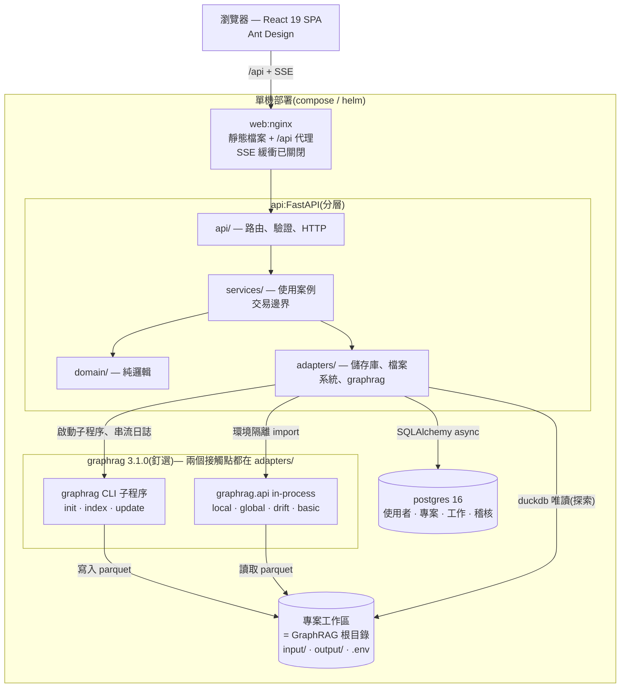
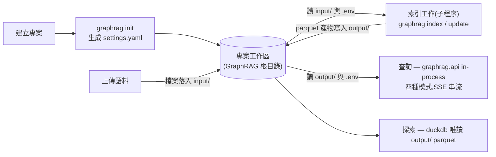
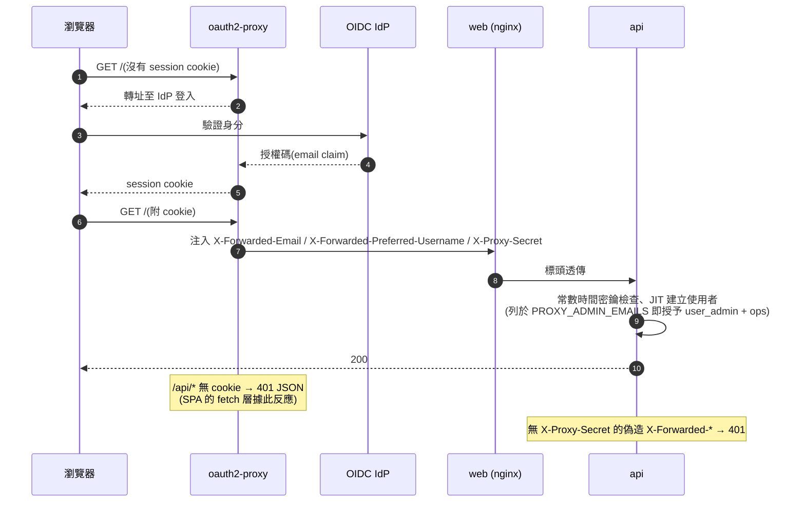

# GraphRAG Web UI

> 本文件為 [README.md](../../README.md) 的正體中文鏡像,英文版為權威版本。

[Microsoft GraphRAG](https://github.com/microsoft/graphrag) 的團隊網頁控制台:管理
專案、上傳語料、執行索引工作、查詢知識圖譜 —— 支援 local / global /
drift / basic 四種搜尋模式,全部透過 SSE 串流並附行內引用。可瀏覽 parquet
產物(entities、relationships、communities、documents、community reports、text units),
並在互動式 WebGL 檢視(圖譜)中探索圖形。它取代了 GraphRAG CLI
操作,讓非技術成員也能上手:從 `graphrag init` 到查詢執行,一切都藏在
登入、角色與每專案配額之後。

## 架構

簡要概覽(完整細節見[設計規格](../../docs/superpowers/specs/)):

- **前端** — React 19 SPA(Ant Design,介面為 zh-TW/English 雙語),以 Vite 建置並由
  nginx 提供服務;nginx 同時將 `/api` 反向代理至後端(SSE 友善:緩衝已關閉)。
- **後端** — FastAPI,分層為 `api` / `services` / `domain` / `adapters`。
  **graphrag 僅有兩個接觸點,且皆侷限於 `adapters/`:**
  - 索引以子程序執行 graphrag CLI —— 專案建立時執行 `graphrag init`,
    之後執行 `graphrag index` / `graphrag update` 工作(`adapters/index_runner.py`、
    `adapters/workspace.py`)。
  - 查詢/搜尋在隔離保護的模組內以 in-process 方式呼叫
    `graphrag.api`(`adapters/graphrag_search.py` —— 之所以隔離,是因為
    graphrag 的相依鏈會在 import 時將 `.env`/dotenv 載入 `os.environ`;
    adapter 會在該 import 前後快照並還原環境)。
- **資料庫** — PostgreSQL 16(SQLAlchemy async + asyncpg);Alembic 遷移會在
  API 啟動時自動執行。
- **專案工作區(workspace)** — 本應用對「每個專案的 GraphRAG 根目錄」的
  稱呼(即 `graphrag init` 建立的目錄),位於 `WORKSPACES_DIR` 下:
  上傳檔案落入 `input/`,索引輸出在 `output/`,每專案金鑰(例如
  `GRAPHRAG_API_KEY`)存於工作區 `.env`。

### 元件視圖



### 以 GraphRAG 為基礎 —— 工作區生命週期

整合契約就是工作區 —— 本應用對「每個專案的 GraphRAG 根目錄」的稱呼,
由 `graphrag init` 生成、位於 `WORKSPACES_DIR`。所有 graphrag 接觸點
—— 索引、查詢、探索 —— 都只透過它讀寫。




## 快速開始(15 分鐘)

1. **必要條件** — Docker + Docker Compose。Node **24** 與 Python 3.12 + uv
   僅在本機開發時需要(前端測試堆疊 jsdom/undici 需要 Node ≥ 22;
   CI 固定使用 24)。
2. **設定** — `cp .env.example .env`,接著設定三個 compose 強制變數:

   - `JWT_SECRET` — 一段長的隨機字串(JWT 簽署金鑰;請勿沿用開發預設值)
   - `BOOTSTRAP_ADMIN_EMAIL` — 必須使用可路由的網域,**不可**用 `.local`:
     登入驗證會拒絕特殊用途網域
   - `BOOTSTRAP_ADMIN_PASSWORD`

   全部 15 個基礎變數與其預設值皆記錄於
   [`.env.example`](../../.env.example);選用的 proxy-auth overlay 另有
   專屬變數(見[ OAuth2-Proxy 驗證](#oauth2-proxy-驗證選用))。
3. **啟動** — `docker compose up --build -d`。UI 位於 `http://localhost:8080`。
   Postgres 會先啟動;API 等待 PG 健康檢查通過後,自動執行 Alembic 遷移。
4. **首次登入** — 以 bootstrap 管理員身分登入;UI 會強制先變更密碼,
   之後才能進行其他操作。

   

5. **建立專案** — 選擇 `input_file_type`(`text` / `csv` / `json`)。此值
   在建立時即固定,並決定上傳接受的副檔名。
6. **上傳語料** — 檔案會進入專案工作區的 `input/`。單檔上限
   `UPLOAD_MAX_FILE_MB`,每專案配額 `PROJECT_QUOTA_MB`;超過任一上限 → 413。

   

7. **設定 LLM 金鑰** — 專案設定 → 環境:設定 `GRAPHRAG_API_KEY`(每專案
   各自持有,存於工作區 `.env`,回讀時遮罩顯示)。缺少此金鑰,索引工作會失敗。

   

8. **索引** — 工作 → 執行一項索引工作(method 為 `fast` 或 `standard`)。
   來自真實語料測試的提醒:在極小語料上,`fast` 方法可能會失敗
   ("Graph Pruning failed. No entities remain.")—— 小型測試語料的首次
   執行請改用 `standard`。可在即時日誌檢視器中追蹤進度。
9. **查詢** — 四種模式(`local`、`global`、`drift`、`basic`)全部以 SSE
   串流回應,並附行內引用。
10. **探索** — 產物資料表(entities / relationships / communities / documents /
    community_reports / text_units)與圖譜 WebGL 圖形檢視。

帳號持有一組角色,而非單一 admin 旗標:內建 `user_admin` 管理使用者與
角色目錄,內建 `ops` 可檢視並操作所有專案,而專案成員持有
`viewer`/`maintainer`/`editor`(owner 固定為建立者);自訂角色則在兩種
範圍內組合權限原子。AdminUsers 以可多選的標籤呈現各帳號的角色(並提供
密碼重設與停用);AdminRoles 頁面管理角色目錄:


## 已知注意事項

- graphrag 固定在 `==3.1.0`:較新的 3.1.x 版本會拉入沒有 macOS x86_64
  wheel 的 `lancedb` 版本(見設計規格 §13)。
- 在 macOS 上,非互動式工作階段(SSH、agent 終端機)中 `osxkeychain`
  憑證輔助程式會擋住 Docker:`error getting credentials … keychain cannot
  be accessed` —— 連公開映像檔的 pull/build 都會失敗。請先解鎖鑰匙圈
  (`security -v unlock-keychain ~/Library/Keychains/login.keychain-db`),
  或在只需要公開映像檔時,暫時從 `~/.docker/config.json` 移除
  `"credsStore"`,結束後再還原。使用 OrbStack 時,`docker compose build`
  也受影響:daemon 會經由主機的 docker 設定解析 registry 憑證。

## 疑難排解

- **重新執行 `docker compose up` 後立刻出現「invalid email or password」** ——
  bootstrap 管理員**只在資料庫為空的首次啟動時建立**。若 Postgres volume
  裡已有管理員(例如兩次執行之間改過 `.env` 的 `BOOTSTRAP_ADMIN_PASSWORD`),
  生效的仍是*舊*密碼;API 啟動時會在日誌中指出被忽略的變數。想要乾淨的
  試用狀態:`docker compose down -v`(⚠ 會刪除所有資料)後再 `up`。
- **web 映像檔建置時 `npm ci` 出現 `ERESOLVE`** —— 前端以
  `frontend/.npmrc`(`legacy-peer-deps=true`)容忍 typescript 6 ↔
  openapi-typescript 的 peer 衝突,Dockerfile 必須在 `npm ci` 前把它複製進
  build stage。若你調整複製步驟,請讓 `.npmrc` 跟著 `package.json` 一起。
- **每份 index 工作日誌開頭的「LiteLLM:WARNING … could not pre-load
  bedrock/sagemaker response stream shape」** —— 無害:graphrag 的 LLM 層
  (litellm)會在 import 時探測選用的 AWS(botocore)整合。兩個 graphrag
  接觸點都預設 `LITELLM_LOG=ERROR`,讓這些雜訊不再進入工作日誌;需要
  除錯 LLM 呼叫時,自行 export `LITELLM_LOG`(例如 `DEBUG`)即可覆蓋。

## 本機開發

後端(需要 Docker —— 測試套件使用 testcontainers):

```
cd backend
uv sync
uv run pytest -m "not slow"
```

前端(Node 24):

```
cd frontend
npm ci
npm test
```

Vite 開發伺服器預設將 `/api` 代理至 `http://localhost:8000`;可用
`API_PROXY_TARGET` 將它指向其他前門(見 `frontend/vite.config.ts`)。

本 README 的截圖可重製 —— compose 堆疊運作中且 `.env` 已設定時:

```
cd frontend
npx playwright install chromium   # 一次即可
npm run screenshots   # 寫入 docs/assets/screenshots/{en,zh}/
```

## 部署

- [`deploy/helm/graphrag-ui`](../../deploy/helm/graphrag-ui) — Helm chart;
  [`values.yaml`](../../deploy/helm/graphrag-ui/values.yaml) 記錄了每個環境變數,
  且 `NOTES.txt` 會在安裝時印出快速開始指引(zh-TW)。
- [`docker-compose.yml`](../../docker-compose.yml) — 單機部署;同樣的 15 個變數。

## OAuth2-Proxy 驗證(選用)

已經在運作 OIDC 供應商(Google、GitHub、Azure Entra、Keycloak……)的團隊,
可以在應用前部署 [oauth2-proxy](https://oauth2-proxy.github.io/),不必再
維護第二組憑證。此模式以部署為單位選用 —— 預設部署的行為與現況逐 byte
相同(設計:[規格](../../docs/superpowers/specs/2026-08-27-oauth2-proxy-auth-design.md))。

`AUTH_MODE=proxy` 改變三件事:

- **本機登入完全停用** —— `login` / `refresh` / `logout` /
  `change-password` 不註冊(404),也不存在應用程式 JWT。身分來自
  oauth2-proxy 在每個請求注入的 `X-Forwarded-Email` 標頭(顯示名稱:
  `X-Forwarded-Preferred-Username`);SPA 透過 `GET /api/auth/config`
  偵測模式。
- **標頭信任錨定於共享密鑰** —— `PROXY_AUTH_SECRET`(必填,≥ 32 字元;
  否則 API 會在啟動時直接退出)以 `X-Proxy-Secret` 標頭傳遞。缺少恰好
  一個相符值的請求一律拒絕,因此直接對 nginx 或 api 偽造
  `X-Forwarded-*` 標頭毫無用處。
- **使用者即時(JIT)建立** —— 首次出現的 email 會成為一列 `user`
  資料列,密碼雜湊不可用(本機登入對它永遠失效)。列在
  `PROXY_ADMIN_EMAILS`(逗號分隔)中的 email 在每個請求都會被授予
  `user_admin` + `ops` 角色組合。



設定方式(compose overlay + `.env` 新增、helm、email 網域允許清單、
模式切換注意事項、手動煙霧測試):**[docs/zh-TW/oauth2-proxy.md](oauth2-proxy.md)**。

## 貢獻與文件

- [CONTRIBUTING.md](../../CONTRIBUTING.md)
- 正體中文(zh-TW)鏡像:[`README.md`](README.md)
- 設計規格:[`docs/superpowers/specs/`](../../docs/superpowers/specs/)
- OAuth2-Proxy 指南:[`docs/zh-TW/oauth2-proxy.md`](oauth2-proxy.md)

## 授權

[MIT](../../LICENSE) — Copyright (c) 2026 Kehao Chen。
